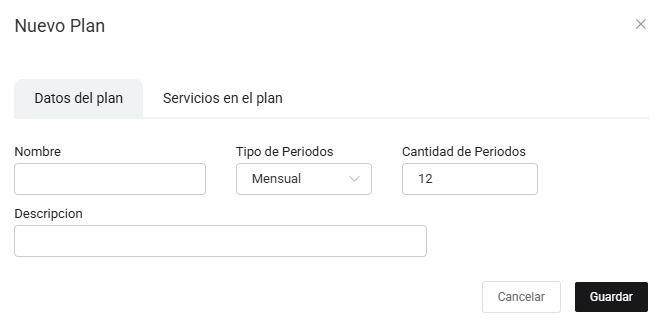
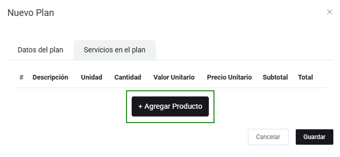
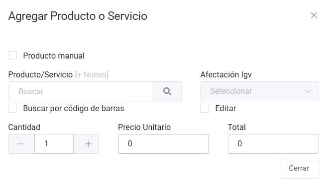

# Planes

En esta área te ayudaremos a cómo crear planes para la escolaridad. Sigue estos pasos para realizarlo:

Ingresa al módulo de **Suscripción escolar** y luego selecciona subcategoría **Planes**. En la parte superior derecha selecciona el botón **Nuevo**.

Completa los siguientes campos:

* **Nombre:** Inserta el nombre del nuevo plan.
* **Tipo de Periodos:** Selecciona el tipo de periodos: Mensual o Anual.
* **Cantidad de periodos:** Inserta la cantidad de periodos.
* **Descripción:** Inserta una pequeña descripción del plan.

:::info importante

Es obligatorio agregar productos.

:::

Agrega servicios al plan:

Al seleccionar **Agregar Productos**, podrá agregar los productos correspondientes para el nuevo plan.

* **Producto/Servicio:** Selecciona el producto creado previamente, si aún no lo creo selecciona **+Nuevo** y sigue los pasos en este **[artículo](https://manual.uio.la/Pro7/modulos/Esenciales/productos-servicios/Productos-Creacion-basica)**.
* **Cantidad:** Ingresa la cantidad del producto.

Seguido selecciona el botón **Guardar**.
