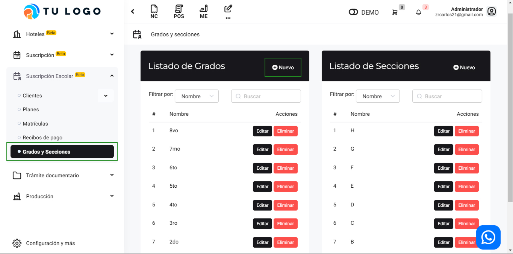
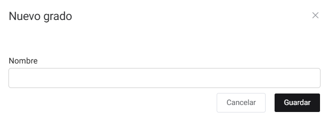
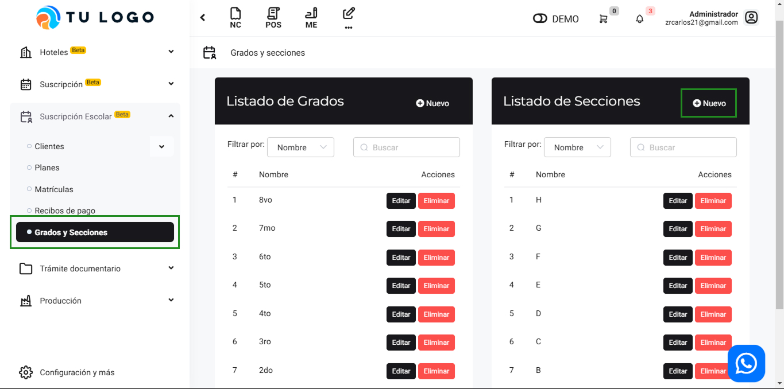
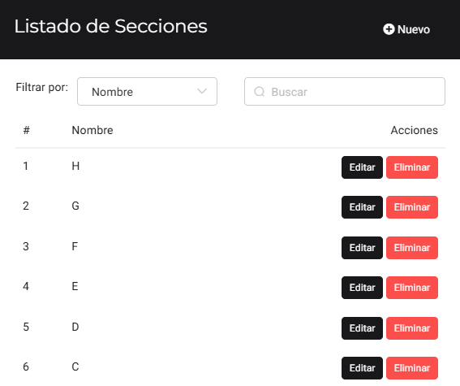

# Grados y Secciones

En este artículo te enseñaremos a crear, editar y eliminar Grados y secciones. Sigue estos pasos para realizarlo:

## Grados

Para crear grados, ingresa al módulo de **Suscripción Escolar**, y luego selecciona la subcategoría **Grados y Secciones**. En la parte superior derecha de Listado de Grados selecciona el botón **Nuevo**.

Para crear un nuevo grado, completa:

El nombre del grado y seguido selecciona el botón **Guardar**. Y podrá observar la lista de grados creados:

Podrá editar y eliminar cada grado seleccionando el botón correspondiente.

## Secciones

Para crear secciones, ingresa al módulo de Suscripción Escolar, y luego selecciona la subcategoría Grados y Secciones. En la parte superior derecha de Listado de Secciones selecciona el botón **Nuevo**.

Para crear una nueva sección, completa:

Podrá editar y eliminar cada sección seleccionando el botón correspondiente.
