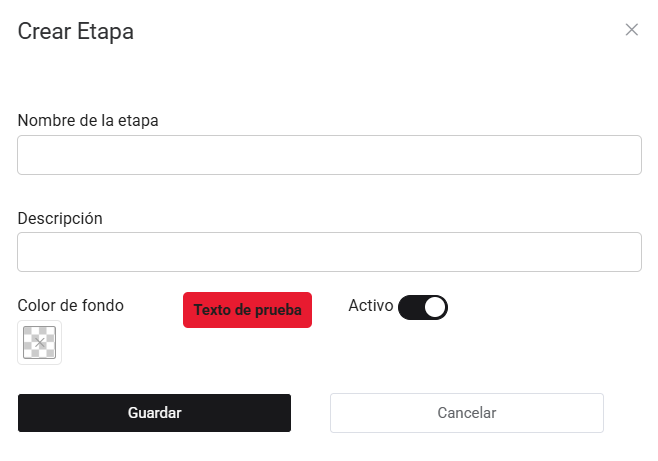

# Listado de Etapas

En este artículo te enseñaremos a crear etapas. Sigue estos pasos para realizarlo:

Ingresa al módulo de **Trámite documentario**, y luego selecciona la subcategoría Listado de Etapas. En la parte superior derecha selecciona el botón **Nuevo**.

Completa lo siguiente:

- **Nombre de la etapa:** Inserta el nombre de la etapa.
- **Descripción:** Inserta una pequeña descripción si así lo requiere.
- **Color de fondo:** Selecciona un color de fondo, puede dejarlo tal como esta en caso no quisiera que tenga un color.
- **Activo:** Active la casilla de selección si desea activar la etapa.

Selecciona el botón **Guardar**. Y podrá visualizar la etapa creada con el color correspondiente.
