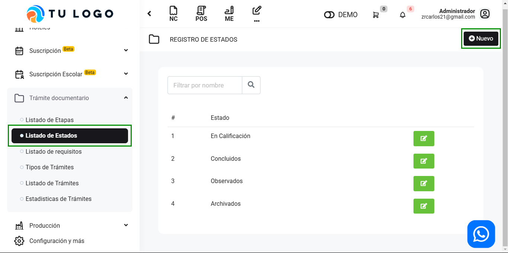
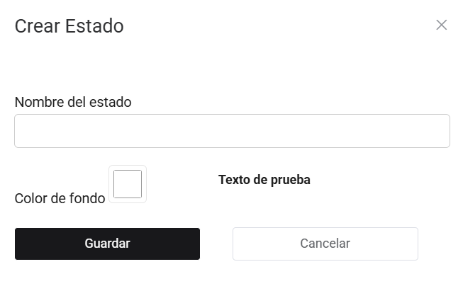

# Listado de Estados

En este artículo te enseñaremos a crear estados. Sigue estos pasos para realizarlo:

Ingresa al módulo de **Trámite documentario**, y luego selecciona la subcategoría **Listado de Estado**. En la parte superior derecha selecciona el botón **Nuevo**.

Completa lo siguiente:

- **Nombre del estado:** Inserta el nombre del estado.
- **Color de fondo:** Selecciona el color de fondo, puede dejarlo tal como esta en caso no quisiera que tenga un color.

Seguido selecciona el botón **Guardar**. Y podrá visualizar el estado creada con el color correspondiente.
