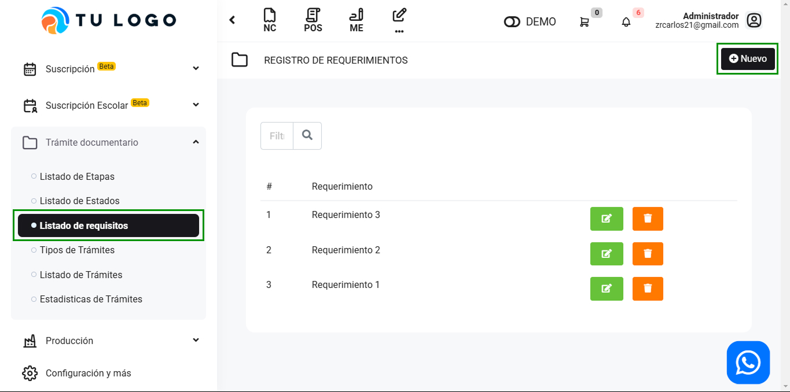
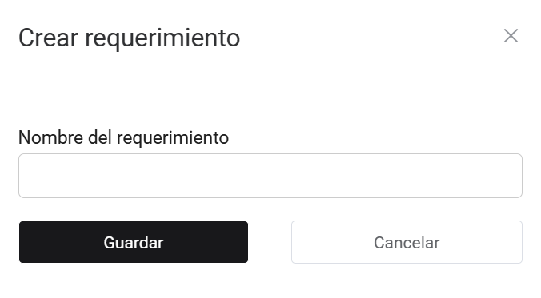

# Listado de requisitos

En este artículo te enseñaremos a crear requisitos. Sigue estos pasos para realizarlo:

Ingresa al módulo de **Trámite documentario,** y luego selecciona la subcategoría **Listado de requisitos.** En la parte superior derecha selecciona el botón Nuevo.

Completa el siguiente campo:

- **Nombre del requerimiento:** Inserta el nombre del requerimiento.

Seguido selecciona el botón Guardar. Y podrá visualizar el tramite creado.
