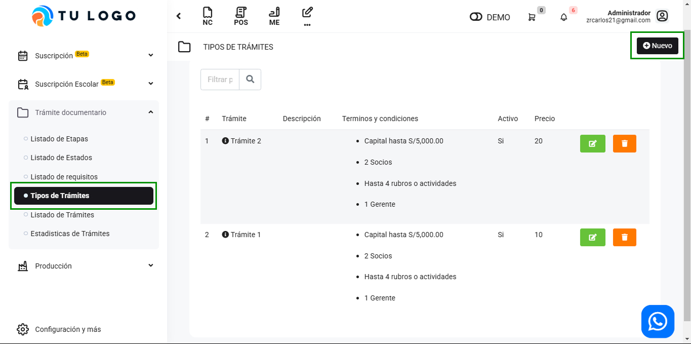
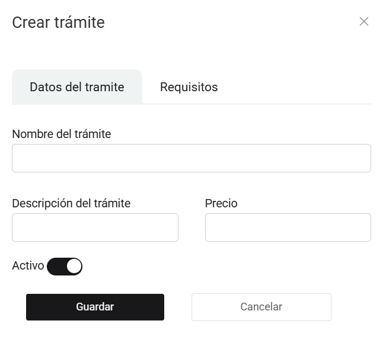

# Tipos de trámites

En este artículo te enseñaremos a crear trámites. Sigue estos pasos para realizarlo:

Ingresa al módulo de **Trámite documentario**, y luego selecciona la subcategoría Tipos de Trámites. En la parte superior derecha selecciona el botón **Nuevo**.

Completa los siguientes campos:

- **Nombre del trámite:** Inserta el nombre del trámite.
- **Descripción del tramite:** Inserta una descripción del trámite.
- **Precio:** Inserta el precio del trámite.
- **Activo:** Selecciona para activar.

## Requisitos

- **Requisitos:** Selecciona un requisito, creado previamente si aún no lo creo, Sigue todos los pasos en este **[artículo](https://manual.uio.la/Pro7/modulos/Rubros/tramite-documentario/Listado-de-requisitos)**.

Seguido selecciona el botón **Guardar**. Y podrá visualizar el trámite creado en la lista de tipos de trámites.
