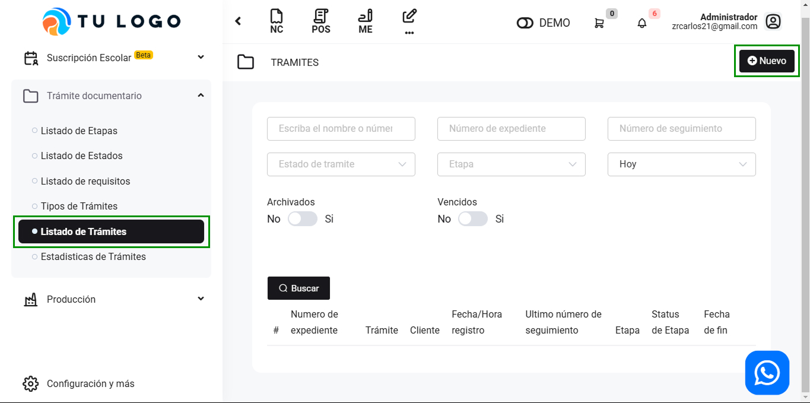

# Listado de trámites

En este artículo te enseñaremos a crear trámites. Sigue estos pasos para realizarlo:

Ingresa al módulo de **Trámite documentario**, y luego selecciona la subcategoría **Listado de Trámite**. En la parte superior derecha selecciona el botón **Nuevo**.

Completa los siguientes campos:

- **1. Cliente:** Selecciona el cliente, si aún no lo creo, sigue todos los pasos en este artículo.
- **2. Tipos de tramite:** Selecciona el tipo de trámite creado anteriormente, si aún no lo creo, sigue todos los pasos en este **[artículo](https://fastura.github.io/documentacion/tramite-documentario/Tipos-de-tr%C3%A1mites)** .
- **3. Código de expediente (Interno):** Inserta el código de expediente.
- **4. Fecha de registro:** Selecciona la fecha de registro.
- **5. Hora de registro:** Selecciona la hora de registro.

**6. Agregar etapa**, selecciona agregar etapa y completa los siguientes campos:

- **Número de seguimiento:** Inserta el número de seguimiento.
- **Fecha/Hora de registro:** Se autocompleta, pero se puede seleccionar otra fecha si lo requiere.
- **Etapa:** Selecciona una etapa, creado previamente si aún no lo creo, selecciona +Nuevo, sigue todos los pasos en este artículo.
- **Fecha cuando se toma la etapa:** Se autocompleta, pero se puede seleccionar otra fecha si lo requiere.
- **Días que toma el etapa:** Inserta los días que toma la etapa.
- **Estado de etapa:**  Selecciona el estado de la etapa, creado previamente si aún no lo creo, selecciona +Nuevo, sigue todos los pasos en este **[artículo](https://manual.uio.la/Pro7/modulos/Rubros/tramite-documentario/Listado-de-Etapas)**.
- **Responsable:** Selecciona el responsable.
- **Observaciones:** Inserta alguna observación si lo requiere.
- **Check box- Calculo por días Hábiles:** Te permite elegir si quieres calcular los días por días hábiles o fecha calendario.

Seguido selecciona el botón **Guardar**. Podrá observar las etapas creadas:

Podrá cambiar el estado y seleccionando los tres puntos al lado derecho, podrá editar o eliminar la etapa.

Seguido selecciona el botón **Guardar**.

Podrá buscar los tramites, podrá exportar en excel y exportar en PDF seleccionando el botón correspondiente.
