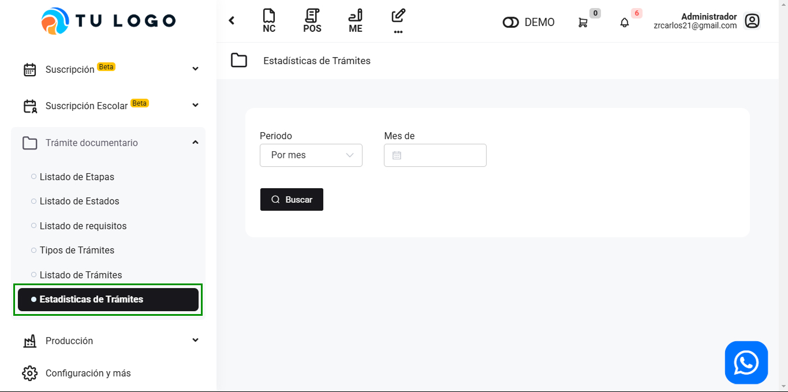

# Estadísticas de Trámites

En este artículo te enseñaremos a revisar las estadísticas de trámites. Sigue estos pasos para realizarlo:

Ingresa al módulo de **Trámite documentario**, y luego selecciona la subcategoría **Estadísticas de Trámites**.

 Completa los siguientes campos:

- **Periodo:** Selecciona el tipo de periodo que desea filtrar.
- **Mes de:** Selecciona el mes que desea filtrar.

Seguido seleciona el botón **Buscar**. Y le aparecerá un detallado:

Puede exportar el detallado en PDF, seleccionando el botón Exportar PDF.
