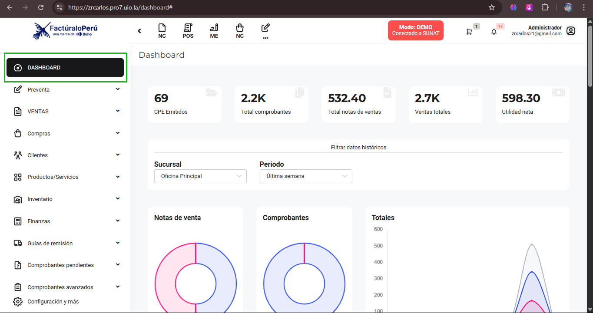
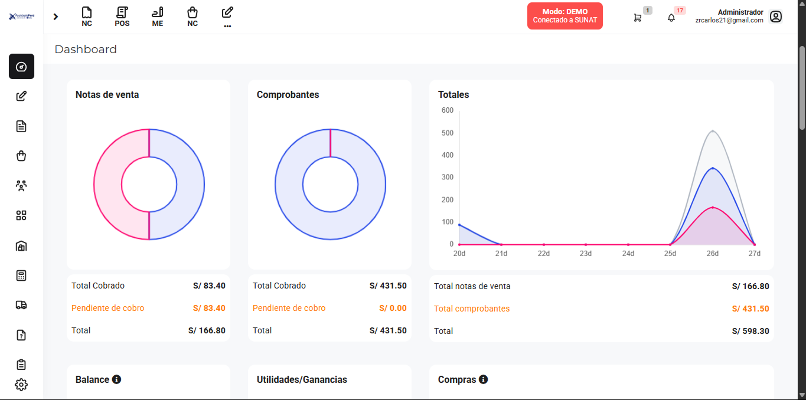
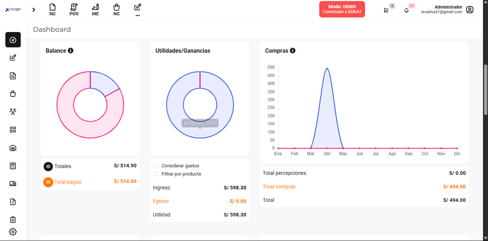

# Dashboard  

El **Dashboard** es la interfaz principal que proporciona una visión general del rendimiento y la actividad de tu negocio. A continuación, se describen las diferentes secciones y métricas que puedes encontrar en el Dashboard. 

## Seccion 1

### 1. Resumen General  
 

Esta sección proporciona datos generales sobre tu empresa:  

- **CPE Emitidos**: Número total de Comprobantes de Pago Electrónicos (CPE) emitidos.  
- **Total comprobantes**: Cantidad total de comprobantes generados.  
- **Ventas totales**: Total monetario de ventas en el periodo seleccionado.  
- **Utilidad neta**: Monto total de la utilidad obtenida.  

---  

### 2. Notas de Venta y Comprobantes  

En esta sección se visualizan los totales de notas de venta y comprobantes emitidos:  

- **Total Cobrado**: Monto total que ha sido cobrado a través de notas de venta.  
- **Notas Pendientes de Cobro**: Monto que aún está pendiente de recibir.  
 

---  

## Seccion 2

### 1. Utilidades/Ganancias  
 

Muestra un resumen de las utilidades obtenidas del negocio:  

- **Ingreso**: Total de ingresos generados.  
- **Egreso**: Total de gastos realizados.  
- **Utilidad**: Monto neto de ganancias tras calcular los ingresos y egresos. 

---  

### 2. Balance  

La sección de **Balance** proporciona información relevante sobre el estado financiero:  

- **Totales**: Total de ingresos y pagos realizados.  
- **Total pagos**: Monto total de pagos procesados.  

---  

### 3. Compras  

El gráfico de **Compras** muestra los totales de compra a lo largo del tiempo:  
 

- Visualiza las tendencias mensuales de compras.  

---

## Seccion 3

### 1. Ventas por Producto  

En la sección de **Ventas por producto**, puedes visualizar:  

- **Código**: Identificación única de cada producto.  
- **Nombre**: Descripción del producto.  
- **Movimientos**: Total de unidades vendidas.  
- **Estado**: Información sobre la disponibilidad del producto (agotado, activo, etc.).  

---  

### 2. Top Clientes  

Esta sección muestra a tus principales clientes según el número de transacciones realizadas:  

- **Cliente**: Nombre del cliente.  
- **Trans.**: Número de transacciones realizadas por cada cliente.  
- **Total**: Monto total de las compras realizadas por cada cliente.  

---  

### 3. Productos por Agotarse  
 
Aquí puedes identificar los productos que están a punto de agotarse:  

- **Producto**: Nombre del producto.  
- **Stock**: Cantidad disponible de cada producto.  
- **Estado**: Indica si el producto está agotado.  
- **Almacén**: Ubicación del producto en el inventario.  

