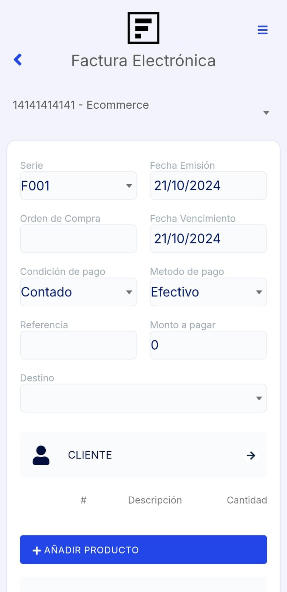

# Factura

En este artículo te explicaremos cómo emitir una factura desde la **App Factúralo**. Sigue los pasos a continuación:

Actualmente, existen **dos formas** de emitir una factura:

1. **Desde el módulo POS**.
2. **Desde el módulo Factura electrónica**.

A continuación, describimos el proceso para ambos casos.

## 1. Emitir una factura desde el módulo Factura Electrónica

### Paso 1: Ingresar al módulo **Factura Electrónica**

### Paso 2: Completar los campos necesarios

#### Campos principales:

- **Cliente**: Selecciona **CLIENTE** y se desplegará una lista con todos tus clientes previamente registrados. Elige al cliente para el que emitirás la factura. Si necesitas agregar un nuevo cliente, selecciona el botón **"+" Nuevo** en la esquina superior derecha y sigue los pasos indicados en este [artículo](https://fastura.github.io/documentacion/app-para-facturacion/Como-crear-cliente).

  

- **Añadir producto**: Haz clic en **Añadir producto** y se abrirá el **Listado de Productos**. Selecciona el producto que deseas facturar y ajusta las cantidades. Luego, en la parte inferior derecha, selecciona el botón con el ícono del carrito de compras para añadirlo. Si necesitas agregar un nuevo producto, selecciona el botón **"+"** en la esquina superior derecha y sigue los pasos en este [artículo](https://fastura.github.io/documentacion/app-para-facturacion/Como-crear-un-producto).

  

:::danger IMPORTANTE:
Todos los campos no mencionados son opcionales y puedes completarlos según tus necesidades.
:::

### Paso 3: Finalizar la emisión

Una vez que todos los campos estén completados, selecciona el botón **Aceptar**.

### Paso 4: Opciones al registrar el comprobante

Después de registrar la factura, aparecerá un mensaje de confirmación y tendrás cuatro opciones para proceder:

- **Imprimir**: Imprime o guarda el comprobante en formato **PDF**.
- **Descargar A4**: Descarga el comprobante en tamaño **A4**.
- **Descargar Ticket**: Descarga el comprobante en formato ticket.
- **Continuar**: Continúa emitiendo facturas.

## 2. Emitir una factura desde el módulo POS

Además de la opción desde **Factura Electrónica**, también puedes emitir una factura directamente desde el **módulo POS**. El proceso es similar en cuanto a la selección de cliente y productos, con la ventaja de que se adapta mejor a operaciones rápidas.

---

Con estos pasos, puedes gestionar la emisión de facturas de manera flexible según tus necesidades, ya sea desde el módulo **Factura Electrónica** o **POS**.

