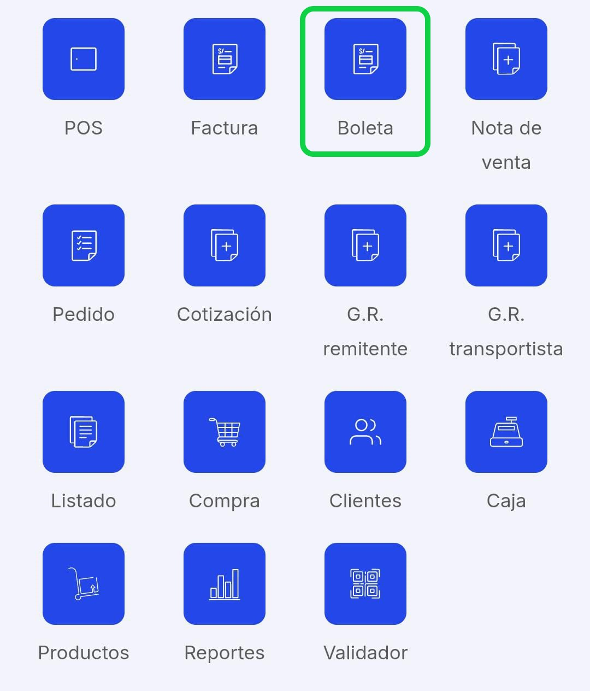
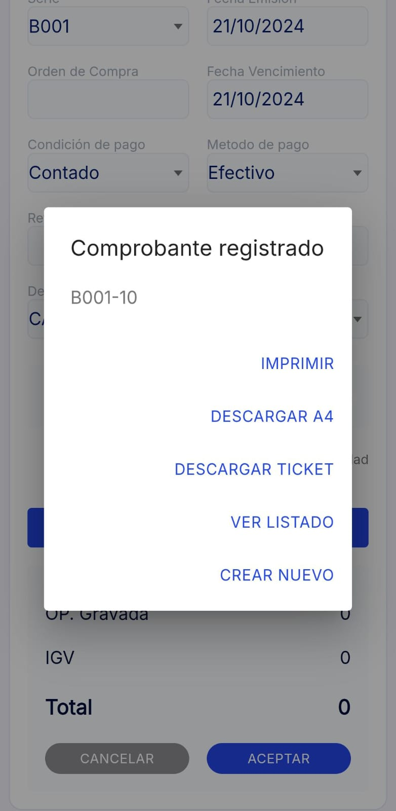

# Boleta

En este artículo te ayudaremos a emitir boleta desde la App. Sigue estos pasos para realizarlo:

1. Ingresar al módulo **Boleta electrónica**.

2. Completa los siguientes campos necesarios:

- **Cliente:** Selecciona **CLIENTE** y aparecerá una lista de todos sus clientes ya registrados, elija al que le realizará la boleta. En caso desee crear un nuevo cliente, en la parte superior derecha selecciona el **"+" Nuevo** ,y sigue los pasos en este [artículo](#Cómo crear cliente) .

- **Añadir producto**: Selecciona el botón **Añadir producto**, aparecerá el **Listado de Productos**, elija el producto,puede agregar las cantidades; en la parte inferior derecha selecciona el botón con el icono del carrito de compras para añadir el producto. En caso desee agregar un nuevo producto, en la parte superior derecha selecciona el botón **"+"** ,y sigue los pasos en este **[artículo](https://fastura.github.io/documentacion/app-para-facturacion/Como-crear-cliente)**

:::danger IMPORTANTE:

Todos los campos no mencionados son opcionales, según su necesidad.

:::

Una vez que los que los campos estén rellenados, selecciona el botón **Aceptar**.

Seguido, aparecerá un mensaje de comprobante registrado. Tendrá cuatro opciones:

- **Imprimir:** Al seleccionar esta opción podrá imprimir o guardar el comprobante electrónico en archivo **PDF**.
- **Descargar A4:** Al seleccionar esta opción podrá descargar el archivo del comprobante electrónico en tamaño **A4**.
- **Descargar Ticket:** Al seleccionar esta opción podrá descargar el archivo del comprobante electrónico en tamaño **ticket**.
- **Continuar:** Al seleccionar esta opción podrá seguir generando boletas.

