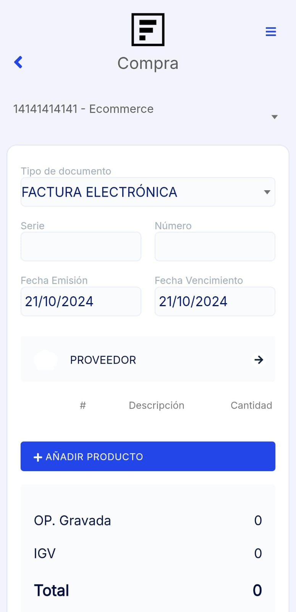
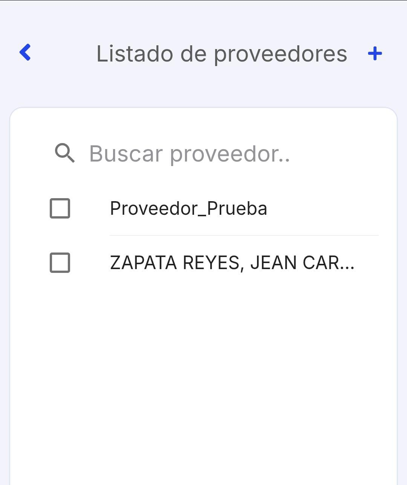
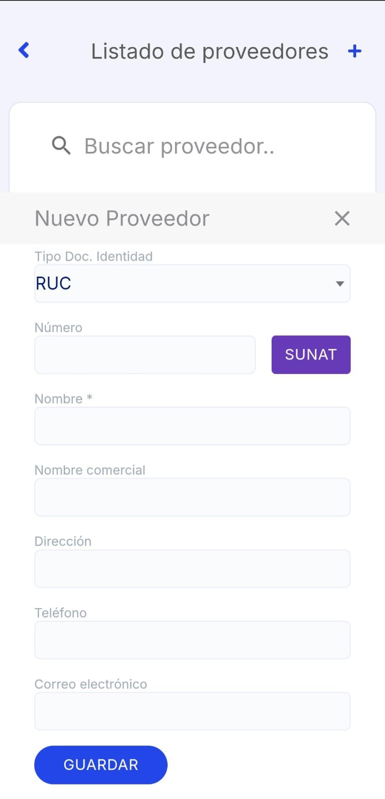
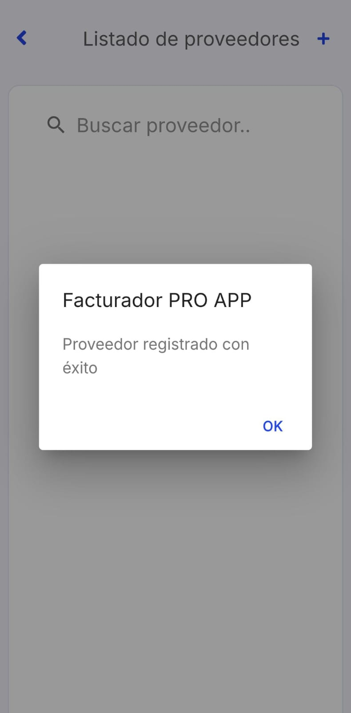
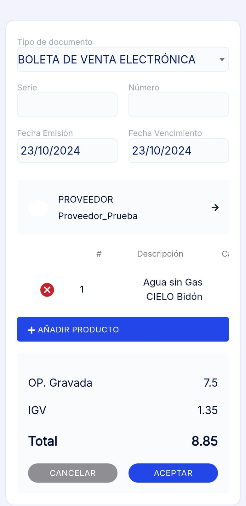

# Nueva compra

En este artículo te ayudaremos a ingresar las compra realizadas desde la **App Facturalo**. Sigue estos pasos para realizarlo:

1. Ingresa al módulo **Compra.**

2. Completa los siguientes campos necesarios:

- **Tipo de documento:** Selecciona el tipo de comprobante.
- **Serie:**  Ingresa la serie del comprobante.
- **Número:**  Ingresa el número del comprobante.
- **Proveedor:** Selecciona **PROVEEDOR** y aparecerá una lista de todos sus proveedores ya registrados.

## Crear nuevo proveedor

En caso desee crear un nuevo proveedor, en la parte superior derecha selecciona el **"+"**, completa los siguientes datos:

- **Tipo Doc. Identidad:** Selecciona RUC,DNI.
- **Número:** Ingresa el número que corresponde al tipo de documento Identidad. Después selecciona el botón SUNAT o RUC (esto depende de que tipo de documento selecciono), para que se autocomplete el nombre y la dirección.

- **Nombre comercial:**  Ingresa la denominación que identifica a la empresa.
- **Teléfono:** Ingresa el teléfono del cliente.
- **Correo electrónico:** Ingresa el correo electrónico del cliente.

:::danger IMPORTANTE:

Todos los campos no mencionados son opcionales, según su necesidad.

:::

Después seleccione el botón **Guardar**. Y aparecerá la lista de proveedores.

- **Añadir producto:** Selecciona el botón **Añadir producto**, aparecerá el **Listado de Productos**, elija el producto, puede agregar las cantidades, en la parte inferior derecha selecciona el botón con el icono del carrito de compras para añadir el producto. En caso desee agregar un nuevo producto, en la parte superior derecha selecciona el **botón "+"** ,y sigue los pasos en este **[artículo](https://fastura.github.io/documentacion/app-para-facturacion/Como-agregar-una-nueva-compra)**.

:::danger IMPORTANTE:

- Todos los campos no mencionados son opcionales, según su necesidad.
- Para que sus productos se visualicen en la app, deben de contar con código interno.

:::

Una vez que los que los campos estén rellenados, selecciona el botón **Aceptar**.

Seguido, aparecerá un mensaje de comprobante registrado. Tendrá 3 opciones:

- **Imprimir:** Al seleccionar esta opción podrá imprimir o guardar el comprobante electrónico en archivo PDF.
- **Ir a listado:** Al seleccionar esta opción podrá dirigirse al módulo listado de comprobantes, puede ver más en este artículo.
- **Continuar:**Al seleccionar esta opción podrá seguir generando notas de venta.

