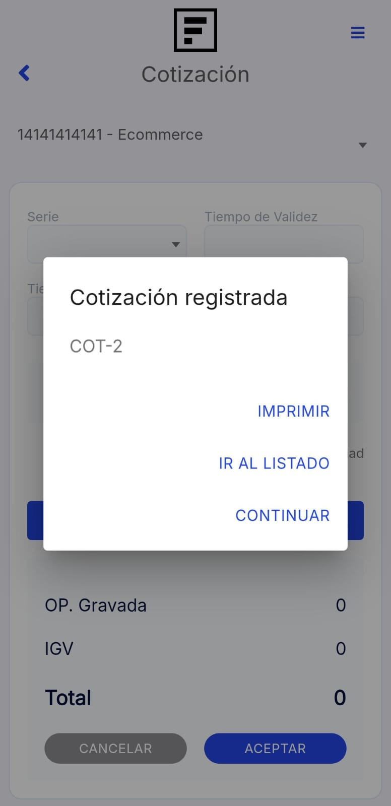

# Cotización

En este artículo te ayudaremos a generar una cotización desde la App Facturalo. Sigue estos pasos para realizarlo:

1. Ingresa al módulo **Cotización**.

2. Completa los siguientes campos necesarios:

- **Cliente:** Selecciona **CLIENTE** y aparecerá una lista de todos sus clientes ya registrados, elija al que le realizará la factura. En caso desee crear un nuevo cliente, en la parte superior derecha selecciona el **"+" Nuevo**, y sigue los pasos en este **[artículo](https://fastura.github.io/documentacion/app-para-facturacion/Como-crear-cliente)**.

- **Añadir producto:** Selecciona el botón **Añadir producto**, aparecerá el **Listado de Productos**, elija el producto,puede agregar las cantidades; en la parte inferior derecha selecciona el botón con el icono del carrito de compras para añadir el producto. En caso desee agregar un nuevo producto, en la parte superior derecha selecciona el botón **"+"** ,y sigue los pasos en este **[artículo](https://fastura.github.io/documentacion/app-para-facturacion/Como-crear-un-producto)**.

:::danger IMPORTANTE:

Todos los campos no mencionados son opcionales, según su necesidad.

:::

Una vez que los que los campos estén rellenados, selecciona el botón **Aceptar**.

Seguido, aparecerá un mensaje de comprobante registrado. Tendrá 3 opciones:

- **Imprimir:** Al seleccionar esta opción podrá imprimir o guardar el comprobante electrónico en archivo PDF.
- **Ir a listado:** Al seleccionar esta opción podrá dirigirse al módulo listado de comprobante **[artículo](https://fastura.github.io/documentacion/app-para-facturacion/Lista-de-comprobantes)**.
- **Continuar:** Al seleccionar esta opción podrá seguir generando notas de venta.

