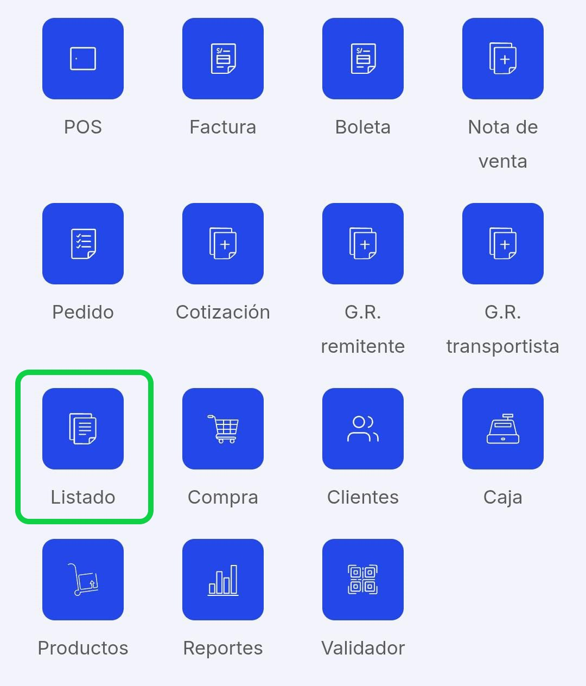
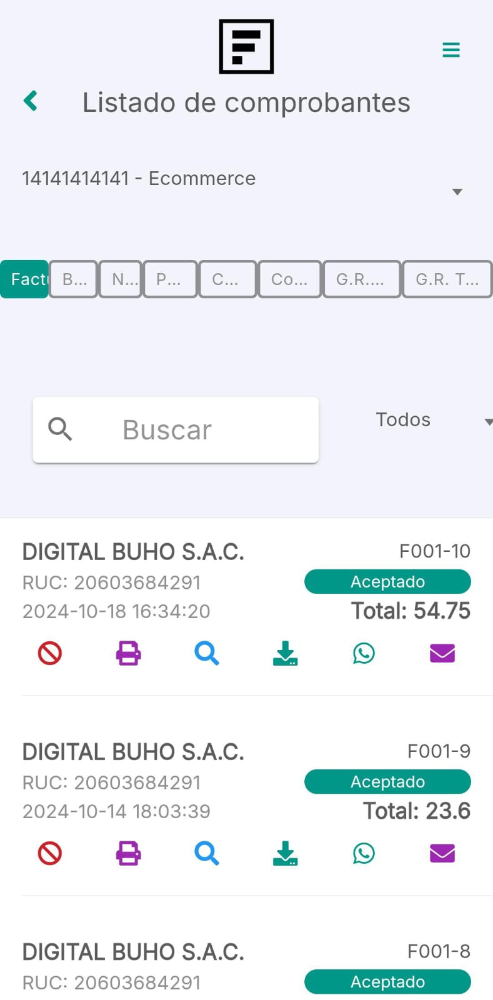
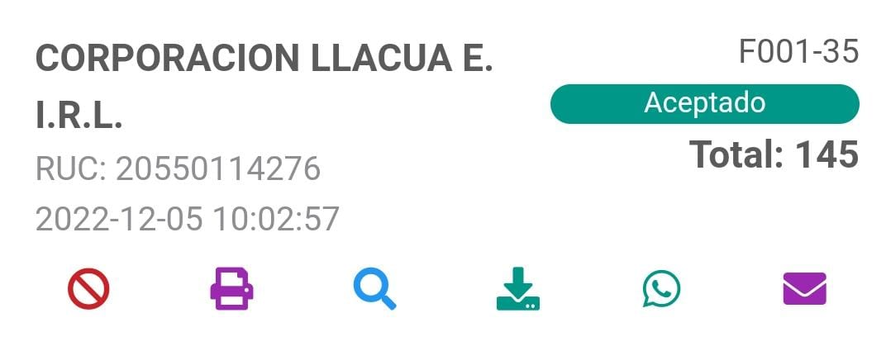
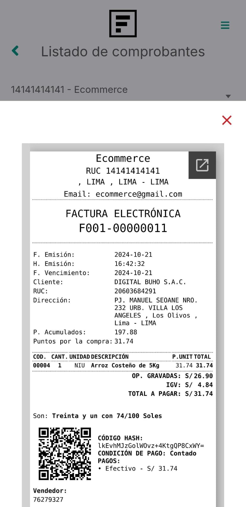
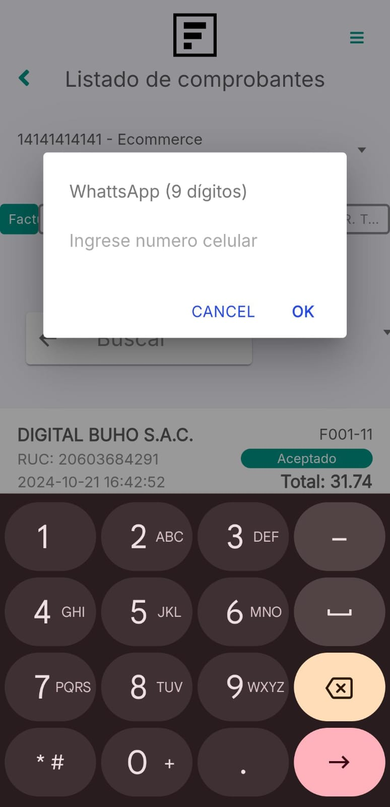

# Lista de comprobantes

En este artículo te ayudaremos a observar tu listado de comprobantes electrónicos desde la **App Factúralo.** Sigue estos pasos para realizarlo:

1. Ingresar al módulo **Listado de comprobantes**.

2. Una vez dentro, podrá observar todos sus comprobantes emitidos:

- Facturas
- Boletas
- Nota
- Pedidos
- Compras
- Cotización
- G.R Remitente
- G.R Trasportista

- En la imagen se observa la lista de Factura, si desea observar una lista en específico, selecciona el botón de lo que desea observar.
- Seguido podrá buscar por nombre los comprobantes, también hay un filtro en el que podrá elegir que tipo de comprobante desea observar:

## Opciones de los comprobantes

Debajo de cada comprobante aparecen botones de acción:

- Anular comprobante: Selecciona el primer icono si desea anular su comprobante. Escriba el motivo y selecciona el botón Anular.

- Imprimir: Selecciona el segundo icono para imprimir o guardar el comprobante en archivo PDF.
- Buscar: Selecciona el tercer icono para observar la vista previa del comprobante.

- Descargar: Selecciona el cuarto icono para descargar el archivo del comprobante electrónico.
- Enviar comprobante vía WhattsApp: Selecciona el quinto icono para enviar el comprobante vía WhattsApp.

- Enviar comprobante vía Email: Selecciona el sexto icono para enviar el comprobante vía Email.
