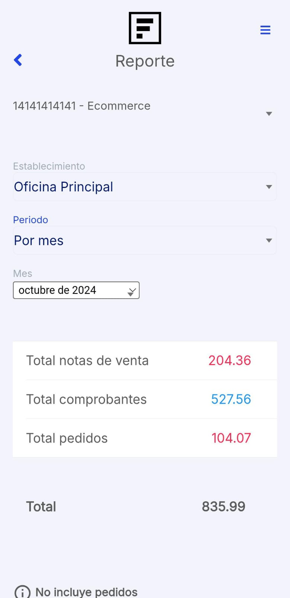

# Reportes

En este artículo te ayudaremos a observar tu listado de comprobantes electrónicos desde la **App Factúralo**. Sigue estos pasos para realizarlo:

1. Ingresar al módulo **Reportes**.

2. Para poder generar su reporte tendrá que completar los siguientes campos:

- **Establecimiento**: Selecciona de que establecimiento desea el reporte.
- **Periodo:** Selecciona en que periodo deseas el reporte.
- **Fecha:** Ingresa la fecha.

:::info IMPORTANTE

El reporte es simplificado visual para revisar los totales de ventas.

:::
