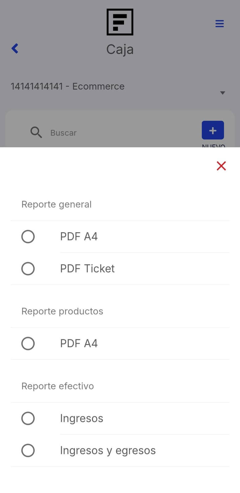

# Aperturar Caja

En este artículo te ayudaremos a generar una cotización desde la App Facturalo. Sigue estos pasos para realizarlo:

1. Ingresa al módulo **Caja**.

## Aperturar caja chica

Para abrir una caja, en la parte superior derecha selecciona el botón **"+" Nuevo**.

:::danger IMPORTANTE:

No se puede abrir más de una caja por usuario.

:::

Aparecerá el formulario **Nueva caja**.

Se completarán los siguientes datos:

- **Saldo inicial**
- **Número de referencia**

Después selecciona el botón **Guardar** y se visualizará el listado de cajas.

Como se puede visualizar el estado de la caja es **Aperturada**, y solo esa caja tiene permitido los accesos de editar, se puede cerrar, eliminar.

Una vez que el estado de la caja sea cerrada ya no podrá editar tampoco eliminar.Los botones que se encuentran al lado derecho:

1. **PDF:** Al seleccionar este botón, aparecerá las siguientes opciones:

- **Reporte general:** En este documento podrá observar todos los comprobantes electrónicos que se realizó con la caja activa. Para descargarlo, selecciona en que formato lo desea observar (cuenta con versiones de impresiones, para que pueda descargar el reporte de la manera que mejor se acomode a sus requerimientos).
- **Reporte de productos:** En este documento podrá observar a detalle los productos que se vendieron las cantidades y  y el precio. Para descargarlo, selecciona el **PDF A4**.

- **Reporte efectivo:**
    * **Ingresos:** En este documento podrá observar los detalles de todos los ingresos en efectivo hacia la caja.
    * **Ingresos y egresos:** En este documento podrá observar los detalles de todos los ingresos en efectivo hacia la caja, los gastos y compras se visualizarán en el reporte una vez que la caja haya sido cerrada.

2. **Email:** Al seleccionar este botón te solicitan tu correo, envía un reporte punto de venta detallado de todos tus movimientos.
