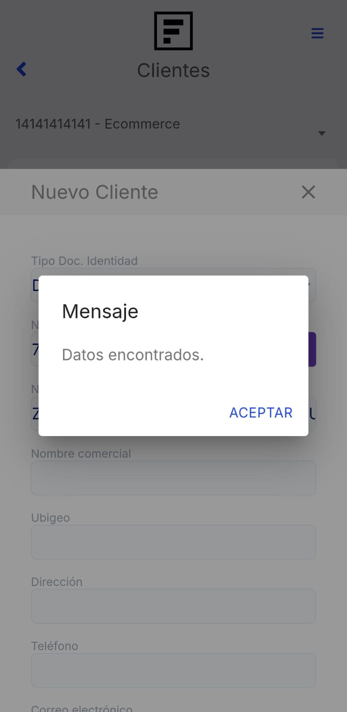

# Clientes

En este artículo te ayudaremos a crear clientes desde la **App Factúralo**. Sigue estos pasos para realizarlo:

1. Ingresar al módulo **Clientes**.

2. En la parte superior derecha selecciona el botón **"+" Nuevo**.

3. Completar los siguientes datos:

- **Tipo Doc. Identidad:** Selecciona RUC,DNI,Doc.trib.no.dom.sin.ruc.
- **Número:** Ingresa el número que corresponde al tipo de documento Identidad. Después selecciona el botón **SUNAT o RUC (esto depende de que tipo de documento selecciono)**, para que se autocomplete el nombre y la dirección.
- **Ubigeo:** Selecciona el Ubigeo haciendo clic en el campo correspondiente. Aparecerá una lista con las diferentes ubicaciones (departamento, provincia y distrito). Elige la opción que corresponda a la dirección del cliente
- **Nombre comercial:** Ingresa la denominación que identifica a la empresa.

- **Teléfono:** Ingresa el teléfono del cliente.
- **Correo electrónico:** Ingresa el correo electrónico del cliente.

:::danger IMPORTANTE:

Todos los campos no mencionados son opcionales, según su necesidad.

:::

Finalmente seleccione el botón **Guardar.** Y aparecerá la lista de clientes.

