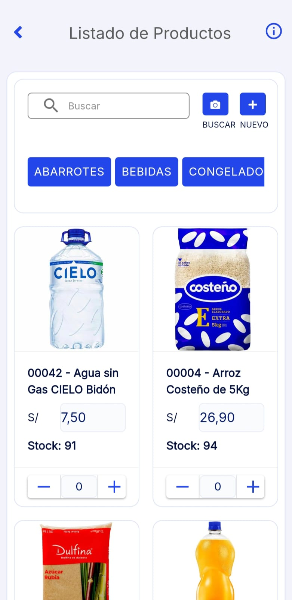

# Productos

En este artículo te ayudaremos a crear productos desde la **App Factúralo.** Sigue estos pasos para realizarlo:

1. Ingresa al módulo **Productos.**

2. En la parte superior derecha selecciona el **"+" Nuevo.**

3. Completar los siguientes datos:

- **Código interno:** Identifica el producto, ayuda a la gestión de inventarios. Es importante colocar el código interno para que los productos puedan visualizarse en su Tienda Virtual.
- **Nombre:**  Ingresa el nombre del producto.
- **Precio unitario (venta):** Ingresa el precio del producto.
- **Interruptor IGV:** En caso el producto incluye **IGV**, déjelo activado.
- **Categoria:** Perpite añadir una categoria al produccto.

:::danger IMPORTANTE:

Todos los campos no mencionados son opcionales, según su necesidad.
Finalmente selecciona el botón **Guardar.** Y aparecerá en su lista de productos.

:::
