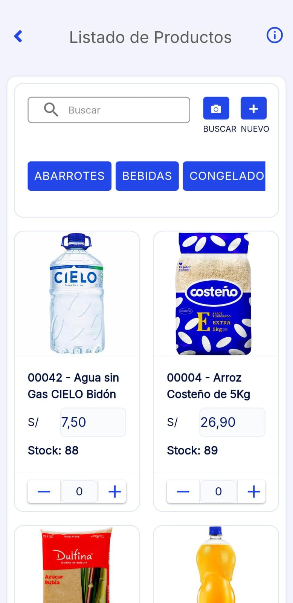
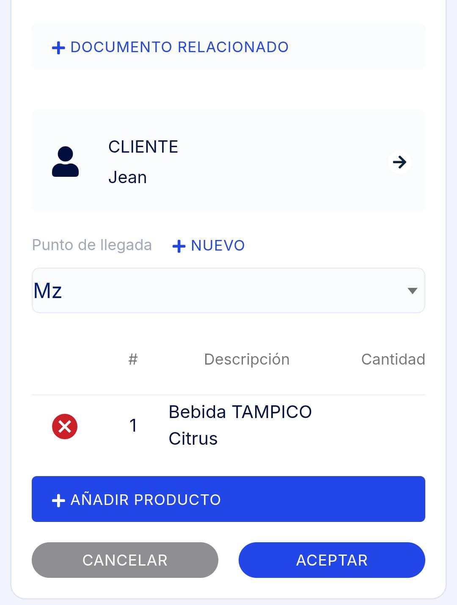

# Guía de Remisión Remitente

En este artículo te explicaremos cómo generar una **Guía de Remisión Remitente** desde la **App Factúralo**. Sigue estos pasos:

---

## 1. Ingresar al módulo **Guía de Remisión**

---

## 2. Completar los siguientes campos necesarios:

### **Punto de Partida:**
Selecciona el punto de partida desde el menú desplegable. Asegúrate de elegir correctamente el lugar de origen del traslado para evitar inconvenientes en la entrega.

### **Fecha de Emisión:**
Selecciona la fecha de emisión del documento haciendo clic en el campo correspondiente. Aparecerá un calendario para elegir la fecha correcta.

### **Fecha de Traslado:**
Haz clic en el campo **Fecha de Traslado** y selecciona desde el calendario la fecha en la que se realizará el traslado. Esta fecha debe coincidir con los acuerdos realizados con el cliente.

---

## 3. Datos del Transportista:

- **Transportista:** Selecciona el transportista encargado del traslado.  
- **Unidad de Medida:** Elige la unidad de medida que corresponde al traslado (Ej.: Kilos, Toneladas).
- **Peso Total:** Ingresa el peso total de la mercancía.
- **Número de Pasajeros:** En caso de que aplique, ingresa el número de pasajeros asociados al envío.

---

## 4. Descripción del Motivo de Traslado:
Selecciona el motivo del traslado. Si es necesario, agrega una breve observación en el campo correspondiente.

---

## 5. Añadir Documentos Relacionados

Haz clic en **+ Documento Relacionado** para vincular documentos adicionales, como una factura o boleta relacionada con la guía de remisión.

---

## 6. Cliente y Punto de Llegada

- **Cliente:** Selecciona el cliente desde la lista desplegable. Si deseas crear un nuevo cliente, selecciona el **"+"** en la parte superior, mas informacion de la creacion de un cliente en el siguiente **[articulo](https://fastura.github.io/documentacion/app-para-facturacion/Como-crear-cliente)**.
- **Punto de Llegada:** Elige el destino final del traslado.  

:::danger IMPORTANTE:

Es posible añadir múltiples direcciones, las cuales se almacenarán en el historial del cliente para optimizar futuros procesos de envío. Esta funcionalidad permite seleccionar rápidamente destinos ya registrados, reduciendo duplicaciones y errores en los datos. Además, facilita la planificación de rutas al tener todas las direcciones asociadas al cliente en un único lugar.

:::

---

## 7. Añadir Producto

Selecciona el botón **Añadir Producto** para agregar productos a la guía. En el **Listado de Productos**, elige los productos correspondientes, especifica las cantidades y selecciona el ícono del carrito para añadirlos.

---

## 8. Finalizar y Guardar

Después de completar todos los campos necesarios, selecciona el botón **Aceptar** para guardar la guía de remisión.

---

:::danger IMPORTANTE:
- Todos los campos no mencionados son opcionales y pueden ser rellenados según tus necesidades.
- Asegúrate de que todos los datos ingresados sean correctos antes de proceder.
:::

---

## 9. Opciones al Finalizar

Una vez registrada la guía de remisión, tendrás las siguientes opciones:

- **Imprimir:** Permite imprimir o guardar el documento en PDF.
- **Ir a Listado:** Dirige al módulo de listado de guías de remisión.
- **Continuar:** Permite seguir generando guías adicionales.
