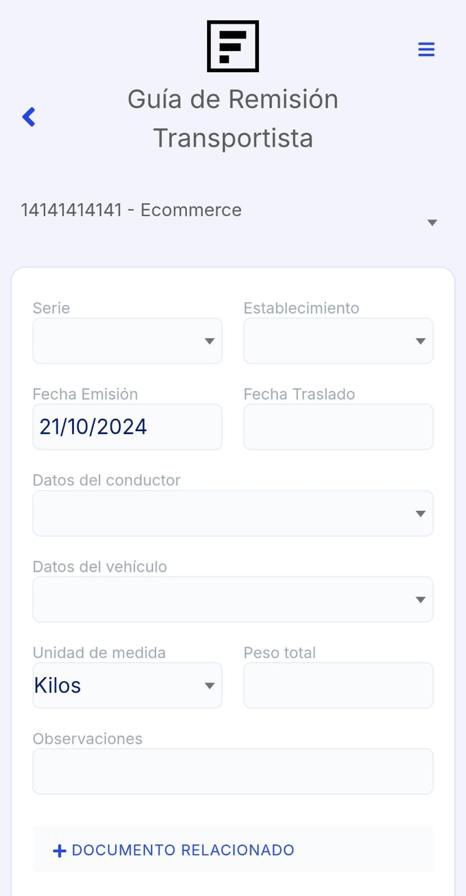

# Guía de Remisión Transportista

En esta guía te mostraremos cómo completar la **Guía de Remisión Transportista** en la **App Factúralo**. Sigue los pasos a continuación:

---

## 1. Ingresar al módulo **Guía de Remisión**

Accede al módulo de **Guía de Remisión Transportista** desde el menú principal.

---

## 2. Fechas y Datos del Traslado:
- **Establecimiento:** Selecciona el Establecimiento desde el menú desplegable. Este campo indica el local, sucursal o almacén desde donde se gestionará el traslado.
- **Fecha de Emisión:** Selecciona la fecha en que se emite la guía de remisión.
- **Fecha de Traslado:** Selecciona la fecha en que se realizará el traslado de los productos.

---

## 3. Datos del Transporte:

- **Datos del Conductor:** Elige al conductor encargado del traslado.
- **Datos del Vehículo:** Selecciona el vehículo que se usará para el envío.

---

## 4. Detalles del Envío:

- **Unidad de Medida:** Selecciona la unidad en la que se medirá la carga (Ej.: Kilos, Toneladas).
- **Peso Total:** Ingresa el peso total del envío.

---

## 5. Añadir Observaciones:

Si es necesario, agrega cualquier observación relevante al traslado en el campo correspondiente.

---

## 6. Documento Relacionado:

Haz clic en **+ Documento Relacionado** para vincular documentos adicionales, como una factura o nota de venta.

---

## 7. Completar los siguientes campos necesarios:

### **Remitente:**
Selecciona al **Remitente** haciendo clic en el campo correspondiente. Aparecerá una lista de tus clientes registrados. Si necesitas agregar uno nuevo, selecciona el ícono **"+"** en la esquina superior.

### **Punto de Partida:**
Elige el punto de partida desde donde iniciará el traslado. Asegúrate de seleccionar correctamente para evitar inconvenientes.

### **Destinatario:**
Selecciona al **Destinatario** del envío desde la lista de clientes disponibles. Si el destinatario no está registrado, podrás crear uno nuevo desde la opción **"+"**.

### **Punto de Llegada:**
Selecciona el punto de llegada donde se entregará la mercancía.

:::danger IMPORTANTE:
- Las direcciones ingresadas se guardan automáticamente en el perfil del cliente para futuros envíos, facilitando la selección en nuevas guías.
:::

----

## 8. Añadir Productos:

Selecciona **+ Añadir Producto** para agregar productos a la guía. Elige los productos desde el **Listado de Productos** y especifica las cantidades necesarias.

---

## 9. Finalizar y Guardar:

Una vez completados todos los campos, selecciona **Aceptar** para guardar la guía. 

---

## 10. Opciones al Finalizar:

Al finalizar tendrás las siguientes opciones:

- **Imprimir:** Genera un PDF del documento para imprimirlo.
- **Ir a Listado:** Te dirige al módulo de guías de remisión registradas.
- **Continuar:** Permite generar más guías de remisión.

---

:::danger IMPORTANTE:
- Todos los datos ingresados deben ser precisos para evitar problemas en la entrega.
- Verifica que tanto remitente como destinatario estén correctamente seleccionados.
:::

