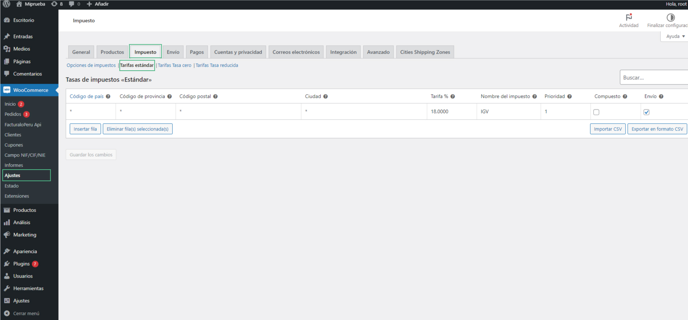

# Plugin API

El plugin de facturación electrónica brindará una solución integral para generar comprobantes electrónicos directamente desde una tienda en línea. Además, permite realizar un seguimiento en tiempo real del estado actual de tus comprobantes y sincronizará automáticamente el inventario.

En este artículo te enseñaremos a descargar el plugin para activarlo en tu wordpress. Sigue estos pasos para realizarlo:

Descarga los siguientes plugins:

- WooCommerce
- WC - APG NIF/CIF/NIE Field
- FacturaloPeru
- Ubigeo-peru

:::info IMPORTANTE
Tener una instalación limpia de Wordpress superior a la versión 5.0.1
:::

## Plugin WC - APG NIF/CIF/NIE Field

Para instalar este plugin, nos dirigimos a **Plugins**, seguido seleccionamos **Añadir nuevo** y buscamos el plugin.

Este plugin agrega el campo correspondiente al RUC/DNI del cliente, tanto en el formulario de compra como en el detalle del pedido, además de incluirlo en el envío hacia el API.

Selecciona las siguientes casillas de selección:

:::info IMPORTANTE
Con el plugin Facturaloperu-wp-api-invoice, al completar este campo del formulario con un **DNI/RUC** válido, es capaz de autocompletar los campos correspondientes.
:::

## Plugin Facturalo 2.0

Descargar el plugin desde el siguiente link: **https://conejo.buho.host/facturador.zip**

Se descargara el plugin como archivo comprimido.

Desde el panel de administración de Wordpress, ir al menú Plugins -> Añadir nuevo. Pulsar sobre el botón superior "Subir plugin", en la siguiente pantalla aparecerá un botón para seleccionar archivo, cargar el plugin. Seguido el botón **Instalar ahora**.

Para habilitar el plugin, haz clic en el botón **"Activar Plugin"**.

### Configuración previa para conectar el API con el sistema de facturación

Es importante configurar los siguientes cuatro parámetros principales para el envío de boletas y facturas; de lo contrario, generará errores al momento de la ejecución.

Ingresa los siguientes datos:

1.  **API_TOKEN:** Ingresa el api-token que se encuentra en tu sistema de facturación, en el módulo Usuarios/Locales & Series, en la subcategoría Usuarios.
    

2.  **API_URL:** Ingresa la URL de tu sistema de facturación.

:::info IMPORTANTE
La URL debe contener http o https, el subdominio del cliente en el facturador y finalizar en **/api/** para su correcto funcionamiento.
:::

3.  **FACTURA:** Ingresa la serie que usas para realizar facturas.

4.  **BOLETA:** Ingresa la serie que usas para realizar boletas.

Seguido selecciona el botón de **Guardar cambios**.

## Ubigeo-peru

Descargar el plugin desde el siguiente link: **https://conejo.buho.host/ubigeo.zip**

Se descargara el plugin como archivo comprimido.

Desde el panel de administración de Wordpress, ir al menú **Plugins -> Añadir nuevo.** Pulsar sobre el botón superior **"Subir plugin"**, en la siguiente pantalla aparecerá un botón para seleccionar archivo, cargar el plugin. Seguido el botón **Instalar ahora**.

Para habilitar el plugin, haz clic en el botón **"Activar Plugin"**.

Para completar el pedido, siga los pasos del siguiente **[articulo](https://fastura.github.io/admin/API-rest-documentaci%C3%B3n/Completar-pedido)**.

### Impuesto

Para agregar impuestos al producto, marca la siguiente casilla de selección:

Seguido seleccionar la siguiente opción, para no introducir impuestos:

Para configurar el porcentaje del IGV, complete los siguientes campos tal como se muestra en la imagen:

