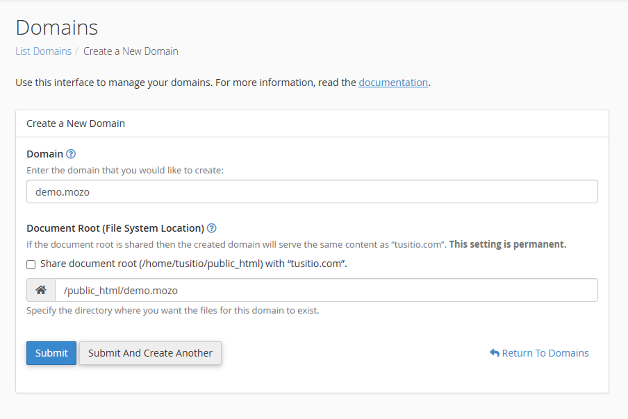
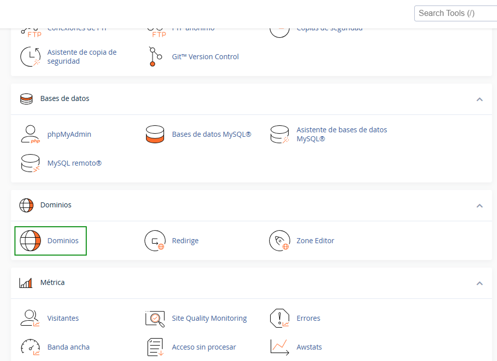
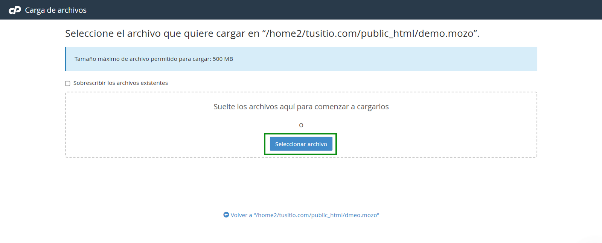
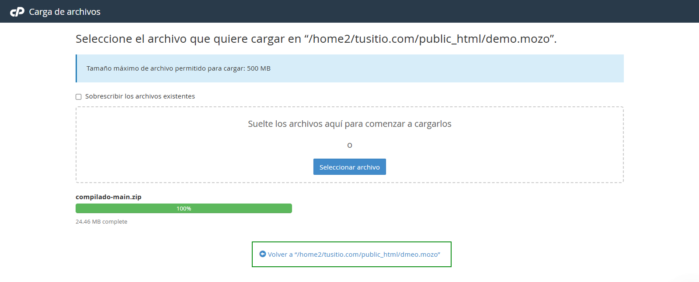
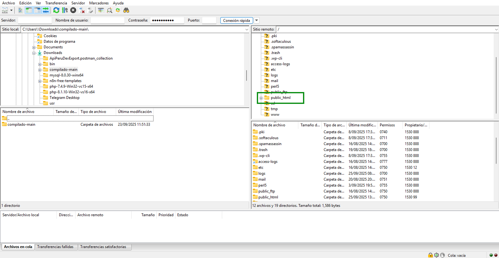
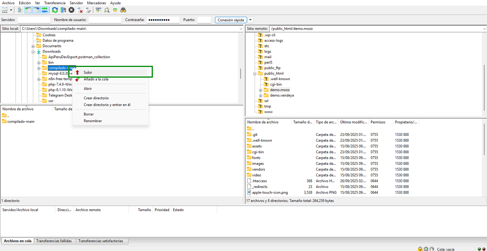
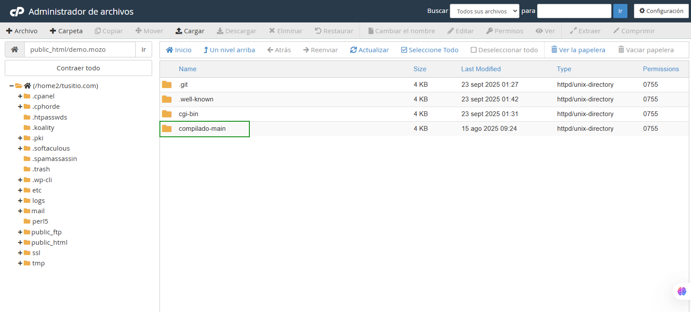
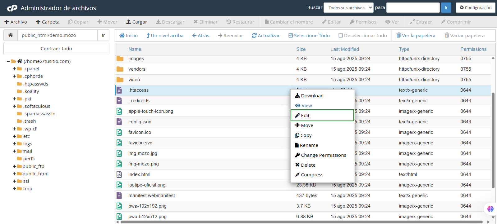
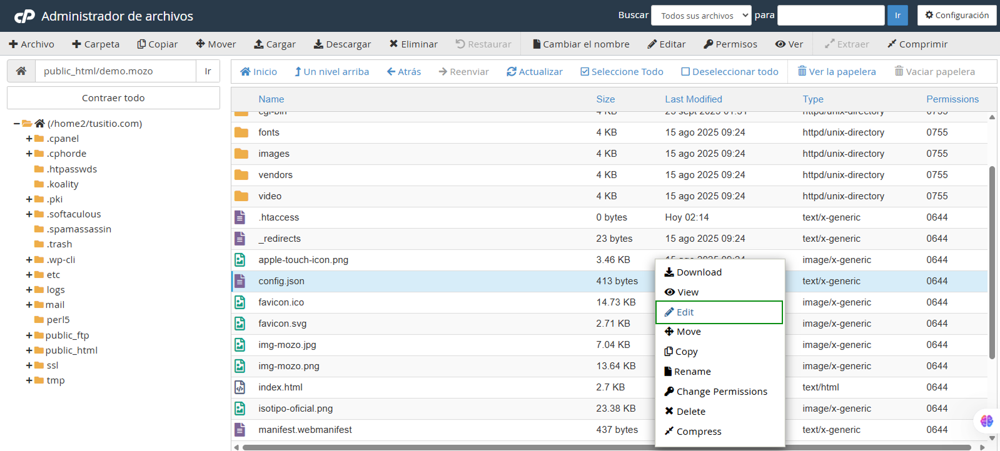
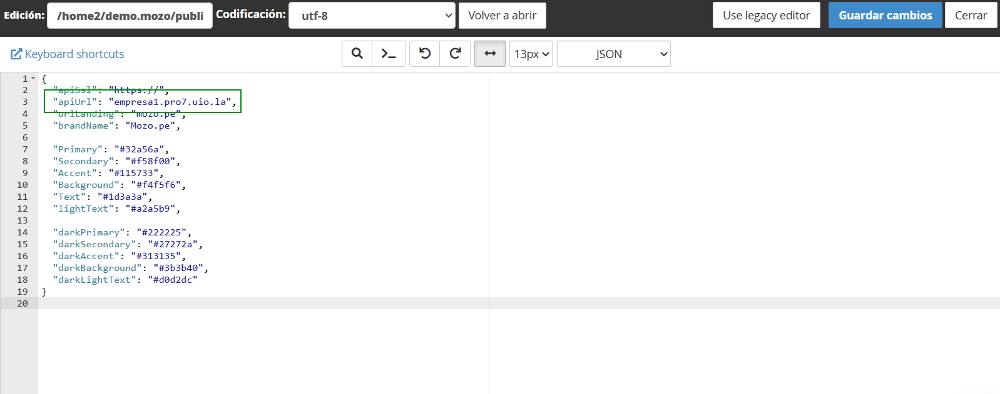

# 🚀 Instalación de Mozo en cPanel

## 🔴 Avisos Importantes

:::danger ⚠️ IMPORTANTE - Migración de Servidor GitLab
**Hemos migrado nuestro servidor de GitLab.** Si aún no has cambiado la URL del sistema (del git para descargar los cambios, etc.), te sugerimos verificar primero.

**Nueva URL:** **`git.buho.la`**
:::

:::danger ⚠️ IMPORTANTE - Descargar FileZilla
Para realizar este proceso correctamente, va a necesitar descargar **FileZilla Client** desde:

**https://filezilla-project.org/**
:::

---

## ✅ Requisitos Previos

- 📦 **[Compilado Mozo](https://git.buho.la/mozo/compilado)** disponible
- 👤 Acceso a cuenta cPanel con privilegios de administrador
- 🌐 Navegador web actualizado
- 📡 Conexión a internet estable
- 🛠️ FileZilla instalado

---

## 📋 Proceso de Instalación

### 🌍 Paso 1: Creación del Dominio

1. **Acceso a cPanel**
   - Ingresar con credenciales de administrador

2. **Navegación**
   - Ir a: **Dominios** → **Crear un Nuevo Dominio**

3. **Configuración del dominio**
   - ✏️ Ingresar el nombre del dominio deseado
   - ⚠️ **CRÍTICO:** Desmarcar la casilla de configuración automática
   - 📁 Agregar `/public_html/` al final del campo "nombre de carpeta"



:::warning NOTA CRÍTICA
Es fundamental desmarcar la casilla y agregar `/public_html/` para que la instalación funcione correctamente.
:::

---

### 📥 Paso 2: Descarga de Mozo Compilado

#### 2.1 Acceso al Repositorio
1. **Ingreso al portal**
   - 🔗 Navegar a: **https://git.buho.la/**

2. **Localización del proyecto**
   - 🔍 Buscar: `Mozo/Compilado`

3. **Descarga del código**
   - 🔵 Hacer clic en el botón **"Code"**
   - 📦 Seleccionar **"Download source code"**
   - 🗜️ Elegir formato **.zip**

   

4. **Almacenamiento local**
   - 💾 Guardar en carpeta de fácil acceso

---

### 📤 Paso 3: Subida de Archivos al Servidor

:::tip RECOMENDACIÓN
Se sugiere usar FileZilla para evitar errores. También permite personalizar logos e imágenes del aplicativo Mozo.
:::

#### 3.1 Navegación en cPanel (Método Básico)

:::note MÉTODO ALTERNATIVO
En caso de errores con la subida directa por cPanel, utilice el **Método 3.2 - FileZilla** que se encuentra a continuación.
:::

1. **Acceso a dominios**
   - 🏠 En cPanel → **Dominios**



2. **Acceso al dominio**
   - 📂 Ingresar a la ruta del dominio creado


3. **Función de carga**
   - ⬆️ Seleccionar **"Cargar"** o **"Upload"**


#### 3.2 Carga del Archivo ZIP

1. **Selección del archivo**
   - 📁 Elegir el archivo `.zip` descargado



2. **Proceso de carga**
   - ⏳ Esperar que la barra indique "Completado"
   - 🔄 Regresar a la carpeta raíz del dominio



#### 3.2 Subida con FileZilla (Método Recomendado)

:::warning CUÁNDO USAR ESTE MÉTODO
- En caso de errores en la subida directa por cPanel
- Para personalizar logos e imágenes del aplicativo Mozo
- Como método principal recomendado para mayor confiabilidad
:::

##### Requisitos de Conexión

Antes de comenzar, necesitará obtener de su cPanel:

1. **📡 Shared IP Address** (Dirección IP compartida)
2. **👤 Usuario actual** de cPanel  
3. **🔐 Contraseña** de cPanel

##### Proceso de Conexión y Subida

1. **Interfaz de FileZilla**

FileZilla funciona con una interfaz dividida:
- **📁 Sección izquierda:** Sus archivos locales (PC/laptop)
- **🌐 Sección derecha:** Carpetas de su cPanel


2. **Localización de la carpeta del dominio**

En su cPanel necesitará buscar la carpeta del dominio que creó:
- **📍 Recordar:** La creamos con el prefijo `/public_html/`
- **🎯 Ubicación:** Esto es crucial para localizar correctamente nuestra carpeta de trabajo



3. **Acceso a la carpeta del dominio**

- **🖱️ Clic derecho** sobre la carpeta para abrirla
- **👁️ Visualizar** los dominios disponibles
- **✅ Seleccionar** el dominio donde instalaremos Mozo Compilado


4. **Subida de archivos**

:::info PREPARACIÓN PREVIA
En la sección izquierda debe tener su compilado **ya extraído** (en carpeta, no en ZIP).
:::

- **📂 Localizar** la carpeta del compilado en la sección izquierda
- **🖱️ Clic derecho** sobre la carpeta
- **⬆️ Seleccionar** la opción **"Subir"**
- **✅ Confirmar** la transferencia



:::success PROCESO COMPLETADO
Con esto habrá terminado la subida de archivos a cPanel usando el método recomendado de FileZilla.
:::

---

### 📂 Paso 4: Extracción y Organización

:::note APLICABLE SOLO AL MÉTODO 3.1
Si utilizó FileZilla (Método 3.2), puede omitir este paso ya que los archivos se subieron directamente extraídos.Puede ir directamente al paso 5.
:::

#### 4.1 Extracción del ZIP

1. **Localización del archivo**
   - 🔍 Buscar el archivo ZIP en la carpeta raíz

2. **Proceso de extracción**
   - 🖱️ Clic derecho sobre el archivo
   - 📦 Seleccionar **"Extract"** (Extraer)


:::info LIMPIEZA
Ya puedes eliminar el archivo ZIP tras la extracción.
:::

#### 4.2 Organización de Archivos

1. **Acceso a la carpeta compilado**
   - 📁 Ingresar a la carpeta `compilado` creada



2. **Selección de archivos**
   - ☑️ Usar "Seleccionar todo"
   - ✅ Verificar que todos los archivos estén marcados

3. **Movimiento a raíz**
   - 🔄 Hacer clic en **"Mover"**


   - 🎯 En el modal: seleccionar carpeta raíz del dominio
   - 🧹 Eliminar prefijo `compilado-main` para dejar solo el nombre del dominio


:::tip LIMPIEZA
Elimina la carpeta `compilado` vacía para mantener el orden.
:::

---

### ⚙️ Paso 5: Configuración del Sistema

#### 5.1 Configuración del .htaccess

1. **Creación del archivo**
   - 📄 Crear archivo `.htaccess` en la carpeta raíz


**Si el archivo no aparece:**

:::note Configuración de visibilidad
**Solución:** Ir al botón **"Configuración"** (esquina superior derecha) y activar **"Mostrar archivos ocultos"**
:::


2. **Contenido del archivo**
   - ✏️ Editar el archivo y agregar:



```apache
# Archivo necesario para funcionamiento SPA en Apache
<IfModule mod_rewrite.c>
    RewriteEngine On
    
    # Condición: si el archivo o directorio solicitado no existe
    RewriteCond %{REQUEST_FILENAME} !-f
    RewriteCond %{REQUEST_FILENAME} !-d
    
    # Redirigir todas las peticiones al index.html
    RewriteRule ^ index.html [L]
</IfModule>
```

3. **Guardado**
   - 💾 Guardar cambios y cerrar editor

#### 5.2 Configuración del config.json

1. **Localización del archivo**
   - 🔍 Buscar y abrir `config.json` en la raíz



2. **Verificación de rutas**
   - ✅ Verificar que la ruta principal esté configurada según su dominio



:::danger CRÍTICO - apiUrl
El `apiUrl` debe apuntar al sistema del cliente final. El cliente debe existir primero antes de configurar Mozo.

**📍 Importante:** Este es el dominio que usted creó cuando configuró al cliente en su panel de administración.

**Ejemplo:** Si su dominio principal es `pro7.com`, el apiUrl del cliente sería `cliente.pro7.com`
:::

3. **Ajustes finales**
   - 🔧 Realizar ajustes según configuración específica
   - 💾 Guardar cambios y cerrar archivo

---

## ✅ Verificación de la Instalación

### 🧪 Pasos de Verificación

1. **Acceso inicial**
   - 🌐 Ingresar al dominio desde navegador web

2. **Verificación de carga**
   - ✅ Confirmar que Mozo se carga correctamente

3. **Prueba de navegación**
   - 🔗 Probar navegación entre secciones

4. **Verificación de errores**
   - ❌ Confirmar ausencia de errores 404

### 🔐 Ruta de Acceso al Sistema

Una vez completada la instalación exitosamente:

```
{su_dominio}/auth/login
```

**📋 Ejemplos:**
- `mirestaurante.com` → `https://mirestaurante.com/auth/login`
- `pedidos.miempresa.com` → `https://pedidos.miempresa.com/auth/login`

---

## 🔧 Solución de Problemas

| 🚨 Problema | 🔍 Posible Causa | 💡 Solución |
|-------------|------------------|-------------|
| Error 404 en navegación | `.htaccess` mal configurado | Verificar configuración del archivo `.htaccess` |
| Aplicación no carga | Ruta incorreta en `config.json` | Revisar y corregir rutas en configuración |
| Archivos no encontrados | Archivos mal ubicados | Verificar que archivos estén en carpeta raíz |

---

## 📝 Notas Finales

:::info Recomendaciones
- **📋 Respaldo:** Mantener copia de seguridad antes de cambios
- **🔒 Seguridad:** Usar credenciales seguras para cPanel  
- **📞 Soporte:** Consultar documentación o equipo de soporte ante problemas
- **🔄 Actualizaciones:** Mantenerse al día con actualizaciones del sistema
:::

---

:::success ¡Instalación Completada!
Su sistema Mozo debería estar funcionando correctamente. Si encuentra problemas, revise cada paso o consulte con soporte técnico.
:::