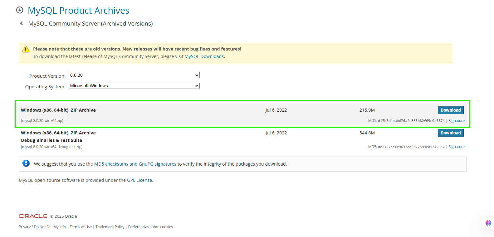
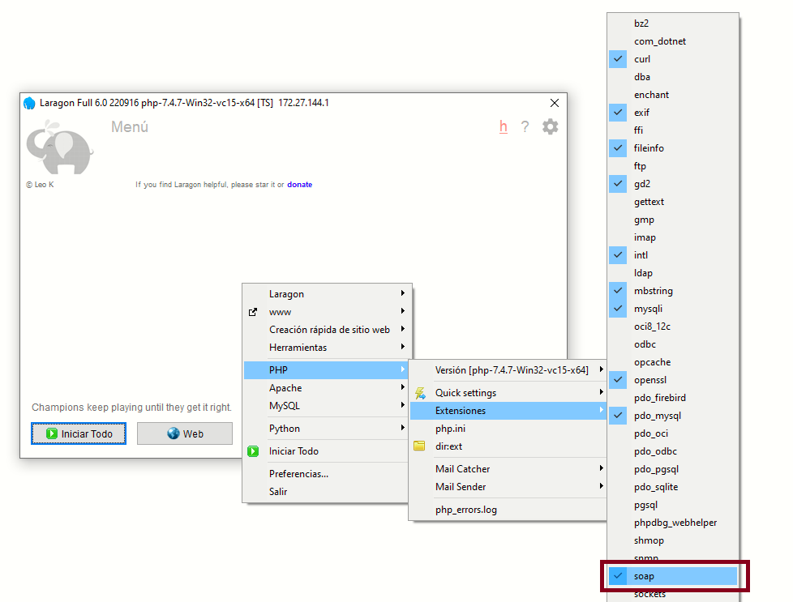
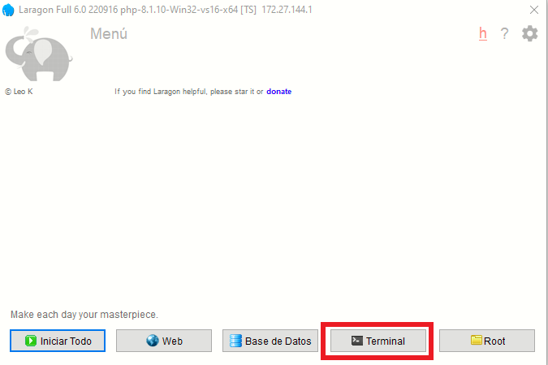
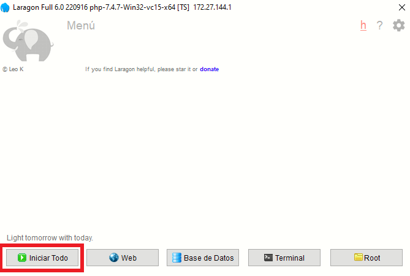
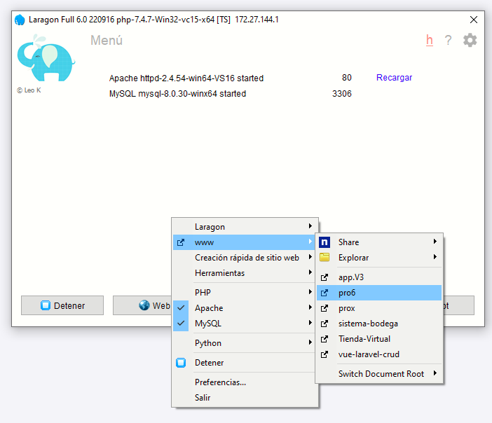

# Windows

Guía paso a paso para instalar y ejecutar el sistema de facturación en Windows.

---

## Requisitos Previos

Antes de instalar, tenga en cuenta que existen dos versiones del facturador: **Pro8** y **ProX**, cada una con sus propios requisitos.

### Pro 8

| Tecnología | Versión |
|------------|---------|
| PHP        | 8.2     |
| MySQL      | 5.7     |
| Laravel    | 9       |
| Node       | 18      |

### ProX

| Tecnología | Versión |
|------------|---------|
| PHP        | 8.1     |
| MySQL      | ^5.7    |
| Laravel    | ^9.0    |
| Node       | ^14.17  |

---

## Instalación de Herramientas

### 1. Laragon

Laragon es el entorno de desarrollo que utilizaremos para ejecutar el facturador.

**Descargar:** [laragon.org/download](https://laragon.org/download/)  

---

### 2. PHP

#### Descarga

Acceda al repositorio oficial: [Repositorio PHP](https://windows.php.net/downloads/releases/archives/)

**Versión recomendada:** [php-8.3.16-Win32-vs16-x64.zip](https://windows.php.net/downloads/releases/archives/php-8.3.16-Win32-vs16-x64.zip)

#### Instalación

1. Descargue el archivo ZIP de PHP
2. Navegue hasta la carpeta de Laragon: `C:\laragon\bin\php`

   

3. Copie el archivo ZIP dentro de la carpeta `php` y extraiga usando **"Extraer en..."**

   

4. Configure esta versión como predeterminada en Laragon:

   

---

### 3. MySQL

#### Descarga

Acceda al repositorio oficial: [MySQL Archives](https://downloads.mysql.com/archives/community/)

**Versión recomendada:** [mysql-8.0.30-winx64.zip](https://downloads.mysql.com/archives/get/p/23/file/mysql-8.0.30-winx64.zip)

#### Instalación

1. Descargue el archivo ZIP de MySQL

   

2. Navegue hasta: `C:\laragon\bin\mysql`

   

3. Copie el archivo ZIP dentro de la carpeta `mysql` y extraiga usando **"Extraer aquí"**

   

4. Configure esta versión como predeterminada en Laragon:

   

---

## Configuración de Laragon

### Extensión SOAP

Verifique que la extensión SOAP esté activada en el archivo `php.ini`:



> **⚠️ IMPORTANTE:** Esta extensión es necesaria para la creación de facturas. Si no está activada, algunas funciones fallarán.

---

### Servicios y Puertos

Si experimenta conflictos de puertos, puede cambiarlos desde:

**Laragon → ⚙️ → Servicios & Puertos**


---

### Hostname

Configure el dominio local según su preferencia. Por ejemplo: `{name}.test`, `{name}.pe`, `{name}.oo`


---

## Instalación del Proyecto

### Paso 1: Abrir Terminal

Abra Laragon y haga clic en **Terminal**. Trabajará dentro de la carpeta `C:\laragon\www`



---

### Paso 2: Clonar el Proyecto

1. Acceda a su cuenta de GitLab y seleccione el proyecto (Pro8)

   

2. Copie la URL que aparece en **"Clone with HTTPS"**

3. En la terminal, ejecute:

   ```bash
   git clone [URL_copiada]
   ```

4. Ingrese su usuario y contraseña cuando se le solicite

---

### Paso 3: Crear Base de Datos

> **⚠️ Precaución:** Antes de continuar, verifique que no haya otros servicios de MySQL ejecutándose en su máquina. Detenga cualquier servicio MySQL activo antes de proceder.

1. En Laragon, haga clic en **Base de datos**

   

2. Seleccione una sesión y presione **"Abrir"**

   

   *Si no tiene una sesión, créela con el botón **"Nueva"***

3. Cree una nueva base de datos:
   - Haga clic derecho en el nombre de la sesión
   - Seleccione la opción para crear base de datos

   

> **💡 Importante:** Recuerde el nombre de su base de datos, lo necesitará más adelante.

---

### Paso 4: Configurar el Proyecto

1. Verifique que esté en la carpeta correcta con el comando `ls`

2. Ingrese a la carpeta del proyecto:

   ```bash
   cd pro8
   ```

3. Cree el archivo de configuración:

   ```bash
   cp .env.example .env
   ```

4. Edite el archivo `.env` y modifique estas variables:

   ```env
   APP_URL_BASE=pro8.test
   ```
   
   *Reemplace `pro8` por el nombre de su carpeta y `.test` según su configuración de Hostname*

   ```env
   DB_DATABASE=nombre_de_su_base_de_datos
   ```
   
   *Ingrese el nombre de la base de datos creada en el Paso 3*

---

### Paso 5: Instalar Dependencias

Ejecute el siguiente comando:

```bash
composer install
```

---

### Paso 6: Configurar el Proyecto

Ejecute estos comandos uno por uno:

```bash
php artisan key:generate
composer dump-autoload
php artisan migrate --seed
php artisan storage:link
```

---

### Paso 7: Iniciar el Servidor

En Laragon, presione el botón **"Iniciar todo"**



Esto iniciará el servidor Apache y MySQL.

---

### Paso 8: Acceder al Sistema

1. En Laragon, haga clic derecho y seleccione la opción **"www"**

   

2. Se abrirá la página de login. Use estas credenciales:

   **Correo electrónico:** `admin@gmail.com`  
   **Contraseña:** `123456`

   

---

## ✅ Instalación Completada

El sistema ya está listo para usar. Si experimenta algún problema, revise cada paso cuidadosamente o contacte al soporte técnico.

---

*Sistema de Facturación Pro 8*