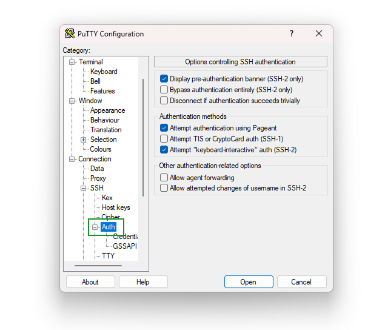

# CONEXIÓN REMOTA - SSH

Para conectarse vía remota debe solicitar si no posee los siguientes puntos

 1. Clave SSH (archivo .pem, .ppk u otro formato)
 2. IP del servidor (en algunos casos puede utilizar el dominio)
 3. Usuario SSH y contraseña si posee

### Vía Putty (.ppk)

Si no posee el programa puede descargarlo en **https://www.putty.org/** 

Instale el programa y ejecutelo, al abrir se mostrará una ventana donde debe ingresar los datos

En el primer campo ingrese la IP del servidor, como alternativa puede ingresar el usuario también, un ejemplo sería el siguiente:

ubuntu@192.168.1.1

En el campo saved sessions puede añadir algun nombre para guardar la sesión que se mostrará en la lista inferior de la ventana

Luego añada la clave ssh ingresando al menú **Connection/SSH/Auth,** 

Una vez allí pulse sobre el boton **+** y seleccione **Credentials**, por ultimo ubique el boton  **Browse** y diríjase hasta la carpeta donde se encuentra su clave **SSH**.

Una vez ingresada puede volver al menú **Sessions** y guardar pulsando sobre el botón **save**

Si no desea guardar la sesión, puede pulsar sobre Open para abrir la consola de comandos del servidor, si ha ingresado el usuario en el campo Host name, se conectará automáticamente, si contiene contraseña le será solicitada al abrir la consola

debe tener en cuenta que en una consola no son mostradas las contraseñas en pantalla, debe ingresarlas y pulsar enter al finalizar.

### Vía WinScp (.ppk .pem)

Si no posee el programa, puede descargarlo de **[https://winscp.net/eng/download.php](https://winscp.net/eng/download.php)**

### Vía Consola-Terminal (.ppk .pem directo)

debe disponer de una consola, si posee puede descargar git desde el siguiente enlace: **[https://git-scm.com/download/win](https://git-scm.com/download/win)**

