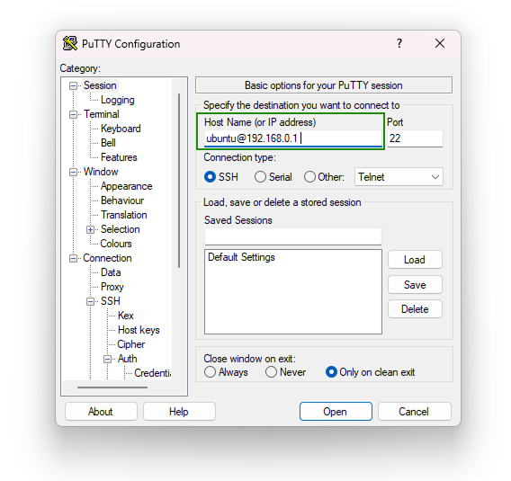
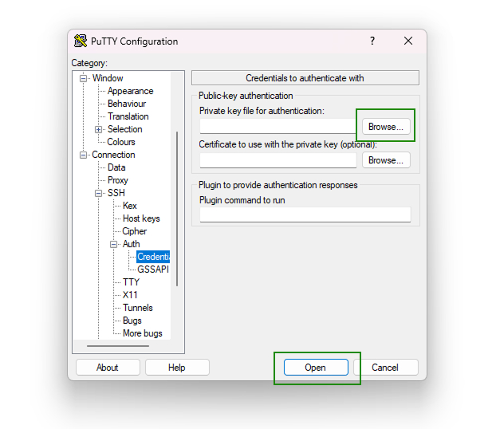
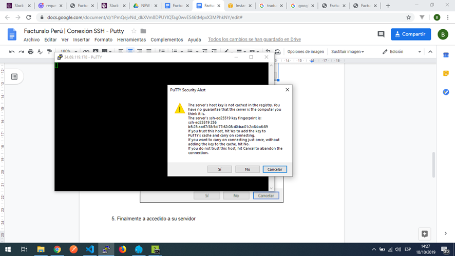
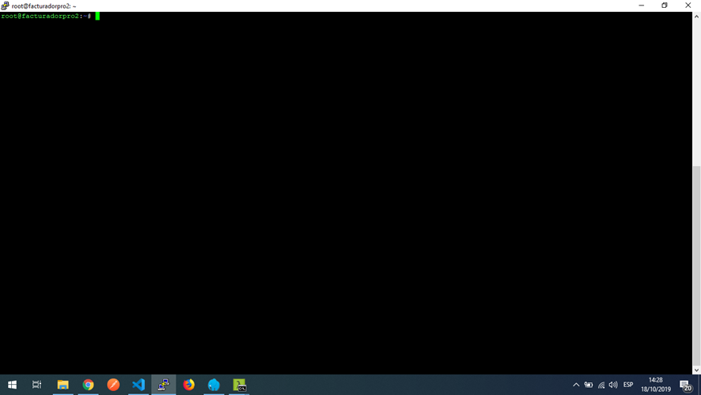

# Conexión SSH - Putty

1. Aperture putty, e ingrese su usuario e ip del servidor de la siguiente forma

**ubuntu@192.168.0.1**

2. Dirijase a la categoria **Connection - SSH - Auth**

3. Seleccione **Credentials**, por ultimo de clic en el boton **“Browse”**, debera buscar la llave privada de su servidor, seleccionela y de clic en “Open”.

4. Le mostrara la siguiente ventana, seleccione NO

5. Finalmente a accedido a su servidor

