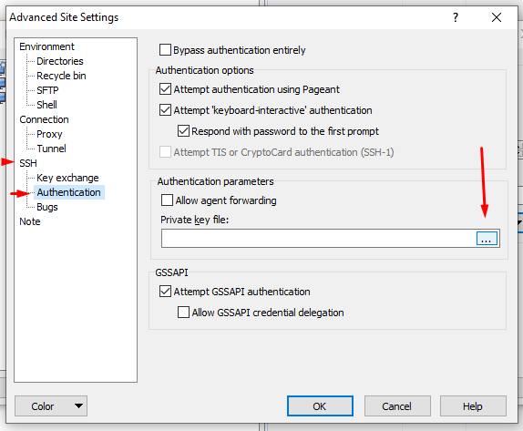
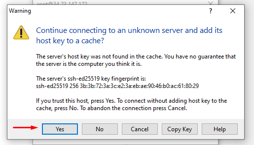
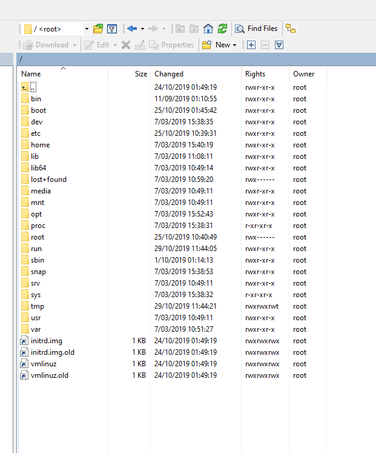
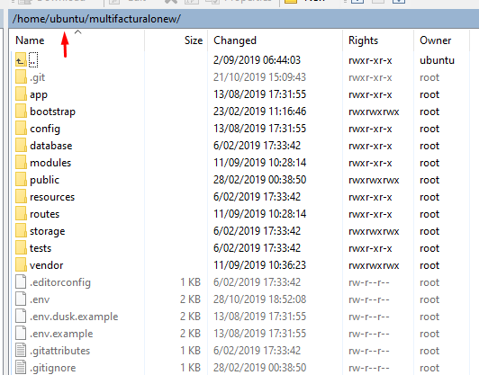
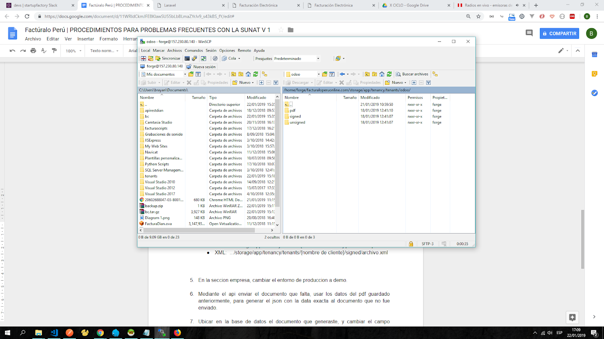

# Conexión servidor - Winscp

### 1. Aperturar Winscp

2. Debe ingresar los datos solicitados:
•	Hostname: ip de su servidor
•	Username: usuario del servidor
•	Password: si es que lo hubiese, caso contrario use la llave privada

•	Llave privada:
1.	Clic en el boton advanced
2.	Dirijase a SSH - Authentication - Private Key File
3.	Seleccione su llave privada
4.	Clic en Ok
5.	Clic en el boton Login

 

### 3. Visualizara la siguiente ventana, clic en Yes

 

### 4. Se conectara a su servidor, visualizará de forma gráfica la carpetas

 

### 5. Diríjase a la carpeta de su proyecto, debe ubicarse en /home/ubuntu/.. o /root/… o /home/user_name/… .

 
1. Si desea realizar un backup de sus archivos:
Dentro de su proyecto, diríjase a storage/app, visualizara 3 carpetas:
   •	certificates: almacena los certificados digitales
   •	public: almacena imagenes (logo)
   •	tenancy/tenants: almacena las carpetas de las empresas o clientes, cada empresa tendra una carpeta y dentro de la misma guardara informacion de los documentos que se vayan generando

Si desea subir un archivo a su proyecto:

Dentro de su proyecto, dirijase a storage/app/tenancy/tenants:

•	Ubique el cliente o empresa al cual subira el archivo, el nombre de la carpeta depende del cliente registrado será tenancy_nombre_cliente

 

•	Después de acceder al cliente, visualizará las carpetas de los documentos generados, dependiendo del tipo de archivo que vaya a subir deberá acceder a la carpeta respectiva

 

