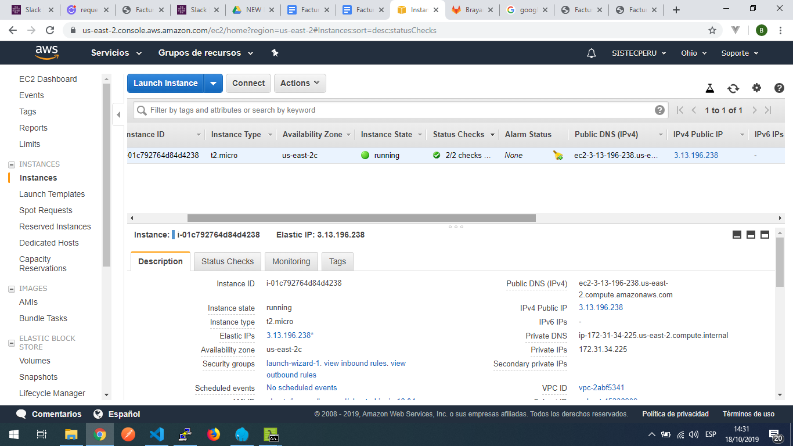
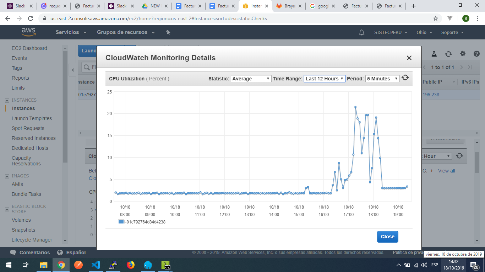

# Iniciar servicios docker 

1. Acceda a la consola de aws o google cloud y verificar el estado de su instancia, si se encuentra detenida, debera iniciarla.

2. Conectarse via ssh a su instancia, puede **[visitar la guía](https://docs.google.com/document/d/1PmQejvNd_dkXVm8DPUYlQTag0wvES46tMpxX3MPhkNY/edit?tab=t.0#heading=h.nezjsyganf1w)**

3. Cambiar a super usuario, ejecute: **sudo su -**

4. Verificar el estado de los contenedores, ejecute: docker ps -a, todos los contenedores deberan tener el status Up xx xxxxx, caso contrario deberá iniciarlo o reiniciarlo, ejecute:

CONTAINER ID        IMAGE                      COMMAND                     CREATED             STATUS              PORTS                                      NAMES
92f43f53f8e4             stenfrank/php:1.0     "php-fpm7.2"                    18 hours ago        Up 18 hours         9000/tcp                                   multifacturalo_fpm2_1
914a35c72512          redis:alpine               "docker-entrypoint.s…"   18 hours ago        Up 18 hours         0.0.0.0:6381->6379/tcp             multifacturalo_redis2_1
de282cbbbc15          mariadb                    "docker-entrypoint.s…"   18 hours ago         Up 18 hours         0.0.0.0:3307->3306/tcp             multifacturalo_mariadb2_1
eb049c8dba9c          stenfrank/nginx:1.0   "nginx"                             18 hours ago        Up 18 hours         80/tcp                                         multifacturalo_nginx2_1

Iniciar contenedor: docker start nombre_contenedor, el nombre del contenedor lo ubica en la columna names.
Reiniciar contenedor: docker restart nombre_contenedor, el nombre del contenedor lo ubica en la columna names.

5. Si el problema persiste y el contenedor no inicia, realice lo siguiente:

Dirijase a la carpeta de su proyecto, debe ubicarse en /home/ubuntu/.. o /root/… o /home/user_name/… .

Una vez accedido, liste los archivos con el comando ls, deberá visualizar el archivo docker  docker-compose.yml

Ejecute el comando docker-compose down, espere a que el procedimiento se realice de forma correcta, ira visualizando que los contenedores se van listando y aparece la palabra done al lado derecho de cada uno.

Despues ejecute el comando, docker-compose up -d, espere a que el procedimiento se realice de forma correcta, ira visualizando que los contenedores se van listando.

6. Ejecute nuevamente el comando docker ps -a, y valide el estado de los contenedores, si todo se encuentra correcto, verifique el correcto funcionamiento de la aplicación web.

CONTAINER ID        IMAGE                      COMMAND                     CREATED             STATUS              PORTS                                      NAMES
92f43f53f8e4             stenfrank/php:1.0     "php-fpm7.2"                    18 hours ago        Up 18 hours         9000/tcp                                   multifacturalo_fpm2_1
914a35c72512          redis:alpine               "docker-entrypoint.s…"   18 hours ago        Up 18 hours         0.0.0.0:6381->6379/tcp             multifacturalo_redis2_1
de282cbbbc15          mariadb                    "docker-entrypoint.s…"   18 hours ago         Up 18 hours         0.0.0.0:3307->3306/tcp             multifacturalo_mariadb2_1
eb049c8dba9c          stenfrank/nginx:1.0   "nginx"                             18 hours ago        Up 18 hours         80/tcp                                         multifacturalo_nginx2_1

### Recomendaciones para monitorear servidor

1. Conectarse a la instancia via ssh y usar el comando htop, visualizara el estado uso del cpu, memoria, procesos ejecutandose, etc.

2. Visualice el espacio en disco, con el comando df -h,  en este caso el disco se encuentra con 16gb disponibles - /dev/xvda1

3. Dirijase a la consola de aws, sección Instances, ubique su instancia en el listado de instancias, verifique la columna Status Checks, se muestra el estado de la comprobacion que realiza AWS para identificar problemas relacionados a los recursos. 

4. Dirijase a la consola de aws, sección Instances, ubique la pestaña Monitoring,  visualizara diversos graficos estadisticos, relacionados a la instancia, verifique y analice cada uno, por ejemplo el uso de cpu, memoria, picos altos, etc.

Utilice los filtros, considerando la fecha y hora en la cual su servidor tuvo problemas, para poder veirificar y analizar el uso en dicho momento.

