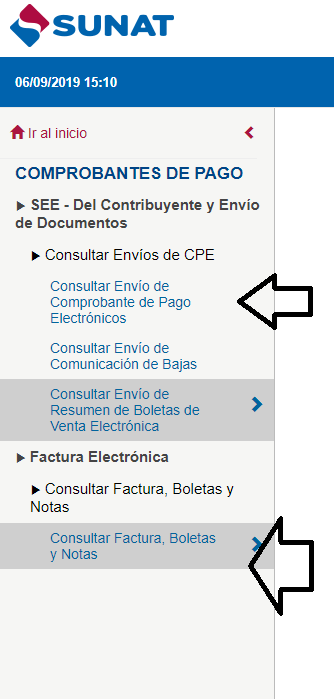
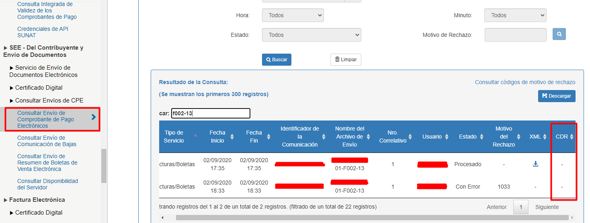
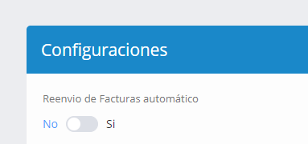
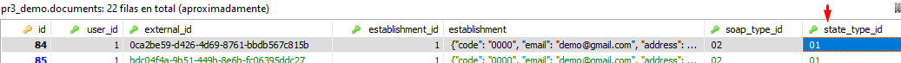
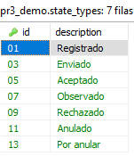
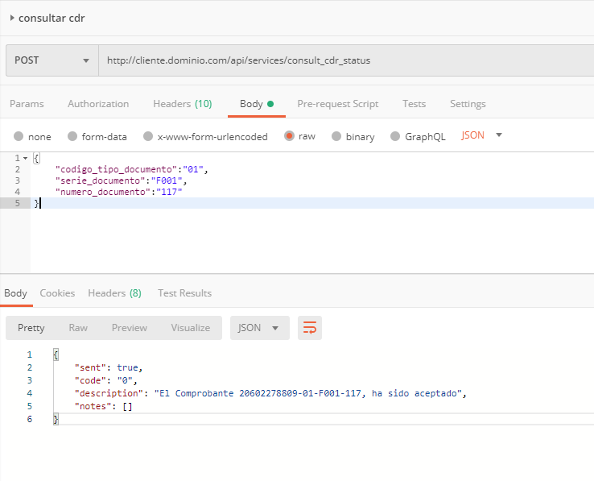

# Procedimiento para Solucionar Error 1033 - SUNAT

## Error: 1033, El comprobante fue registrado previamente con otros datos

### 1. Documento no registrado en base de datos del sistema, pero sí en SUNAT

#### Casuística
Se generó una factura electrónica, esta fue enviada a SUNAT, su servidor agotó el tiempo de espera del sistema (facturador), sin embargo, SUNAT la procesó y la registró en sus servidores.

#### Incidencia
Al no registrarse el documento, el correlativo se encuentra desfasado, por lo tanto, al generar otro comprobante, este no se genera correctamente y presenta el error 1033.

#### Causas
- Servicio de la SUNAT saturado
- Problemas de respuesta de CDR
- Bad Gateway

### Alternativa de Solución

1. Identificar el documento que fue enviado y aceptado por SUNAT, pero no se encuentra registrado en la base de datos del facturador.
2. Verifique la serie y el número de documento, este debe ser igual al siguiente correlativo del último documento generado.
3. Verificar el estado de documento en el portal de SUNAT, en las siguientes opciones.




Una vez ubicado el documento en SUNAT, descargue el CDR y XML. En una de las opciones de búsqueda del menú, visualizará el documento generado con todos los datos (cliente, ítems, montos, etc.), caso contrario visualice en el XML.

**OBS:** Si no ubica el CDR, puede usar el método para consultarlo (disponible por API). Diríjase al punto 11.  
**OBS Actualizada:** Si el comprobante no posee CDR como en la imagen siguiente, diríjase al punto 12.




4. Luego de ubicar los datos del documento registrado en SUNAT, deberá generar el documento en el facturador con los datos ubicados. Puede realizarlo por la interfaz o por API, previamente debe desactivar el envío automático, para que este no sea enviado a SUNAT.

    **Módulo configuración - Avanzado**

    

5. Después de haber generado el documento, tomando como referencia los datos ubicados en el comprobante registrado en SUNAT, deberá subir el CDR a la carpeta de la empresa.

    Puede usar **WinSCP - Guía conexión**

    **Suba el archivo**

    Dentro de su proyecto, diríjase a `storage/app/tenancy/tenants`

    Ubique el cliente o empresa al cual subirá el archivo, el nombre de la carpeta depende del cliente registrado será `tenancy_nombre_cliente`.

    

6. Después de acceder al cliente, visualizará las carpetas de los documentos generados. Dependiendo del tipo de archivo que vaya a subir deberá acceder a la carpeta respectiva, en este caso **cdr**.


7. Cambie el estado del documento por base de datos, puede usar la guía ubicada en el README del repositorio. Este estado dependerá del que visualice en el portal de SUNAT, también puede revisarlo en el CDR.

    **Estado, en tabla documents, campo state_type_id**

    

    **Estados sistema - tabla state_types**

    

Al culminar los pasos anteriores, ya habrá regularizado los documentos del sistema con los registrados en SUNAT.

### Consultar CDR - Vía API

**Requerimientos:**
- URL del cliente: Por ejemplo `http://cliente.dominio.com/api/services/consult_cdr_status`, deberá modificarla por la de su cliente.
- API token: Lo puede ubicar en el listado de usuarios.
- JSON a enviar: Ejemplo a continuación.

```json
{
    "codigo_tipo_documento": "01",
    "serie_documento": "F001",
    "numero_documento": "117"
}
```

**Descripción:**
- `codigo_tipo_documento`: Código del tipo de documento de acuerdo al catálogo de SUNAT.
- `serie_documento`: Serie de su CPE.
- `numero_documento`: Número o correlativo de su CPE.

Si no conoce el manejo de la API, puede verificar la documentación.




### Consultar CDR

En el listado de comprobantes pulse sobre el botón opciones. 


En la ventana pulse sobre el botón consultar y habrá regularizado su comprobante, obteniendo el CDR y su estado correcto.

