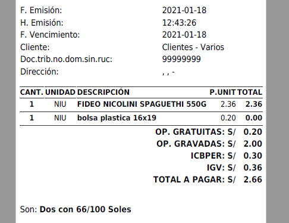
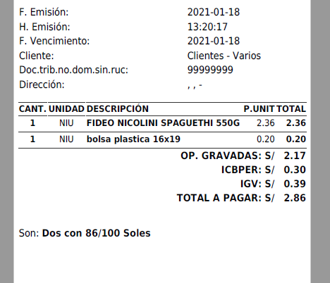

# Manual de Uso ICBPER

## Ventas | POS

### 2021
facturaloperu.com

## Manejo del ICBPER

Las Bolsas Plásticas son bienes que pueden ser entregados gratuitamente o en calidad de venta y que deben estar detalladas en los comprobantes de pago. Para el manejo correcto del Impuesto a las bolsas plásticas (ICBPER) siga el procedimiento.

### Creando el Producto afecto al ICBPER (Bolsas Plásticas)

1. En Catálogo de Productos, crear un producto con las especificaciones de la bolsa plástica. Se recomienda detallar las medidas de la misma.
2. Asignarle un Código Interno práctico, ejemplo: B10, B20 o el más conveniente.
3. Activar el check de “Impuesto a las bolsas”, ver imagen.
4. Asignarle el precio de venta referencial o conveniente (en caso se venda).
5. Seleccionar el “Tipo de Afectación” Correcta:
    - Si la bolsa será obsequiada, seleccionar “Exonerado Transferencia Gratuita”. Ver imagen de ejemplo.

    - Si la bolsa será vendida, el tipo de afectación será la habitual como en todos los productos que se comercializan, “Gravado Operación Onerosa” o “Exonerado Operación Onerosa” según sea la condición tributaria. Ver imagen de ejemplo.

### Facturación y Uso correcto del ICBPER

1. Una vez en POS o en Ventas – Nuevo comprobante, luego de añadir los productos a vender, deberá añadir a la lista de venta la bolsa correspondiente que se entregará (medidas) y la cantidad de las mismas.

2. Al generar el comprobante, se mostrará con el siguiente detalle correspondiente:
    - Cuando la bolsa plástica es OBSEQUIADA por el emisor:

    - Cuando la bolsa plástica es VENDIDA por el emisor:

