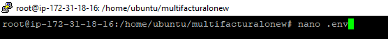
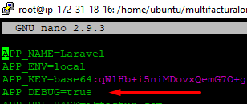
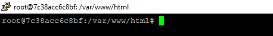

# Habilitar debug

1. Conectarse al servidor vía SSH, puede usar la guía.

2. Ubicar el directorio de su proyecto, debe ubicarse en `/home/ubuntu/...`, `/root/...` o `/home/user_name/...`.

3. Acceder a la raíz del proyecto (por ejemplo, `multifacturalonew`, `facturadorpro3`).

4. Editar el archivo `.env`:
    - Ejecute el comando `nano .env`.

   

    - Modifique la variable `APP_DEBUG` con valor `true`.

   

    - Guarde los cambios con `CTRL + X`, confirme con `Y`.

5. Acceder al contenedor PHP:
    - Ejecute `docker ps` y verifique que estén al menos las siguientes líneas que equivalen a los contenedores de cada servicio iniciado por Docker:
      ```
      CONTAINER ID        IMAGE                      COMMAND                     CREATED             STATUS              PORTS                                      NAMES
      92f43f53f8e4        stenfrank/php:1.0          "php-fpm7.2"                18 hours ago        Up 18 hours         9000/tcp                                   multifacturalo_fpm2_1
      914a35c72512        redis:alpine               "docker-entrypoint.s…"      18 hours ago        Up 18 hours         0.0.0.0:6381->6379/tcp                     multifacturalo_redis2_1
      de282cbbbc15        mariadb                    "docker-entrypoint.s…"      18 hours ago        Up 18 hours         0.0.0.0:3307->3306/tcp                     multifacturalo_mariadb2_1
      eb049c8dba9c        stenfrank/nginx:1.0        "nginx"                     18 hours ago        Up 18 hours         80/tcp                                     multifacturalo_nginx2_1
      ```

6. En la lista, fíjese en los `NAMES` que contengan `fpm` ya que deberá acceder a uno de ellos. Por ejemplo, `multifacturalo_fpm2_1` equivale al nombre del proyecto donde una vez accedido se encontrará justo en la ruta donde se ha alojado el repositorio y podrá ejecutar comandos `artisan`, `git` o `composer`. Este nombre puede variar un poco, puede llamarse `multifacturalonew_fpm1_1`.

7. Una vez ubicado el contenedor a acceder, ejecute el siguiente comando:
    ```
    docker exec -ti multifacturalonew_fpm1_1 /bin/bash
    ```

    De esta manera se conectará al contenedor y observará un cambio en el inicio de la terminal.

   

8. Ejecute los siguientes comandos:

```bash
    php artisan config:cache && php artisan cache:clear
```

    Finalmente, tendrá habilitado el modo debug.
