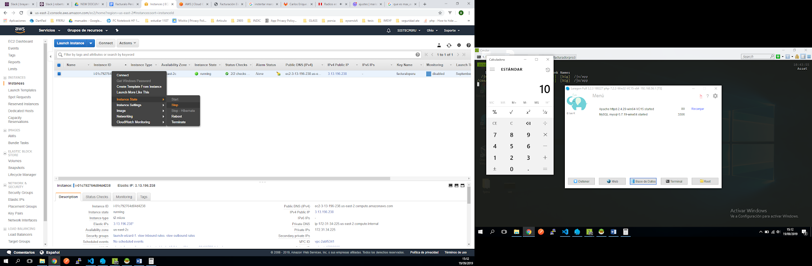
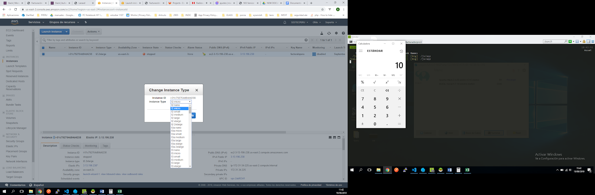
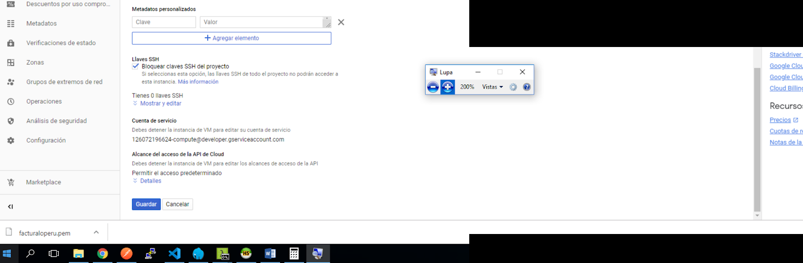

# Incrementar Recursos - Servidor

## Incrementar recursos AWS

1. Acceder a la consola de AWS, con su usuario y contraseña.
2. Dirigirse al listado de instancias - Instances.

3. Ubique la instancia a aumentar recursos.
4. Detenga la instancia para que pueda realizar la modificación.
    - Instance State -> Stop

5. Cambie el tipo de instancia.
    - Instance Settings -> Change Instance Type

6. Visualizará la siguiente ventana donde deberá elegir un tipo de instancia, cada tipo cuenta con diferentes recursos hardware.
    - [Tipos de instancia AWS](https://aws.amazon.com/es/ec2/instance-types/)

7. Si el cambio fue exitoso, debe iniciar la instancia.
    - Instance State -> Start

## Incrementar recursos GOOGLE CLOUD

1. Acceder a la consola de Google Cloud, con su usuario y contraseña.
2. Dirigirse al listado de instancias - Compute Engine - Instancias de VM.

3. Ubique la instancia a aumentar recursos.
4. Detenga la instancia para que pueda realizar la modificación.
    - Detener

5. Seleccione la instancia - clic en “facturadorpro3”.
6. Clic en editar.

7. Modifique los recursos de acuerdo a su necesidad, el costo aumentará a medida que los incremente.

8. Guarde los cambios.

9. Si el cambio fue exitoso, debe iniciar la instancia.
    - Iniciar

## Referencias

- [AWS: Cambiar tipo de instancia](https://docs.aws.amazon.com/es_es/AWSEC2/latest/UserGuide/ec2-instance-resize.html)
- [Google Cloud: Cambiar tipo de máquina](https://cloud.google.com/compute/docs/instances/changing-machine-type-of-stopped-instance)

## Recomendaciones

- Realizar backup de su base de datos y archivos.
