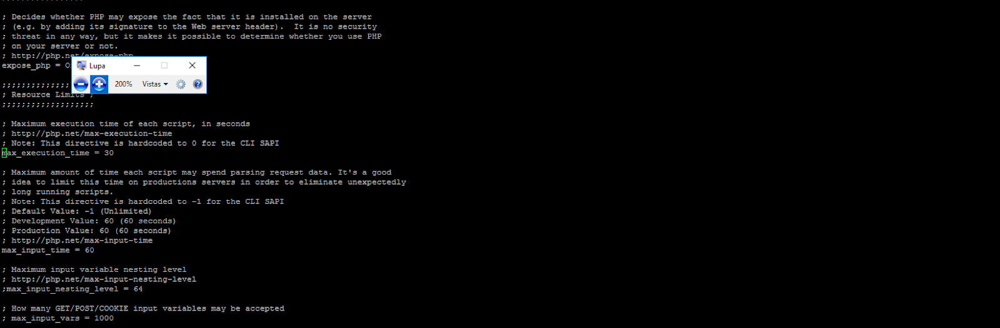

# Incrementar Recursos - Aplicación

## 1. Incrementar límite de memoria php.ini - Instalación docker

1. Conectarse vía ssh a su instancia.
2. Ejecute: `sudo su`.
3. Ejecutar `docker ps` y verificar el contenedor php:

    ```
    CONTAINER ID        IMAGE                      COMMAND                     CREATED             STATUS              PORTS                                      NAMES
    92f43f53f8e4        stenfrank/php:1.0          "php-fpm7.2"                18 hours ago        Up 18 hours         9000/tcp                                   multifacturalo_fpm2_1
    914a35c72512        redis:alpine               "docker-entrypoint.s…"      18 hours ago        Up 18 hours         0.0.0.0:6381->6379/tcp                     multifacturalo_redis2_1
    de282cbbbc15        mariadb                    "docker-entrypoint.s…"      18 hours ago        Up 18 hours         0.0.0.0:3307->3306/tcp                     multifacturalo_mariadb2_1
    eb049c8dba9c        stenfrank/nginx:1.0        "nginx"                     18 hours ago        Up 18 hours         80/tcp                                     multifacturalo_nginx2_1
    ```

4. En la lista deberá fijarse en los NAMES que contengan `fpm` ya que en él deberá acceder. `multifacturalo_fpm2_1` es el contenedor donde podrá acceder a php y modificar.
5. Una vez ubicado el contenedor a acceder, ejecute el siguiente comando:

    ```bash
    docker exec -ti multifacturalo_fpm2_1 /bin/bash
    ```

6. De esta manera se conectará al contenedor, observará un cambio en el inicio de la terminal.
7. Verifique la versión de php:

    ```bash
    php -v
    ```

8. Dependiendo de la versión que tenga instalada deberá acceder a la ruta, en este caso la instalada es 7.2, dependiendo de la versión deberá cambiar el acceso a la carpeta:

    ```bash
    cd /etc/php/7.2/fpm/
    ```

9. Editar el archivo `php.ini`, deberá usar un editor, en este caso `nano`, use el comando:

    ```bash
    nano php.ini
    ```

    Si no lo tiene instalado, deberá instalarlo:

    ```bash
    apt-get update
    apt-get install nano
    ```

10. Busque y ubique la variable `memory_limit`, es la que modificará.


11. Modifique el valor dependiendo de la cantidad que necesite, considere el límite de memoria de su servidor.
12. Ejecute `CTRL + X` para cerrar el archivo, le solicitará confirmación para que guarde los cambios, ejecute `Y` o `YES`.
13. Reinicie el servicio php-fpm:

    ```bash
    /etc/init.d/php-fpm reload
    ```

14. Salir del contenedor, ejecute el comando `exit`.

## 2. Incrementar límite de ejecución de script - php.ini - Instalación docker

`max_execution_time` establece el número de segundos que se permite la ejecución de un script.

1. Conectarse vía ssh a su instancia.
2. Ejecute: `sudo su`.
3. Ejecutar `docker ps` y verificar el contenedor php:

    ```
    CONTAINER ID        IMAGE                      COMMAND                     CREATED             STATUS              PORTS                                      NAMES
    92f43f53f8e4        stenfrank/php:1.0          "php-fpm7.2"                18 hours ago        Up 18 hours         9000/tcp                                   multifacturalo_fpm2_1
    914a35c72512        redis:alpine               "docker-entrypoint.s…"      18 hours ago        Up 18 hours         0.0.0.0:6381->6379/tcp                     multifacturalo_redis2_1
    de282cbbbc15        mariadb                    "docker-entrypoint.s…"      18 hours ago        Up 18 hours         0.0.0.0:3307->3306/tcp                     multifacturalo_mariadb2_1
    eb049c8dba9c        stenfrank/nginx:1.0        "nginx"                     18 hours ago        Up 18 hours         80/tcp                                     multifacturalo_nginx2_1
    ```

4. En la lista deberá fijarse en los NAMES que contengan `fpm` ya que en él deberá acceder. `multifacturalo_fpm2_1` es el contenedor donde podrá acceder a php y modificar.
5. Una vez ubicado el contenedor a acceder, ejecute el siguiente comando:

    ```bash
    docker exec -ti multifacturalo_fpm2_1 /bin/bash
    ```

6. De esta manera se conectará al contenedor, observará un cambio en el inicio de la terminal.
7. Verifique la versión de php:

    ```bash
    php -v
    ```

8. Dependiendo de la versión que tenga instalada deberá acceder a la ruta, en este caso la instalada es 7.2, dependiendo de la versión deberá cambiar el acceso a la carpeta:

    ```bash
    cd /etc/php/7.2/fpm/
    ```

9. Editar el archivo `php.ini`, deberá usar un editor, en este caso `nano`, use el comando:

    ```bash
    nano php.ini
    ```

    Si no lo tiene instalado, deberá instalarlo:

    ```bash
    apt-get update
    apt-get install nano
    ```

10. Busque y ubique la variable `max_execution_time`, es la que modificará.



11. Modifique el valor dependiendo de la cantidad que necesite.
12. Ejecute `CTRL + X` para cerrar el archivo, le solicitará confirmación para que guarde los cambios, ejecute `Y` o `YES`.
13. Salir del contenedor, ejecute el comando `exit`.
14. Reinicie el contenedor php-fpm:

    ```bash
    docker restart multifacturalo_fpm2_1
    ```
