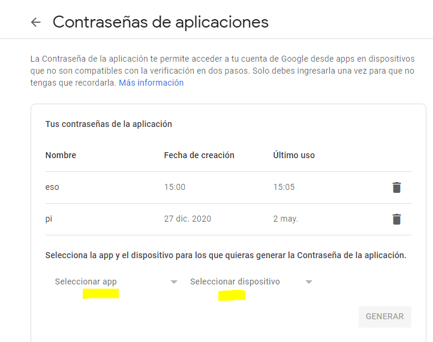
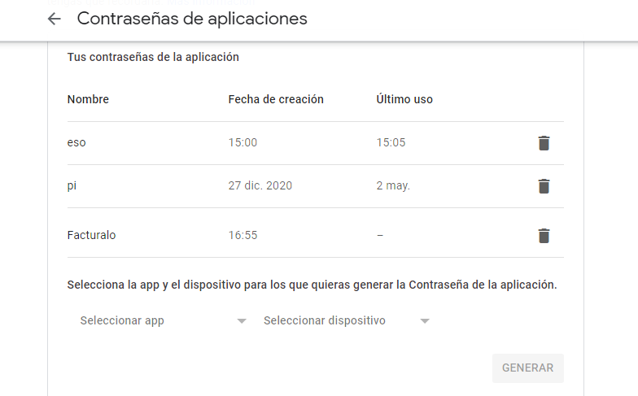
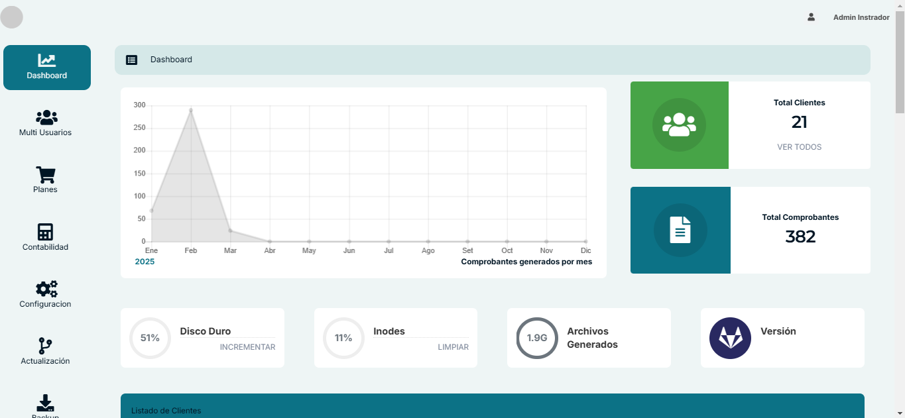
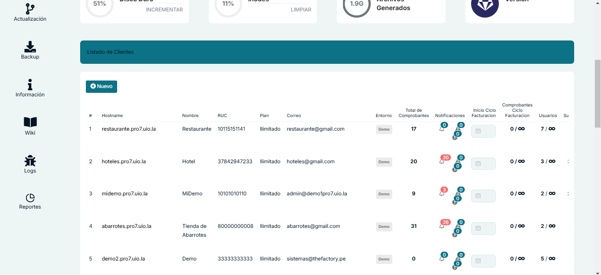
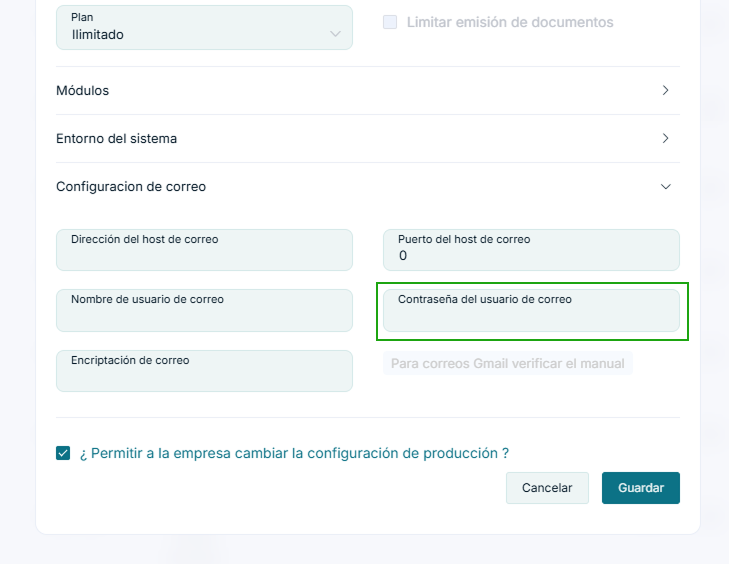

# Correo electronico emisor - Cliente

**Docker | LAMP**

### Requisitos previos

1. En la cuenta de Google, accede al apartado de [seguridad](https://myaccount.google.com/) y luego a la sección de Verificación de dos pasos.

2. Después de activarlo, crea una contraseña de aplicaciones.

3. Este apartado, generará una contraseña para que se pueda acceder desde otros dispositivos, se recomienda generarla al momento que se va insertar en el sistema ya que es recomendable no usar la contraseña para otras aplicaciones.

### Generación de contraseña de aplicaciones

1. Selecciona la aplicación, en nuestro caso, Correo electrónico.

2. Para el dispositivo, selecciona "Otra" y nómbralo (Facturalo).

3. Genera la contraseña de aplicación.

4. Copia la contraseña generada en el recuadro amarillo en el apartado de contraseña.

5. COn esto, ya tenemos generada la contraseña de la aplicacion.

### Notas adicionales

- Es posible eliminar la contraseña de aplicación si no se desea usar, sin necesidad de cambiar la contraseña de la cuenta principal.
- Si las credenciales son correctas y aún no envía correo, desbloquea el acceso de aplicaciones mediante el enlace [DisplayUnlockCaptcha](https://accounts.google.com/DisplayUnlockCaptcha).

---

## Configurar contraseña en el sistema 

Una vez ya generada la contraseña vamos a importarla. Para hacerlo siga los siguientes pasos: 

1. Entre al panel Administrador de su sistema.

2. Ubique la opción de **Listado de Clientes**, y ubique el cliente al que le va agregar la contraseña.

3. Una vez ya ubicado el **Cliente**, tendrá que desplazarse todo a la derecha y seleccionar el ícono de los **3 puntos** y elegir la alternativa de **Editar**.

4. Aparecerá el siguiente modal:

Donde tendrá que elegir la opción de **Configuración de correo**.

5. Por último, tendrá que introducir sus datos y la contraseña creada previamente en el campo **Contraseña del usuario de correo**.

6. Finalmente, haga clic en **Guardar** para aplicar los cambios.

