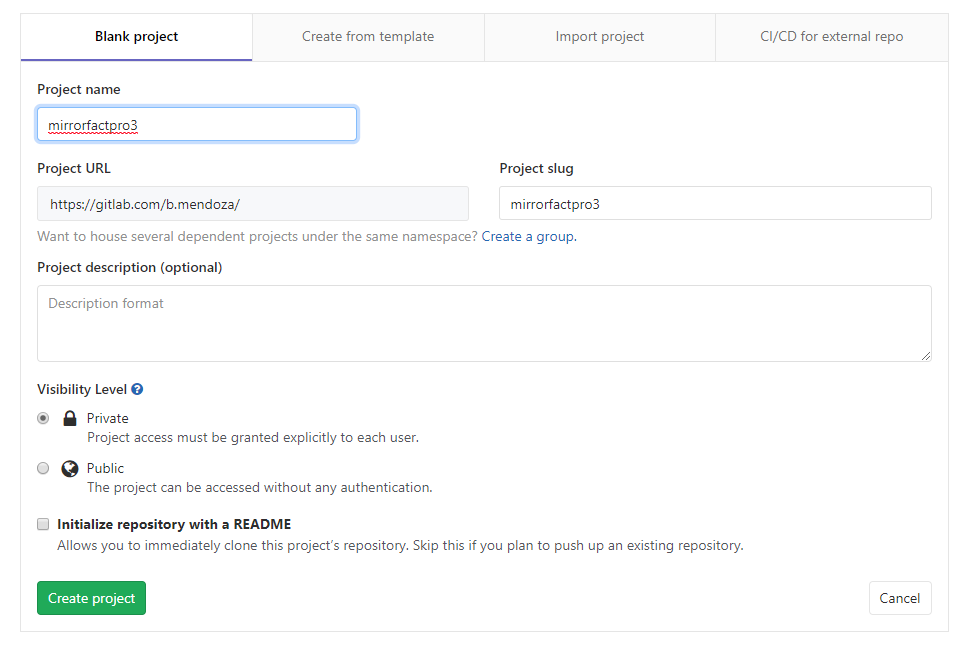
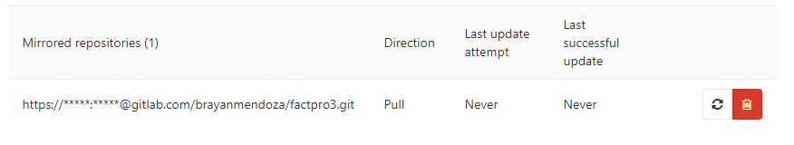
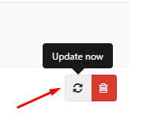
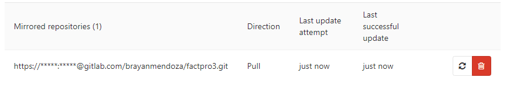
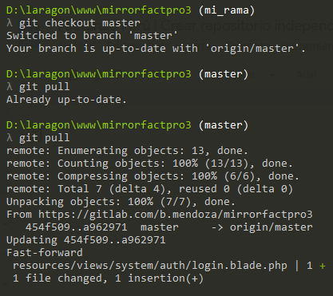

# Crear repositorio independiente - Espejo (Mirror)

El objetivo de crear un repositorio espejo es poder realizar cambios propios en un repositorio independiente y obtener los cambios de un repositorio principal o raíz.

**Referencia:** [Enlace](#)

## Pasos

1. Acceda a su cuenta y verifique que tenga acceso al repositorio principal o raíz.


2. Cree un nuevo repositorio y consigne los datos necesarios.




### Configurar el Espejo (Mirror)

3. Diríjase a: **Settings > Repository > Mirroring repositories**.


4. En el campo **Git repository URL**, ingrese la ruta del repositorio principal. Considere agregar su usuario de GitLab en la URL, por ejemplo:

    ```
    https://b.mendoza@gitlab.com/brayanmendoza/factpro3.git
    ```


5. Configure los siguientes campos:
    - **Mirror direction:** Debe ser igual a `Pull`.
    - **Password:** Ingrese el password del usuario de la cuenta o el que consignó en la URL previamente asignada.
6. Haga clic en el botón **Mirror repository**.


    Luego de haberlo creado, visualizará lo siguiente:



7. Seleccione el siguiente botón:

    

    Su repositorio se actualizará con los cambios del repositorio principal.

**Nota:** Para actualizar su repositorio privado con los cambios del principal, debe realizar el paso 5.



Hasta esta parte ya tendrá enlazado su repositorio propio (`mirrorfactpro3`) con el repositorio principal o raíz (`factpro3`).

## Realizar cambios en repositorio propio

Para realizar cambios en su repositorio propio, debe crear una nueva rama (branch). No puede hacerlo directamente en la `master`, ya que esta será la que se actualizará desde el repositorio principal. Si tiene modificaciones, no podrá actualizar su repositorio y podría dejar inutilizable el enlace espejo entre ambos repositorios.

Para crear una rama (branch), ejecute el siguiente comando:

```bash
git checkout -b mi_rama
```

Después de realizar cambios o modificaciones del código, deberá hacer push a la rama creada. Puede usar lo siguiente:

```bash
git add .
git commit -m "cambio"
git push origin mi_rama
```

Para más información, verifique la documentación de Git.

Posteriormente a realizar los cambios, necesitará actualizar su repositorio propio con los cambios del repositorio principal. Para ello, debe realizar:

1. El paso 5 y 6 de la primera sección.
2. Cambiarse de la rama en la que trabaja (`mi_rama`) hacia la `master`. Puede ejecutar:

    ```bash
    git checkout master
    ```

3. Cuando se encuentre en la rama `master`, debe actualizarla. Ejecute:

    ```bash
    git pull
    ```

    

## Realizar merge entre ramas

Una vez actualizada la rama `master`, debe hacer el merge entre su rama (`mi_rama`) y la rama `master`. Para ello, deberá regresar a su rama de trabajo:

```bash
git checkout mi_rama
```

Realice el merge:

```bash
git merge master
```

Si tiene conflictos, deberá solucionarlos de forma manual. Considere que mientras haga cambios en archivos independientes a los del proyecto principal, tendrá menos conflictos.

Finalmente, ejecute los siguientes comandos para culminar el procedimiento:

```bash
git add .
git commit -m "cambio"
git push origin mi_rama
```

