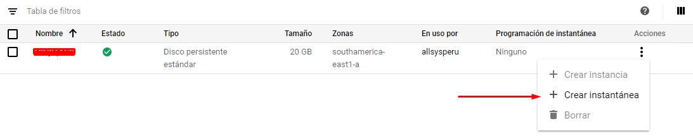
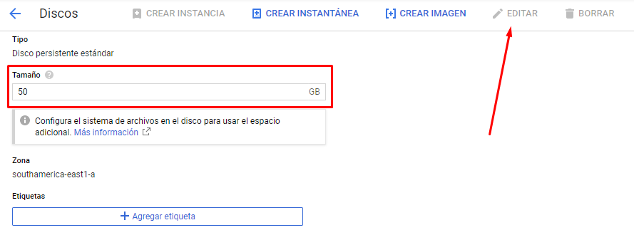
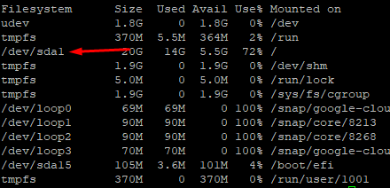
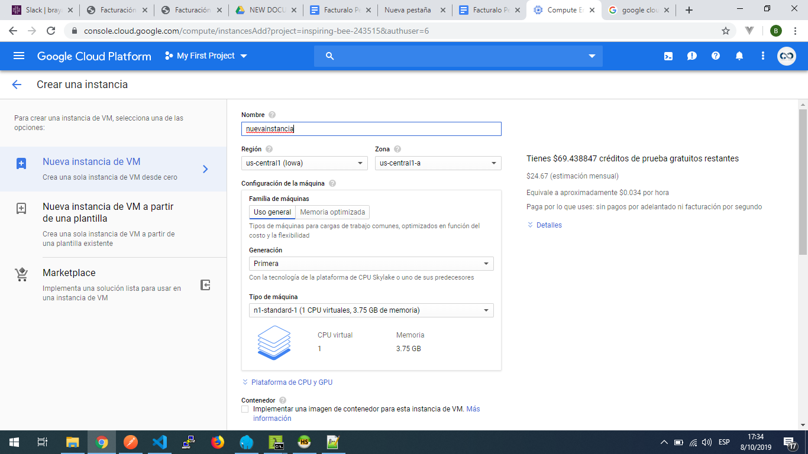
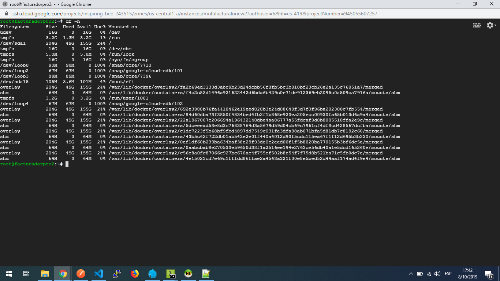
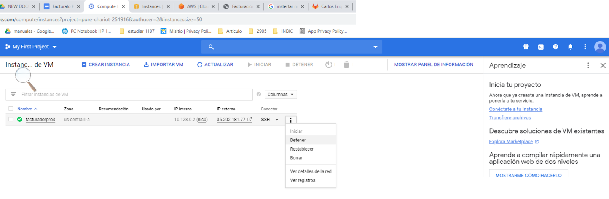

# Guía para incrementar espacio en disco

## Google Cloud - Modo 1

1. Conectarse a la consola de Google Cloud: [Google Cloud Console](https://console.cloud.google.com)
2. Diríjase a Compute Engine - Discos.
3. En el listado, verá el disco de su instancia. A la derecha de la tabla, presione sobre "Crear instantánea".



4. Al finalizar, será llevado a la vista de instantáneas. Luego, diríjase de nuevo a discos y presione sobre el nombre del disco.
5. Presione "Editar" y modifique el tamaño. Baje con scroll y pulse "Guardar" para almacenar los cambios. No se verá afectada la información ni debe detener la instancia. En caso de problemas, ya se ha creado una instantánea con la que podrá generar una nueva instancia exactamente igual a la que tiene activa.



6. Acceda vía SSH a su instancia e ingrese como superusuario:
```bash
    sudo su
```
7. Instale el siguiente paquete:
```sh
    apt -y install cloud-guest-utils
```
8. Ejecute `df -h` para verificar el nombre de la partición.



9. Ejecute tomando en cuenta el nombre anterior:

 ```sh
    growpart /dev/sda 1
   ```
10. Ejecute para extender el sistema de archivos:
 ```sh
     resize2fs /dev/sda1
   ```
11. Puede confirmar con `df -h` si su partición ha sido redimensionada.

## Google Cloud - Modo 2

1. Conectarse a la consola de Google Cloud: [Google Cloud Console](https://console.cloud.google.com)
2. Diríjase a la opción Compute Engine - Instantáneas.


3. Seleccione "Crear instantánea".
4. Asigne un nombre y seleccione el disco de origen (VM actual).
5. Después de que se haya culminado de crear la instantánea, tendrá un respaldo de todos los datos actuales de su VM.
6. Diríjase a la opción Compute Engine - Instancias de VM.


7. Debe crear una nueva instancia, seleccione el botón "Crear instancia".
8. Asígnele un nombre, elija la cantidad de memoria y CPU que tendrá la VM.



9. Seleccione la opción "Cambiar" en Disco de arranque.


10. Asígnele el tamaño necesario al disco de la nueva VM.


11. Diríjase a la pestaña "Instantáneas" y seleccione la que creó previamente, luego haga clic en "Seleccionar".


12. Habilite el tráfico HTTP y finalmente haga clic en el botón "Crear".


13. Espere a que la nueva VM termine de iniciar.
14. Si la IP de su VM cambió, deberá modificarla en el panel de configuración de su proveedor de dominio, el registro tipo A.
15. Acceda vía SSH a su nueva VM y verifique el espacio en disco con el comando `df -h`.



16. Deberá visualizar el espacio total de su disco incrementado. En caso contrario, deberá asignarlo manualmente por línea de comandos:
```sh
     sudo apt -y install cloud-guest-utils
     sudo growpart /dev/[DEVICE_ID] [PARTITION_NUMBER]
     sudo resize2fs /dev/[DEVICE_ID][PARTITION_NUMBER]
 ```
     Donde `[DEVICE_ID]` es la ID del dispositivo y `[PARTITION_NUMBER]` es el número de partición para ese dispositivo. Por ejemplo:
 ```sh
     sudo growpart /dev/sda 1
     sudo resize2fs /dev/sda1
 ```
17. Verifique nuevamente el espacio en disco con `df -h`, deberá visualizar el total asignado a la VM.
18. Ubique la primera instancia (VM donde el disco se quedó sin espacio) y deténgala.



## AWS

Para incrementar el tamaño de disco en Amazon AWS EC2 sin reiniciar, siga la guía en el siguiente enlace: [Cómo aumentar el tamaño de disco duro en Amazon AWS EC2 sin reiniciar](https://www.javierserrano.me/como-aumentar-el-tamano-de-disco-duro-en-amazon-aws-ec2-sin-reiniciar/)

Fuente: [Google Cloud Documentation](https://cloud.google.com/compute/docs/disks/add-persistent-disk#resize_partitions)
