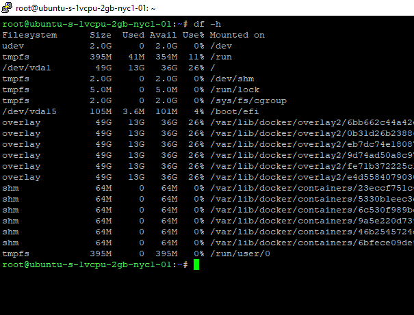
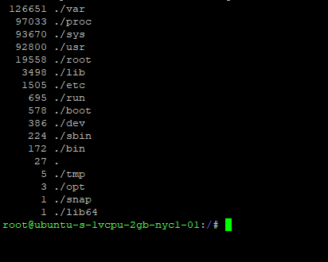
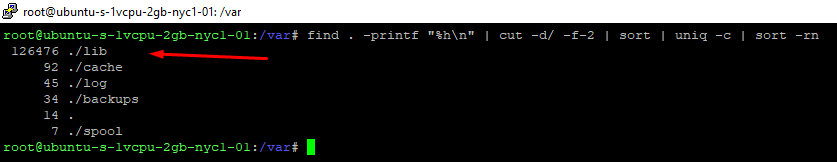
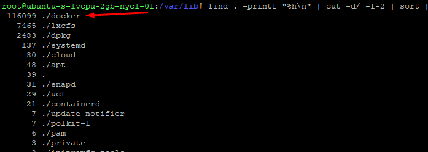
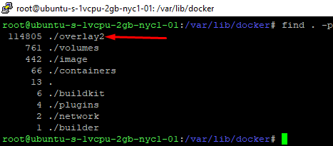
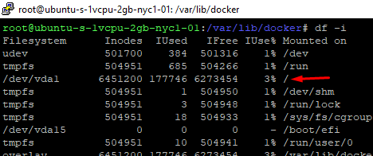
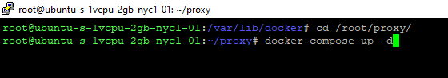
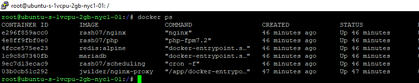

# Limpiar inodes

## Limpieza manual

El inodo se refiere a un nodo de índice o número de índice, esto es, una estructura de datos en un sistema de archivos en GNU/Linux, que almacena información sobre un archivo o directorio.

### Problema:
No tiene espacio en disco o los inodes están llenos, visualiza el siguiente mensaje “No space left on device”.

Debe verificar el espacio en disco, use `df -h`. 



Si aún cuenta con espacio, verifique los inodes usando `df -i`.


Si los inodes se encuentran al 100% de capacidad, puede usar los siguientes pasos para limpiarlos.

### Pasos:

1. Realizar un backup de sus datos. Si se encuentra en Google Cloud o AWS, puede realizar un snapshot o instantánea.
2. Diríjase a la raíz de su servidor, ejecute: `cd /`
3. Ejecute el siguiente comando para contar la utilización de inodos:
    ```bash
    find . -printf "%h\n" | cut -d/ -f-2 | sort | uniq -c | sort -rn
    ```
4. Visualizará un listado. El directorio que tiene el valor más alto es el que tiene más inodos y genera que se llegue a la capacidad máxima. En este caso es `/var`. Acceda a `/var` y ejecute el comando del paso 3.



5. Visualice que el directorio `lib` tiene un valor alto. Acceda y ejecute el comando del paso 3.



6. Acceda a `docker` y ejecute el comando del paso 3. Se visualiza que la carpeta `overlay2` tiene un valor alto. Continúe.



---



7. Ejecute `docker ps` para ver los contenedores activos.


8. Debe detener todos los contenedores y el proxy:
    - Para los contenedores: Acceda a la carpeta de su proyecto, en este caso se encuentra en `/home/ubuntu/facturadorpro3`. Dentro ejecute `docker-compose down`. En caso de que no pueda detener los servicios, ejecute `docker stop $(docker ps -a -q)`.
    - Para el proxy: Acceda a `/root/proxy`. Dentro ejecute `docker-compose down`.
9. Ejecute `docker ps` nuevamente para validar que los contenedores fueron detenidos.
10. Reinicie docker, ejecute: `service docker restart`.
11. Después de reiniciar, ejecute el siguiente comando:
     ```bash
     docker system prune
     ```


     Confirme la acción con `Y`. Este proceso puede ser un poco prolongado.

12. Cuando finalice el proceso, ejecute `df -i` para visualizar el espacio en los inodes. 



El valor de la columna `IUse %` debe haber disminuido.

13. Ahora debe iniciar nuevamente los contenedores y el proxy:
     - Para el proxy, diríjase a `/root/proxy` y ejecute `docker-compose up -d`.



     - Si obtiene el siguiente error:
        ```
        ERROR: Network proxynet declared as external, but could not be found. Please create the network manually using `docker network create proxynet` and try again.
        ```
        Ejecute los siguientes comandos:
        ```bash
        docker network create proxynet
        docker-compose up -d
        ```


     - Para los contenedores, diríjase a la carpeta de su proyecto, en este caso se encuentra en `/home/ubuntu/facturadorpro3`. Luego de acceder, ejecute `docker-compose up -d`.
14. Si todo ejecutó correctamente, ejecute `docker ps` para verificar el estado de los contenedores y acceda a su proyecto. Verifique que su información es correcta y el flujo es funcional.




## Limpieza automática (script bash)

1. Acceda como superusuario:
    ```bash
    sudo su
    ```
2. Utilice `nano` para crear y pegar el script:
    ```bash
    nano docker-prune.sh
    ```
3. Pegue el contenido del script (se recomienda pegarlo en un editor de texto antes de pegarlo en la consola):
    [Script](https://gitlab.com/snippets/1918794/raw)
4. Edite la ruta de su proyecto en la línea 38 o cerca:
    ```bash
    cd $HOME/[nombre_del_proyecto]
    ```
    `$HOME` es la ruta del usuario en cuestión, en este ejemplo equivale a `/root/`. Algunos ejemplos de ruta:
    - `$HOME/facturadorpro3`
    - `/home/ubuntu/multifacturalonew`
    - `/home/facturador/multifacturalonew2`
5. Para guardar, pulse `Ctrl + X`, se le consultará si está seguro, pulse “Y”.
6. Asigne permisos al archivo:
    ```bash
    chmod +x docker-prune.sh
    ```
7. Ejecute el script:
    ```bash
    ./docker-prune.sh
    ```
