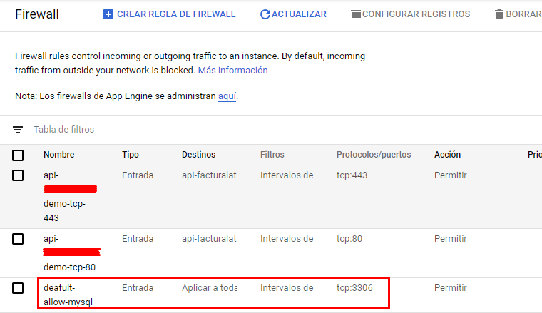

# Manual de Google Cloud: Habilitando Puertos en Firewall

## Pasos

1. Ingresar a su panel de Google Cloud y dirigirse al menú de firewall.

2. Crear una nueva regla.

3. Llenar el nombre con el servicio para que pueda reconocerse en la lista.

4. Completar los siguientes 3 puntos (para el ejemplo se está habilitando un puerto para MySQL, lo que comúnmente sería el 3306).

5. Finalizar pulsando en el botón crear. En el menú de firewall podrá observar las reglas registradas disponibles para las instancias de su cuenta.

De esta manera podrá acceder a su servidor por diferentes puertos. Para el caso de Odoo, suele habilitarse el 8069, siempre dependerá del servicio que desee observar.

---

