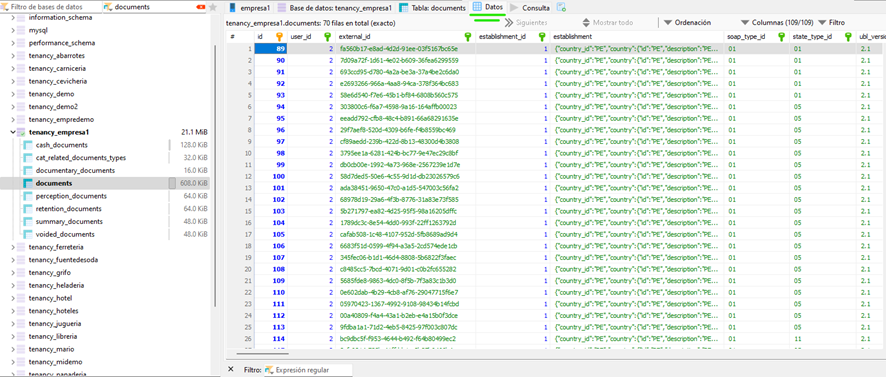

# Cómo realizar el cambio de estados de comprobantes desde la base de datos

:::info Requisitos Previos
Antes de proceder, asegúrese de tener acceso a:
- Archivo `.env` del servidor
- Credenciales de acceso
- Permisos necesarios para modificar la base de datos
:::

## Requisitos de Conexión
Para poder ingresar a la base de datos del servidor, necesitamos los siguientes datos:

- **Nombre del host/IP**: IP del servidor
- **Usuario**: Usuario del servidor
- **Contraseña**: Se encuentra en el archivo `.env` como `MYSQL_ROOT_PASSWORD`
- **Puerto**: Se encuentra en el archivo `.env` como `MYSQL_PORT_HOST`

Después de haber llenado todos esos campos, seleccione abrir.

## Interfaz de la Base de Datos
Se le abrirá una vista similar a la siguiente:

## Cambio de Estados de Comprobantes

:::tip Ubicación Correcta
Asegúrese de estar en el tenancy correcto antes de realizar cualquier modificación
:::

### Ubicación
Para poder cambiar los estados de los comprobantes:
1. Nos dirigimos al tenancy del sistema que deseamos cambiar
2. En este caso será `tenancy_empresa1`, porque mi sistema se llama empresa1

### Proceso
1. Buscar la tabla de `documents`
2. Ubicar `state_type_id`

### Estados Disponibles
Estas son las opciones de los estados de los comprobantes:

:::danger ⚠️ ADVERTENCIA CRÍTICA
Este cambio es **SOLO VISUAL** y debe ser el **ÚLTIMO RECURSO** a utilizar.

**Proceso Correcto:**
1. Primero revisar el validador de documentos
2. Regularizar el documento si es necesario
3. Solo si los pasos anteriores no funcionan, proceder con este cambio

**IMPORTANTE:**
- El cambio no afecta en nada a SUNAT
- La base de datos es muy delicada
- Un mal dato registrado puede comprometer el sistema
- No modificar ningún otro dato
:::

:::note Recordatorio
Antes de realizar cualquier cambio, asegúrese de:
- Tener un respaldo de la base de datos
- Estar en el tenancy correcto
- Tener los permisos necesarios
:::
