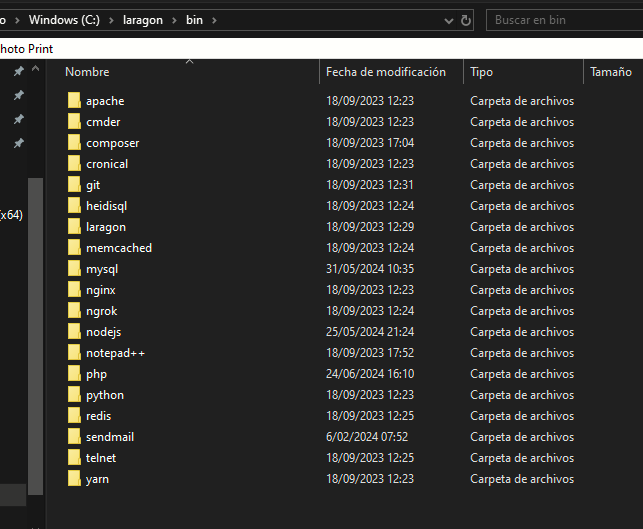
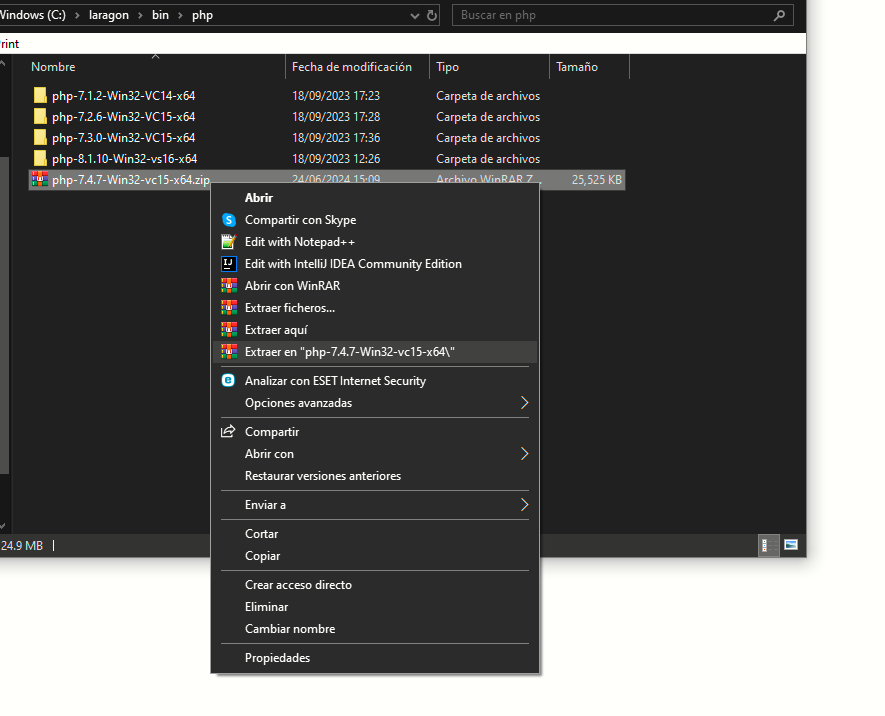
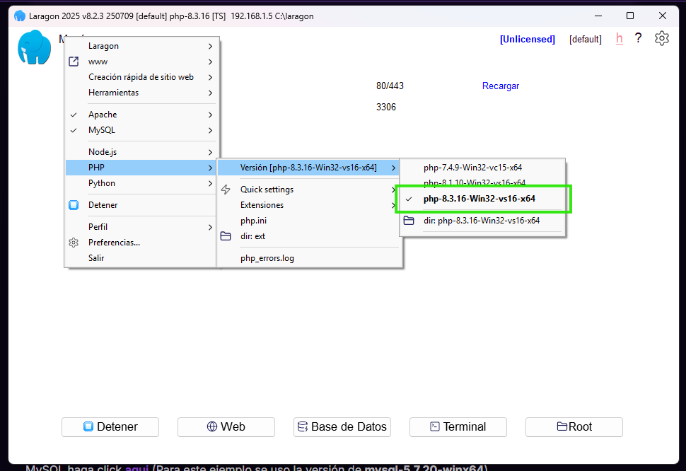
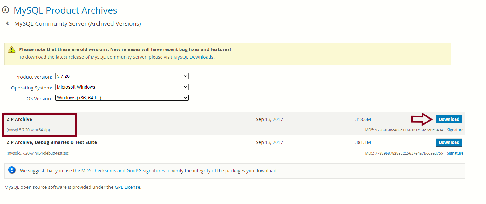
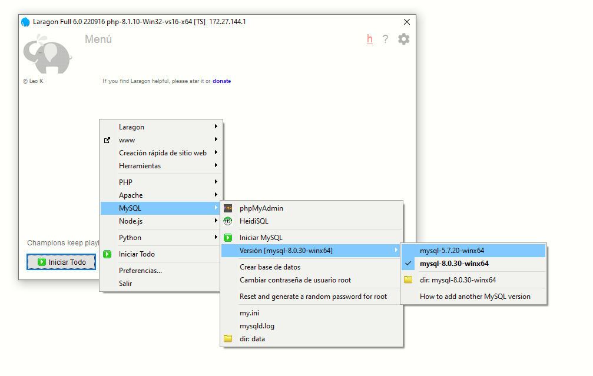
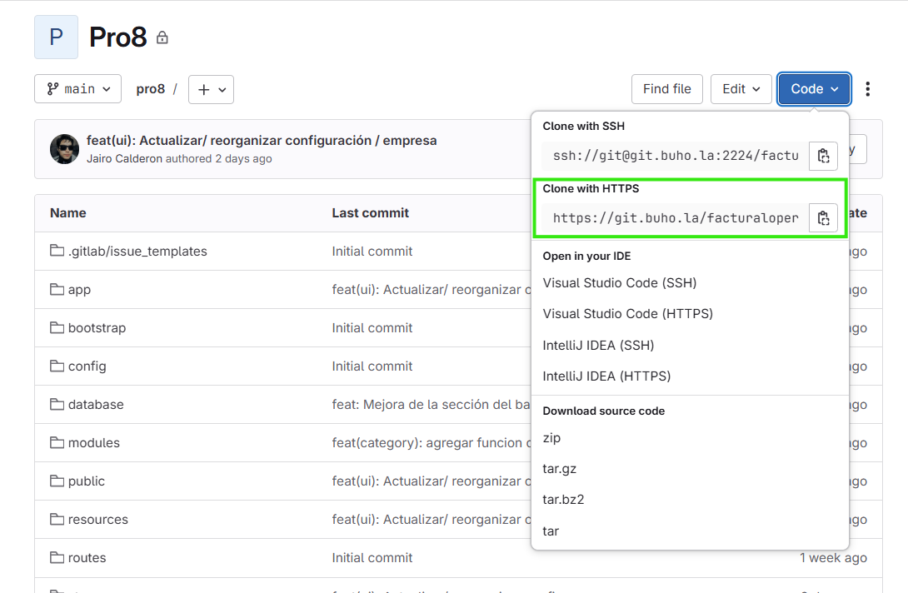

# Windows

Se explicará como poder descargar y poder ejecutar el facturador dentro de su máquina windows.

Antes de instalar, se tiene que tener presente que hay dos proyectos de facturador: **Pro6** y **ProX**, de las cuales cada uno tiene sus propios requisitos previos

## Requisitos previos del Pro6

| Tecnología | Versión |
|------------|---------|
| PHP        | 7.4     |
| MySQL      | 5.7     |
| Laravel    | 5.6     |
| Node       | 12.22   |

## Requisitos previos del ProX

| Tecnología | Versión |
|------------|---------|
| PHP        | 8.1     |
| MySQL      | ^5.7    |
| Laravel    | ^9.0    |
| Node       | ^14.17  |

## Instalaciones 

Este tópico es para ambos proyectos, asi que funcionará con cualquier tecnologias que descargues respecto a la versión del facturador. 

### Laragon

Para poder correr el facturador se necesitará de un entorno de desarrollo, aquí es donde entra Laragon, si quieres descargalo haz click **[aqui](https://laragon.org/download/)** (se recomienda descargar la versión full).

### PHP

Puede entrar dentro de este repositorio y encontrará los binarios de php **[Repositorio PHP](https://windows.php.net/downloads/releases/archives/)** (Para este ejemplo se uso la versión **php-7.4.7-Win32-vc15-x64**).

Una vez haga click a su versión, se le instalará un zip, ahora este archivo debe colocarse dentro de Laragon.

1. Instalar la versión de PHP. 
2. Luego dirigirse a donde se encuentra Laragon ``` C:\laragon``` (Por defecto Laragon te lo descarga en el disco C) y entrar en la carpeta **bin**.
 

 Dirigirse a la carpeta **php**

3. El archivo zip de PHP que descargaste, se deberá colocar dentro de la carpeta **php** y descomprimirlo con el boton **"Extraer en 'php-7.4.7-Win32-vc15-x64'"**.

 

4. Ya hecho esto, solo faltaria colocar este versión de PHP por defecto:

  

### MySQL

Para colocar la version de MySQL correcta dentro de Laragon se debe descargar su zip, para buscar la versión de MySQL haga click **[aqui](https://downloads.mysql.com/archives/community/)** (Para este ejemplo se uso la versión de **mysql-5.7.20-winx64**).

1. Instalar la versión de MySQL.

 

2. Luego dirigirse a donde se encuentra Laragon ``` C:\laragon``` (Por defecto Laragon te lo descarga en el disco C) y entrar en la carpeta **bin**.

 

 Ahi se encontrará la carpeta de **mysql**, ingresamos a esa carpeta

3. El archivo zip de MySQL que descargaste, se debera colocar dentro de la carpeta mysql y descomprimirlo con el boton **Extraer aquí**.

 

4. Ya hecho esto, solo faltaría colocar esta versión de MySQL por defecto.

 

## Configuración de Laragon

### Activar extensión **SOAP**

 
:::danger IMPORTANTE
 Revisar si esta activado esta extensión, algunas funciones podrían fallar, como por ejemplo la creación de facturas.
:::

### Puertos de los Servicios
Algunas veces podrian presentarse un error de puertos ocupados, esto se soluciona si los cambia. Dentro de Laragon hay un icono de una tuerca, haga click y luego dirigirse a **Servicios & Puertos**. Ahi podra personalizar en que puerto desea cambiar.

 
 

### Hostname
En laragon crea un dominio, puede cambiarlo a su gusto, por ejemplo **\{name\}.text**, **\{name\}.pe**, **\{name\}.oo**

 

## Pasos

1. Abre Laragon y haga click en **Terminal**, ahora toda instalación será dentro de la carpeta ```C:\laragon\www```


2. Ahora se debe clonar el proyecto en tu máquina: 
   * Entra a tu cuenta que se te brindo y entra al proyecto que elegiste (para este ejemplo se usará el **Pro6**)

     
    En el recuadro donde dice **"Clone with HTTPS"**, copia la URL que se encuentra.

    * Ahora tienes que colocar este comando dento de la terminal que abriste en Laragon.
     ```bash
     git clone [La URL que copiaste]
     ```
     Y luego de esto, se le pedirá su usuario y contraseña, una vez verificado se le descargará el proyecto.

3. Se debe crear la base de datos, para ello debes ingresar a la base de datos que esta integrado en Laragon
    :::caution Precaución
     Antes de comenzar, verifique que no tengan ningún otro servicio de MySQL corriendo en su máquina ya que puede ver conflictos entre ellas. Primero apaga cualquier servicio de MySQL y luego ingrese a la base de datos de Laragon
    :::

    

    * Seleccione alguna sesión y ingrese con el botón **"Abrir"**:

     
      Si por alguna razón no tiene alguna sesión, entonces puede crearlo con el botón de **"Nueva"**.
    
    * Ahora solo debe crear una base de datos, el nombre depende de usted pero se recomienda que no tenga caracteres especiales. En el recuadro donde esta el nombre de la sesión, hazle click derecho y luego dirigase a la opción de la imagen de abajo:

     
    
     :::tip RECUERDA
      Tenga en cuenta el nombre de su base de datos, se usará más adelante.
     :::


4. Una vez descargado el proyecto, tendra que tener el archivo **pro6**.
  Para verificar si tienes la carpeta pro6, hazlo con el comando ```ls```

   * Ingresa a la carpeta pro6

    ```bash
    cd pro6
    ```
   * Ahora, coloca este comando para crear un archivo .**env**

   ```bash
   cp .env.example .env 
   ```

   * Se debe modificar el archivo .env que hemos creado, especificamente dos variables:

    ```env
    APP_URL_BASE={carpeta}.test
    ```

     * **carpeta**, aca debe colocarse el nombre específico de la carpeta del proyecto.
     * El **".test"** dependerá de la configuración que colocaste dentro del Hostname de Laragon.

    ```env
    DB_DATABASE={el nombre de su base de datos}
    ```

     * Se debe ingresar el nombre de la base de datos que creaste en el Paso 3.

5. Instalar las dependencias del proyecto
  ```bash
  composer install
  ```

6. Y luego seguir estos comandos, cada comando debe hacerse uno por uno.
  ```bash
  php artisan key:generate
  composer dump-autoload
  php artisan migrate --seed
  php artisan storage:link
  ```

7. Abre Laragon y presiones el botom **"Iniciar todo"**
 
  Con esto ya esta encendido el servidor apache.


8. Si todo se ha realizado al pie de la letra, entonces ya puedes ingresar a la pagina. Haga click derecho y se le mostrará opciones, eliga la opción **"www"**. 


Se le mostrará la pagina de login, las credenciales son:
 * Correo electrónico: **admin@gmail.com**
 * Contraseña: **123456**


