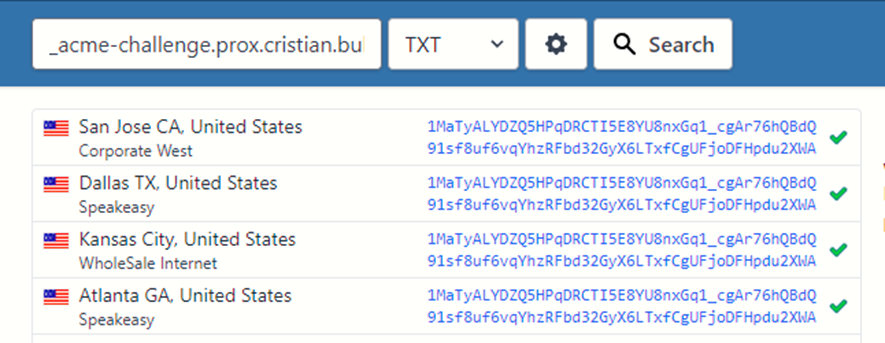

# Instalar - Actualizar el SSL

Si al instalar el facturador, elegiste la opción de no descargar el certificado SSL entonces con estos pasos podrás adquirirlo en tu dominio.

:::info TEN EN CUENTA
El certificado SSL solo tiene una duración de 30 días, por lo tanto una vez pasado este tiempo, deberá actualizarlo.
::: 

## Primera vez instalando SSL

1. Ingrese a su VPS e inserte este comando. 
 ```bash
 sudo su 
 ```
2. Luego ingrese este comando para descargar el script. 
 ```bash
 curl https://git.buho.la/-/snippets/12/raw/main/newSSL.sh -o updateFirstSSL.sh && chmod +x updateFirstSSL.sh && ./updateFirstSSL.sh
 ```
3. Se le preguntará sobre el dominio para instalar el certificado SSL (si no lo coloca, entonces el script termina)
    
 

4. Se le preguntará sobre un email para certificar.
5. Luego se le pedirá que agregue dentro de su registro DNS un nuevo registro TXT, el nombre del registro será **_acme-challenge.[el nombre de su dominio]**, el programa mostrará dos cadena de texto de la cual tendrá que colocarlo dentro del registro recién creado.

 

 :::danger PRECAUCIÓN
 Antes de seguir verifique que los registros txt se hayan propagado por la internet, puede usar el servicio de **https://www.whatsmydns.net/** y revíselo.
 :::

 

 Después de verificar que los registros ya están, puede seguir el proceso con enter.

6. Hará una pequeña verificación y si todo está bien entonces se le mostrará el siguiente mensaje

 


## Actualizar SSL

1. Ingrese a su VPS e inserte este comando. 
 ```bash
 sudo su 
 ```
2. Luego ingrese este comando para descargar el script. 
 ```bash
 curl https://git.buho.la/-/snippets/13/raw/main/updateSSL.sh -o updateSSL.sh && chmod +x updateSSL.sh && ./updateFirstSSL.sh
 ```
3. Desde este punto, es lo mismo que se muestra en la sección de la instalación de Primera vez del SSL desdel el paso 3
