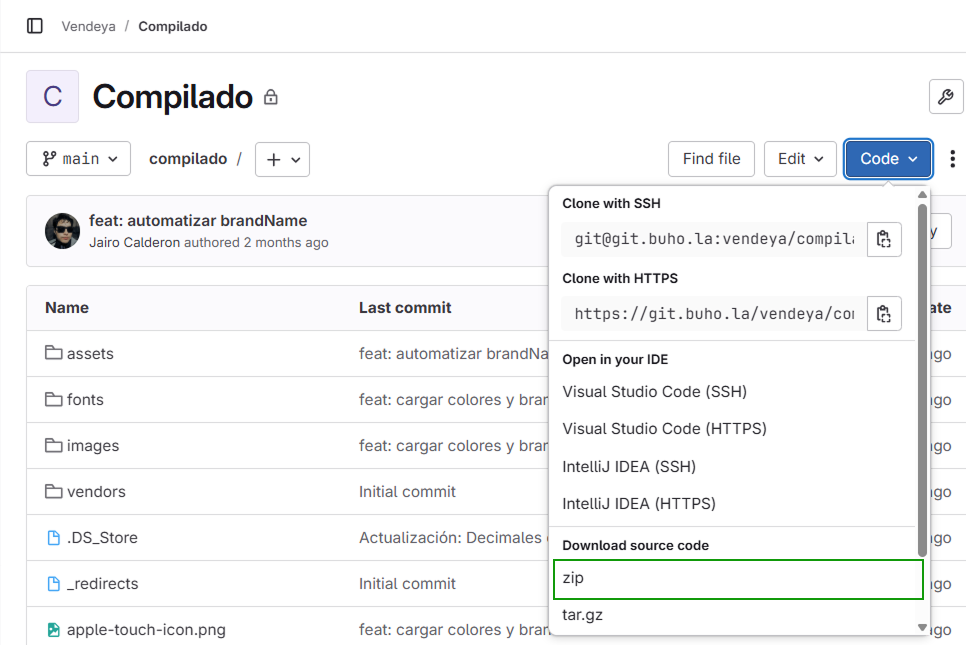
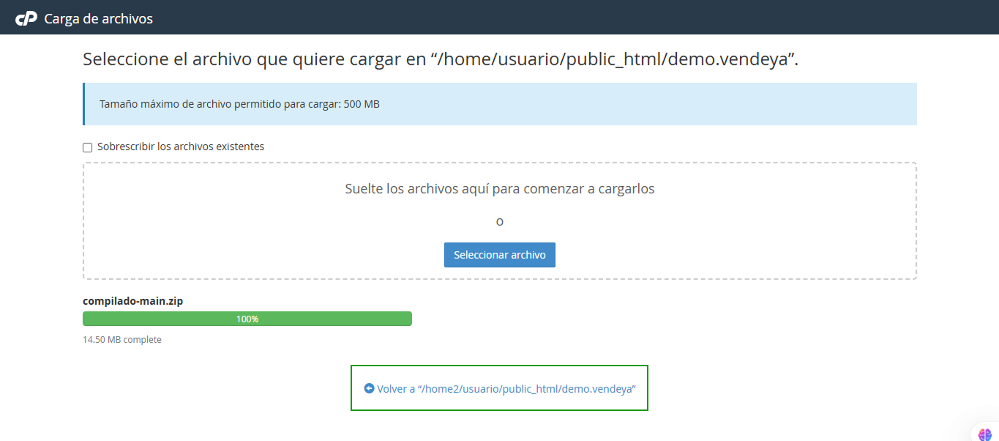
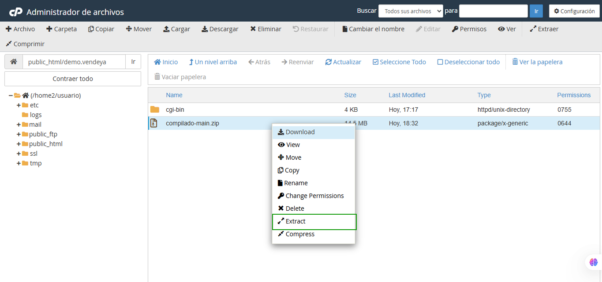

# 🚀 Instalación de VendeYA en cPanel

> ⚠️ **IMPORTANTE - Migración de Servidor GitLab**
> 
> **Hemos migrado nuestro servidor de GitLab.** Si aún no has cambiado la URL del sistema (del git para descargar los cambios, etc.), te sugerimos verificar primero.
>
> **Nueva URL:** `git.buho.la`
>
> Para más información sobre cómo actualizar la URL del repositorio, consulta nuestra **[guía de actualización y migración](https://manual.uio.la/Pro7/devs/instalacion/Actualizar-Migrar)**.

## Requisitos Previos

- ✅ **[Compilado VendeYa](https://git.buho.la/vendeya/compilado)** disponible
- ✅ Acceso a cuenta cPanel con privilegios de administrador
- ✅ Navegador web actualizado
- ✅ Conexión a internet estable

## Proceso de Instalación Paso a Paso

### 1. Creación del Dominio

1. **Acceder a cPanel** mediante sus credenciales de administrador
2. **Navegar** a la sección **Dominios > Crear un Nuevo Dominio**
3. **Configurar el dominio:**
   - Ingresar el nombre del dominio deseado
   - ⚠️ **CRÍTICO**: Desmarcar la casilla de configuración automática
   - Agregar `/public_html/` al final del campo "nombre de carpeta"


> ⚠️ **NOTA IMPORTANTE**: Es fundamental desmarcar la casilla y agregar `/public_html/` en el nombre de su carpeta para que la instalación funcione correctamente.

### 2. Descarga de VendeYA Compilado

#### 2.1 Acceso al Repositorio
1. **Ingresar** a su perfil en **https://git.buho.la/**
2. **Localizar** el proyecto `VendeYA/Compilado`
3. **Descargar** el código compilado:
   - Hacer clic en el botón azul **"Code"**
   - Seleccionar **"Download source code"**
   - Elegir el formato **.zip** para la descarga



4. **Guardar** el archivo descargado en una carpeta de fácil acceso en su computadora

### 3. Subida de Archivos al Servidor

#### 3.1 Navegación en cPanel
1. En cPanel, **navegar** a la sección **Dominios**
2. **Acceder** a la ruta del dominio creado anteriormente
3. **Seleccionar** la opción **"Cargar"** o **"Upload"**


#### 3.2 Carga del Archivo ZIP
1. **Seleccionar** el archivo `.zip` descargado desde su computadora


2. **Esperar** a que la barra de progreso indique "Completado"
3. Una vez finalizada la carga, **regresar** a la carpeta raíz del dominio



### 4. Extracción y Organización de Archivos

#### 4.1 Extracción del Archivo ZIP
1. **Localizar** el archivo ZIP en la carpeta raíz
2. **Hacer clic derecho** sobre el archivo
3. **Seleccionar** la opción **"Extract"** (Extraer)



#### 4.2 Movimiento de Archivos
1. **Ingresar** a la carpeta `compilado` que se creó tras la extracción


2. **Seleccionar todos** los archivos de la carpeta:
   - Usar la opción "Seleccionar todo"
   - Verificar que todos los archivos estén marcados


3. **Mover** los archivos a la carpeta raíz:
   - Hacer clic en **"Mover"**
   - En el modal, seleccionar la carpeta raíz del dominio (un nivel arriba: `..`)


> 💡 **TIP**: Una vez movidos todos los archivos, puede eliminar la carpeta `compilado` vacía para mantener el orden.

### 5. Configuración del Sistema

#### 5.1 Configuración del Archivo .htaccess
1. **Crear** un nuevo archivo llamado `.htaccess` en la carpeta raíz


2. **Editar** el archivo y agregar la siguiente configuración:


```apache
# Archivo necesario para el funcionamiento del SPA en Apache
<IfModule mod_rewrite.c>
    RewriteEngine On
    
    # Condición: si el archivo o directorio solicitado no existe
    RewriteCond %{REQUEST_FILENAME} !-f
    RewriteCond %{REQUEST_FILENAME} !-d
    
    # Redirigir todas las peticiones al index.html
    RewriteRule ^ index.html [L]
</IfModule>
```

3. **Guardar** los cambios y cerrar el editor

#### 5.2 Configuración del config.json
1. **Localizar y abrir** el archivo `config.json` en la raíz del proyecto
2. **Verificar** que la ruta principal esté correctamente configurada según su dominio como **"Cliente Final"**


3. **Realizar los ajustes** necesarios según su configuración específica
4. **Guardar** los cambios y cerrar el archivo

## Verificación de la Instalación

### Pasos de Verificación
1. **Acceder** al dominio configurado desde un navegador web
2. **Verificar** que la aplicación VendeYA se cargue correctamente
3. **Probar** la navegación entre diferentes secciones
4. **Confirmar** que no hay errores 404 al navegar

### 🔗 Ruta de Acceso al Sistema
Una vez completada la instalación exitosamente, podrá acceder al sistema VendeYA utilizando la siguiente ruta:

```
{su_dominio}/auth/login
```

**Ejemplo:**
- Si su dominio es `mitienda.com`, acceda a: `https://mitienda.com/auth/login`
- Si su dominio es `ventas.miempresa.com`, acceda a: `https://ventas.miempresa.com/auth/login`

### Solución de Problemas Comunes

| Problema | Posible Causa | Solución |
|----------|---------------|----------|
| Error 404 en navegación | `.htaccess` mal configurado | Verificar la configuración del archivo `.htaccess` |
| Aplicación no carga | Ruta incorrecta en `config.json` | Revisar y corregir las rutas en el archivo de configuración |
| Archivos no encontrados | Archivos no movidos correctamente | Verificar que todos los archivos estén en la carpeta raíz |

## Notas Finales

- 📋 **Respaldo**: Siempre mantenga una copia de respaldo antes de realizar cambios
- 🔒 **Seguridad**: Asegúrese de usar credenciales seguras para su cPanel
- 📞 **Soporte**: En caso de problemas, consulte la documentación oficial o contacte al equipo de soporte
- 🔄 **Actualizaciones**: Manténgase al día con las actualizaciones del sistema

---

> ✅ **¡Instalación Completada!** Su sistema VendeYA debería estar funcionando correctamente. Si encuentra algún problema, revise cada paso de esta guía o consulte con el equipo de soporte técnico.