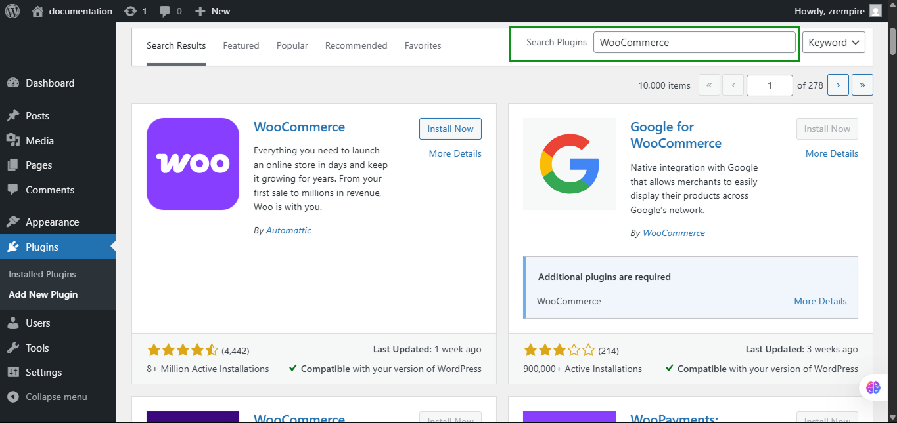
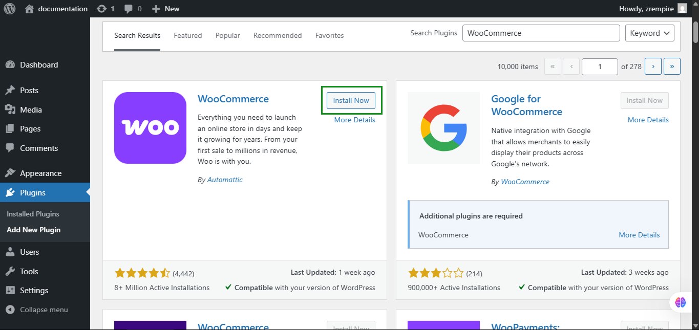
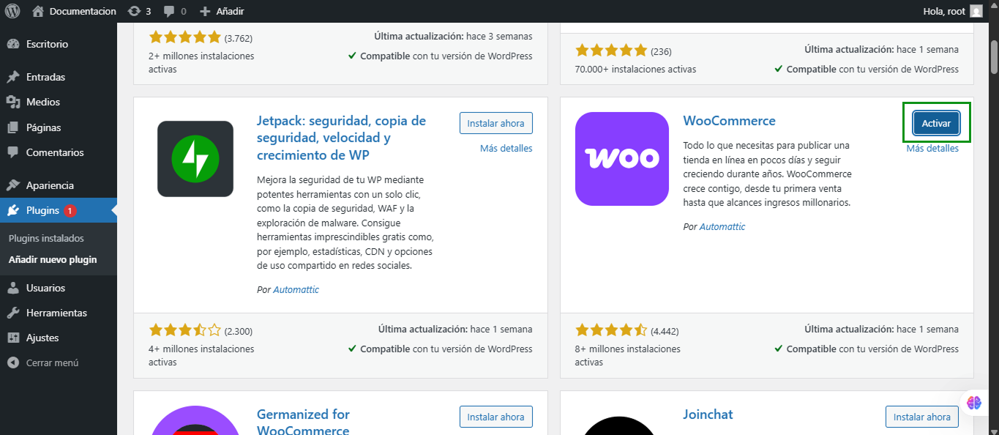
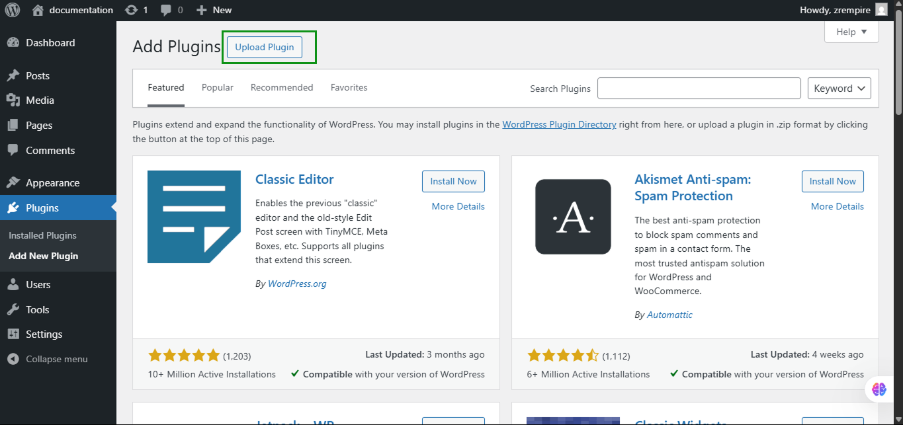
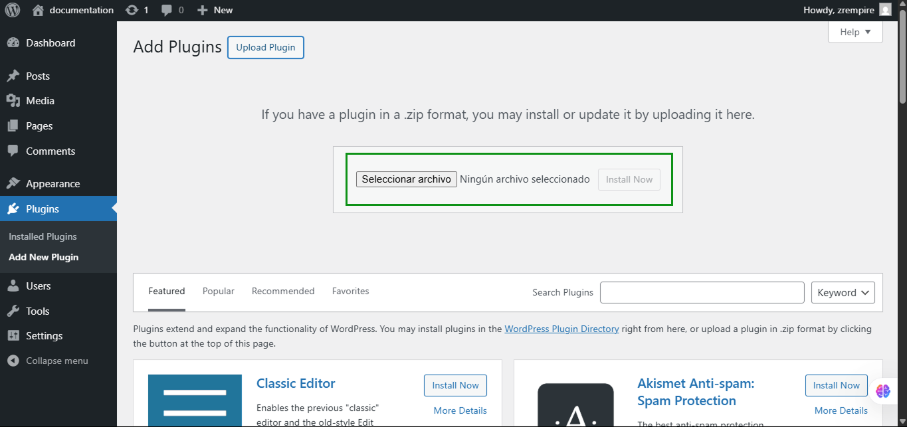
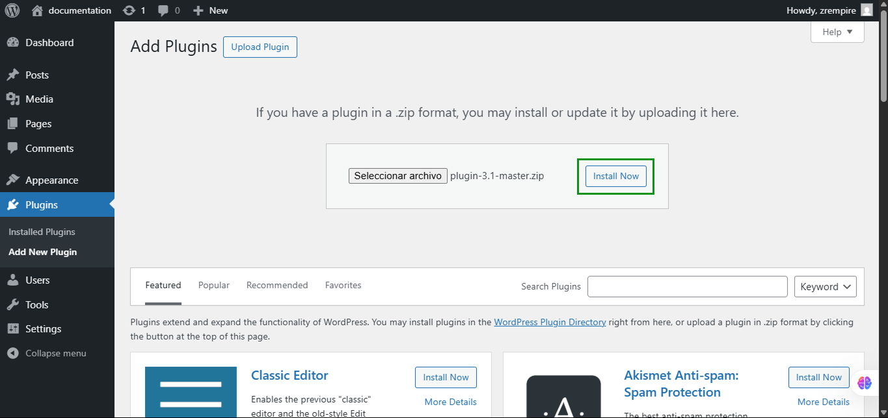

# Pasos para ingresar a WordPress

1. **Abrir el navegador web**: Inicia tu navegador web preferido (Chrome, Firefox, Safari, etc.).

2. **Ir a la página de inicio de sesión**: En la barra de direcciones, escribe la URL de tu sitio de WordPress seguida de `/wp-admin` o `/wp-login.php`. Por ejemplo:
    ```
    https://tusitio.com/wp-admin
    ```

3. **Ingresar las credenciales**:
    - **Nombre de usuario**: Introduce tu nombre de usuario de WordPress.
    - **Contraseña**: Introduce tu contraseña de WordPress.

4. **Hacer clic en "Iniciar sesión"**: Presiona el botón "Iniciar sesión" para acceder al panel de administración de WordPress.

5. **Navegar por el panel de administración**: Una vez dentro, podrás gestionar tu sitio web desde el panel de administración.


## Pasos para añadir un nuevo plugin

Para el funcionamiendo correcto del Plugin de Digital Buho - FacturaloPeru Api, debe de tener activo el Plugin de WooCommerce.

1. **Acceder al panel de administración**: Asegúrate de haber iniciado sesión en tu sitio de WordPress y estar en el panel de administración.

2. **Ir a la sección de plugins**: En el menú lateral izquierdo, haz clic en "Plugins" y luego en "Añadir nuevo".
    

3. **Buscar el plugin**: En el campo de búsqueda, escribe el nombre del plugin que deseas instalar.
    

4. **Instalar el plugin**: Una vez encontrado el plugin, haz clic en el botón "Instalar ahora".
    

5. **Activar el plugin**: Después de la instalación, haz clic en "Activar" para empezar a usar el plugin.
    

6. **Página de Bienvenida**: Una vez instalado el plugin, se te dirigirá a una página de bienvenida. De momento, solo haz clic en "Saltar configuración guiada".
    

## Pasos para instalar el plugin de Facturalo Perú

1. **Acceder al panel de administración**: Asegúrate de haber iniciado sesión en tu sitio de WordPress y estar en el panel de administración.

2. **Ir a la sección de plugins**: En el menú lateral izquierdo, haz clic en "Plugins" y luego en "Añadir nuevo".
    

3. **Subir plugin**: Haz clic en el botón "Subir plugin" en la parte superior de la página.
    

4. **Seleccionar archivo**: Haz clic en "Seleccionar archivo" y elige el archivo .zip del plugin desde tu computadora.
    

5. **Instalar y activar**: Haz clic en "Instalar ahora".
    

    Y luego en "Activar" para empezar a usar el plugin.
    