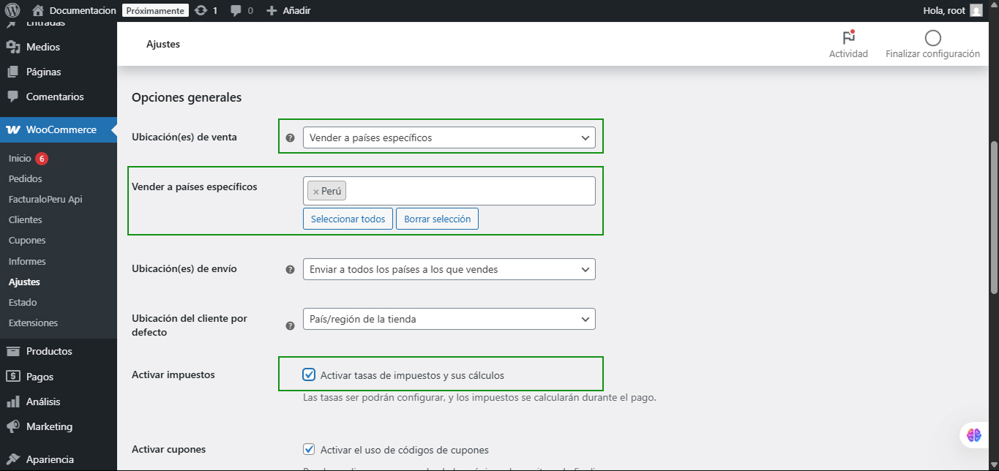
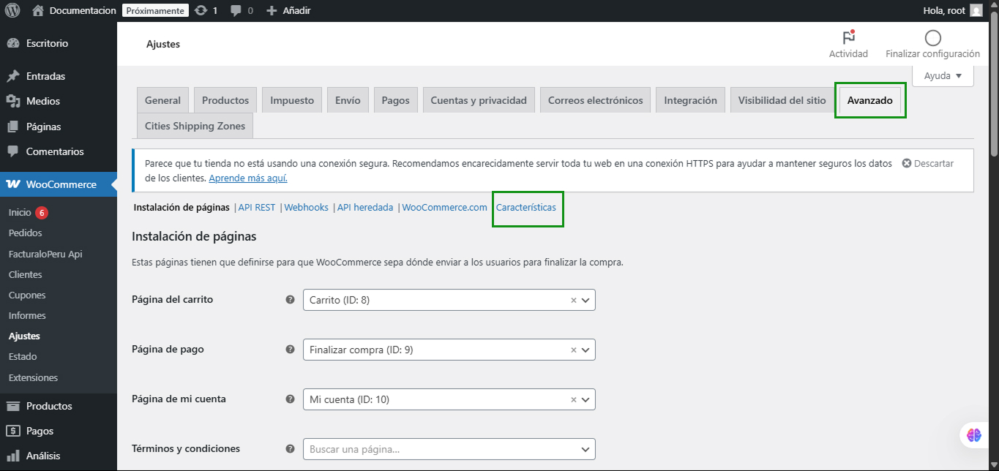
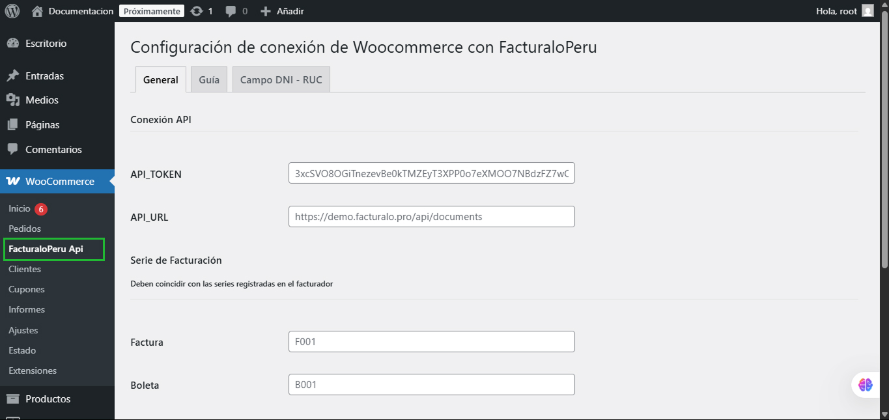
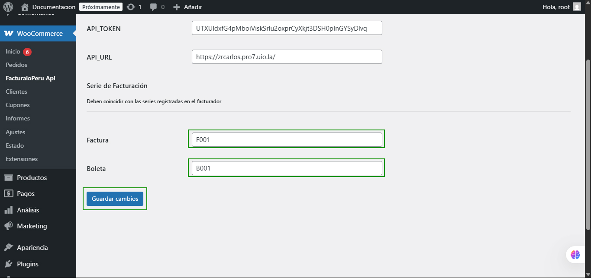
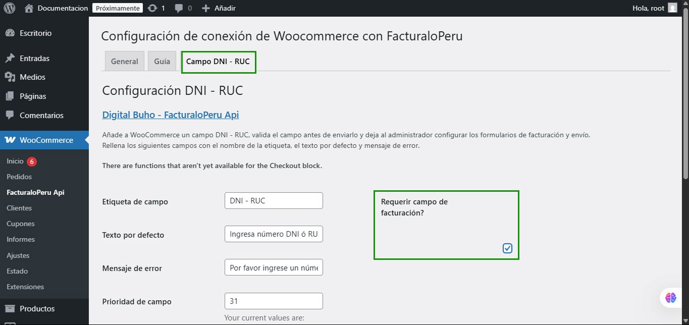

# Configuración Previa

Como primer paso, ingresaremos al panel de Ajustes de **WooCommerce**.


##  Ajustes Generales de WooCommerce

a. Ubique la opción País/Provincia y seleccione Perú y su respectiva provincia.


**b.** En la sección de Opciones Generales:

1. En ubicación de venta seleccione **Vender a países específicos**, lo cual habilitará una nueva opción donde deberá seleccionar **Perú**.

2. Active la opción **Activar Impuestos**.

3. Guarde los cambios realizados.



## Configuración en la sección Avanzado

1. Ubique la opción de **Características**



2. Verifique si tiene activo el **Almacenamiento por entradas**. De no ser así, actívelo y guarde los cambios.


## Configuración de Cities Shipping Zones

Esta opción aparecerá una vez que tenga instalado el Plugin en su **WordPress**. Si aún no lo ha realizado, puede hacerlo siguiendo los pasos del siguiente [artículo](https://manual.uio.la/Pro7/Devs/Plugins/intro).

1. Dentro de esta sección, verifique la casilla **País / Región** de **Región(es) de la zona Selección por lotes**, donde posiblemente no aparezca **Perú**.


2. Para habilitar esta opción:

   Deseleccione y seleccione nuevamente la opción **Autofill the state in orders based on the selected city**. Esto hará que la opción de **País/Región** se cargue correctamente. Finalmente, guarde los cambios.


## Configuración del Plugin de FacturaloPeru

A continuación se detalla la configuración correcta del plugin:

1. Ingrese al **módulo de WooCommerce** y seleccione la subcategoría **FacturaloPeru API**.



Se solicitarán los siguientes datos:

- **API TOKEN**
- **API_URL**

Para obtener estos datos, acceda al sistema de facturación.

### Obtención del API TOKEN

**a.** Ingrese al sistema, seleccione **Configuración y más** y elija la opción de **Usuarios**.

**b.** En **Usuarios**, ubique la opción del listado **API TOKEN**.


### Obtención del API URL

Para este **API** debe copiar y pegar la **URL** del sistema, añadiendo **/api/** al final. Por ejemplo:

```
https://empresa1.pro7.uio.la/api/
```

Para Factura y Boleta, configure las opciones por defecto como **F001** y **B001** respectivamente.

Seleccione el botón **Guardar Cambios**.



2. Por último, acceda a la opción **Campo DNI - RUC** dentro del plugin.

Active únicamente la opción **¿Requiere campo de facturación?**



Finalice guardando los cambios con el botón **Guardar**.