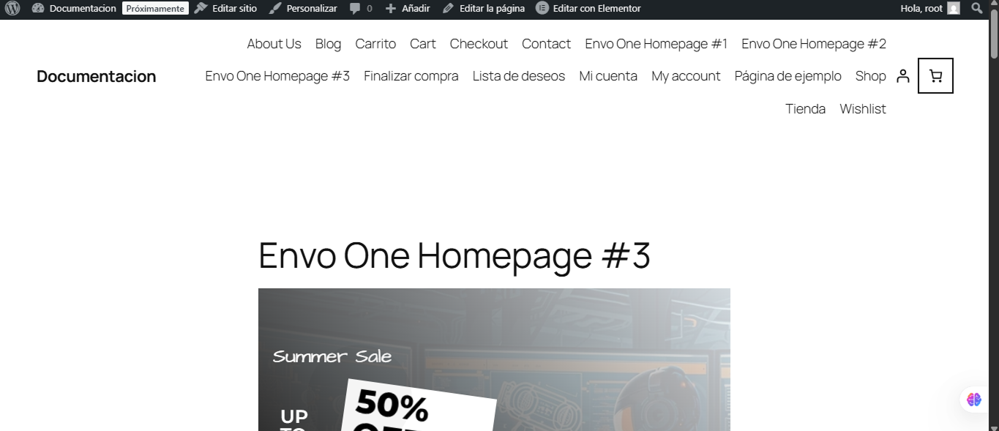
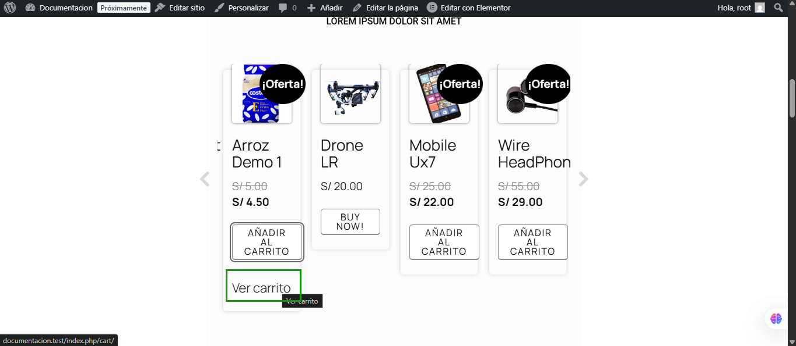
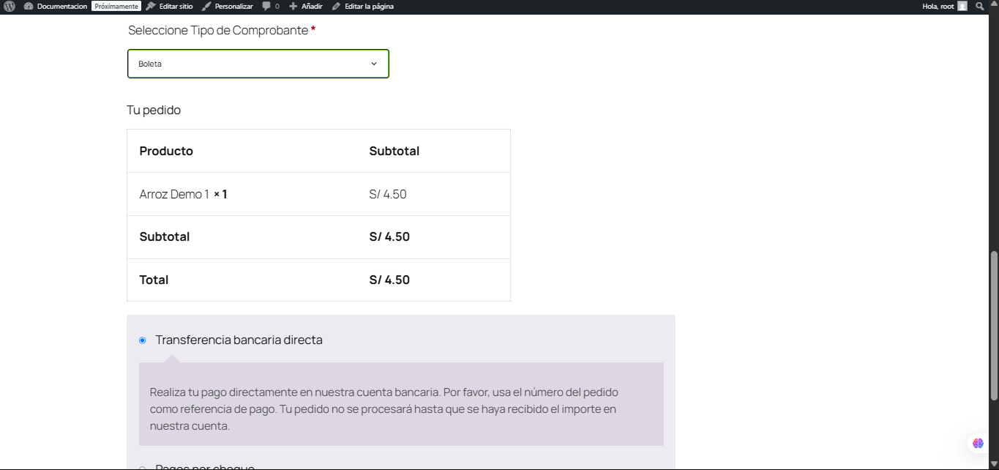
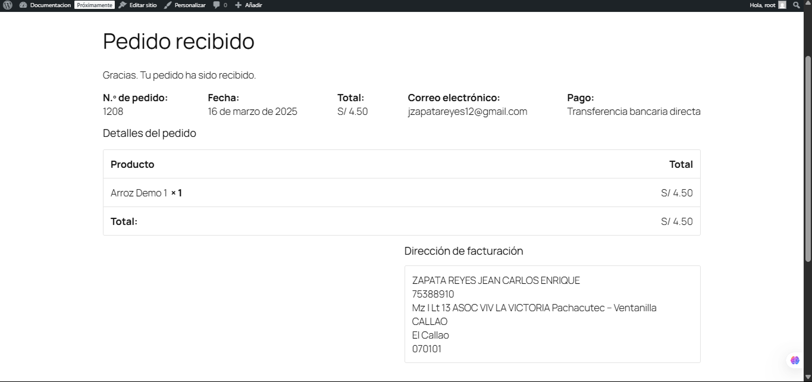

# Tutorial de uso del Plugin

## 1. Página principal de la tienda 

En esta pantalla se muestra la **tienda en línea** con los productos disponibles para la venta.  
- El usuario puede ver el listado de productos, sus precios y ofertas.  
- Para continuar, debe seleccionar el producto que desea comprar (por ejemplo, “Arroz Demo 1”) y hacer clic en **Añadir al carrito**.

---

## 2. Visualización del carrito 

Después de agregar el producto, el usuario puede ir al **Carrito** para verificar:  
- El producto seleccionado  
- El precio unitario  
- La cantidad  
- El subtotal y total  

Para avanzar en el proceso de compra, se hace clic en **Finalizar compra**.

---

## 3. Formulario de Checkout 

En esta pantalla se solicitan los **Datos de Facturación**:  
- Nombre  
- Apellidos  
- DNI/RUC  
- Dirección, Ciudad, Código Postal, etc.

El plugin permite **autocompletar** la información del cliente a partir del DNI o RUC.  
1. Ingrese el número de **DNI** (para Boleta) o **RUC** (para Factura).  
2. **Haga clic** en cualquier parte de la pantalla o presione Enter para que el sistema complete automáticamente los campos (Nombre, Apellidos, Dirección, etc.) gracias a la integración con el servicio de consulta de datos.

> **Nota**: Este autocompletado ocurre justo **después** de ingresar el DNI o RUC y **hacer clic** en la pantalla (o presionar Enter).

---

## 4. Datos cargados en el Checkout 

Una vez que el plugin recupera la información del **DNI** o **RUC**, los campos de facturación se llenan automáticamente.  
- Verifique que los datos sean correctos.  
- Ajuste manualmente cualquier dato adicional si fuera necesario.

---

## 5. Datos de envío y facturación 

WooCommerce mostrará los campos de ciudad, código postal, teléfono, correo electrónico, etc. Asegúrate de completarlos o verificar su autocompletado.  
- Aquí también se confirma el tipo de comprobante: si el usuario seleccionó **Boleta**, aparecerá el DNI; si seleccionó **Factura**, se usará el RUC.

---

## 6. Selección de tipo de comprobante 

Aquí se elige el **tipo de comprobante** que el usuario desea generar:

- **Boleta** (en caso de usar DNI)  
- **Factura** (en caso de usar RUC)

Dependiendo de la selección, WooCommerce (y el plugin) validarán si el campo de **DNI** o **RUC** está correcto.

---

## 7. Comprobación final de datos 

Antes de **finalizar la compra**, revisa que:  
- El producto y su precio sean correctos.  
- El subtotal y total sean los esperados.  
- El método de pago seleccionado sea el deseado (por ejemplo, Transferencia bancaria directa, Pago por cheque, Contra reembolso, etc.).

Al estar todo en orden, haz clic en **Realizar el pedido**.

---

## 8. Confirmación de pedido 

Al **confirmar** el pedido, WooCommerce registra la venta con los datos proporcionados (DNI o RUC).  
- Aparece el **resumen** del pedido (número de pedido, fecha, total, correo electrónico, método de pago).  
- El plugin enviará la información a la **API** de FacturaloPeru para generar la Boleta o Factura correspondiente.

---

## 9. Pedido recibido 

Después de realizar el pedido, se muestra la página de **“Pedido recibido”**:  
- Indica que la compra ha sido procesada.  
- Muestra el detalle del producto adquirido, total pagado y dirección de facturación.  
- Este comprobante (Boleta/Factura) quedará registrado en el sistema FacturaloPeru según la configuración previa.

---

## 10. Métodos de pago adicionales 

Por último, si el usuario eligió otro método de pago (por ejemplo, **Transferencia bancaria directa**), se mostrará la instrucción correspondiente:  
- Número de cuenta o CCI donde depositar.  
- Referencia de pago (número de pedido).  
- Mensaje indicando que el pedido se procesará cuando se confirme el pago.

---

# Conclusión

Siguiendo estos **10 pasos** se completa el flujo de compra con WooCommerce y el plugin de **FacturaloPeru**:  
1. Selección de producto en la tienda.  
2. Revisión del carrito.  
3. Llenado de datos en Checkout (con autocompletado por DNI/RUC).  
4. Elección del tipo de comprobante (Boleta/Factura).  
5. Confirmación y envío del pedido.  
6. Visualización del “Pedido recibido” y detalles finales.

Con esto, la integración generará automáticamente la **Boleta** o **Factura** según el documento ingresado y quedará todo registrado en el sistema de facturación asociado.

> **Recomendación**: Revisa siempre la **configuración previa** en WooCommerce (ajustes de país, impuestos y zonas de envío) y en el propio plugin (API Token, API URL y campos de facturación requeridos) para asegurar un correcto funcionamiento.
