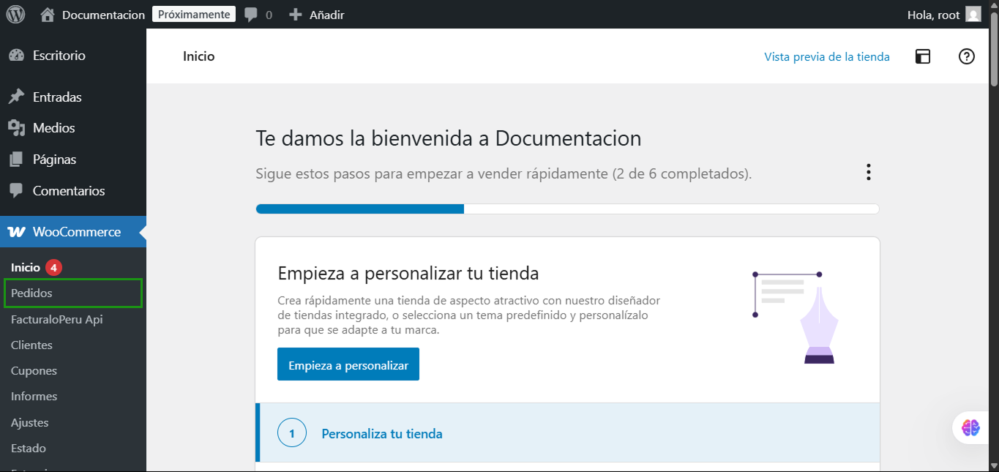

# Tutorial Uso del Plugin - Pedidos  

## 1. Vista de Pedidos  

**Acceder al Menú de WooCommerce**: En el menú principal del sistema, selecciona la opción **Pedidos** para acceder a la interfaz de gestión de pedidos.

  

En esta pantalla se muestran los pedidos registrados en WooCommerce.  

- Se puede ver el **número de pedido**, el **nombre del cliente** y el **estado** del pedido.  
- Se permite filtrar los pedidos y realizar acciones en lote.  

---  

## 2. Detalles del Pedido  

  

Al seleccionar un pedido, se accede a los detalles del mismo. Aquí se muestra:  
- **Información del Cliente**: Nombre, correo electrónico, y tipo de documento.  
- **Estado del Pedido**: Se pueden cambiar los estados como "En espera", "Completado", etc.  
- **Detalles de Facturación y Envío**: Asegúrate de que toda la información esté correcta.  

> **Nota Importante**: Antes de cambiar el estado del pedido de "En espera" a "Completado", es necesario verificar que el JSON se haya generado correctamente.  

---  

## 3. Información de Artículo  

  

Aquí se detallan los productos incluidos en el pedido:  
- **Costo**: Precio por unidad y cantidad.  
- **Subtotal**: Total antes de impuestos y descuentos.  
- **JSON Generado**: Estructura del JSON que se envía a la API para generar la Boleta o Factura.  

---  

## 4. Cambio de Estado del Pedido  

  

En esta sección puedes cambiar el estado del pedido:  
- **En espera**: Indica que el pedido está a la espera de confirmación.  
- **Completado**: Marca el pedido como finalizado después de verificar el JSON.  
- **Otros estados**: Inclusión de estados como "Cancelado", "Reembolsado", etc.  

---  

## 5. Confirmación de Cambios  

  

Al realizar cambios en el pedido:  
- Haz clic en **Actualizar** para guardar los cambios.  
- Verifica que el estado se haya modificado correctamente en la lista de pedidos.  

---  

## 6. Visualización Final de Pedidos  

  

En la vista de pedidos, se puede observar el estado actualizado de cada pedido.  
- **Estado**: Se refleja en la columna correspondiente (Ej. "Completado", "En espera").  
- **Detalles del Pedido**: Cualquier acción adicional puede realizarse desde esta vista.  

---  

# Verificación de Comprobantes  

## 7. Cambio de Estado del Pedido  

Una vez que has verificado que el **JSON** se ha generado correctamente y has cambiado el estado del pedido a **Completado**, el siguiente paso es verificar el comprobante en el sistema de facturación.  

---  

## 8. Acceso al Módulo de Ventas  

Navega en el sistema de facturación a la sección de **Ventas** y selecciona el submódulo **Listado de comprobantes**.  

  

---  

## 9. Verificación del Comprobante  

En la lista de comprobantes, busca el comprobante correspondiente al pedido.  
- **Cliente**: Verifica que el nombre del cliente coincida con el solicitado.  
- **Número de Comprobante**: Asegúrate de que el número del comprobante (por ejemplo, **B001-15**) sea el correcto.  
- **Estado**: Revisa el estado del comprobante, debe estar marcado como **Registrado**.  

---  

## 10. Detalles del Comprobante  

Haz clic en el número del comprobante para ver los detalles específicos:  
- **Tipo de Comprobante**: Asegúrate de que sea una **Boleta de Venta Electrónica** o el tipo que corresponda.  
- **T. Grabado y T. IGV**: Confirma que los montos sean correctos.  
- **Opciones**: Puedes exportar el comprobante en formatos **XML** o **PDF** según sea necesario.  

---  

## 11. Confirmación Final  

Una vez confirmado que el comprobante ha sido registrado correctamente y los detalles son los adecuados:  
- Puedes proceder a emitir cualquier documentación o comprobante adicional según sea necesario.  
- Asegúrate de informar al cliente que su comprobante ha sido autenticado y está disponible.  

---  

# Conclusiones  

La verificación del comprobante en el sistema de facturación después de cambiar el estado a **Completado** garantiza que todos los pasos en el proceso de venta se han realizado correctamente.  
1. Cambio de estado del pedido.  
2. Acceso al módulo de ventas y listado de comprobantes.  
3. Verificación de detalles del comprobante en el sistema.  

> **Recomendación**: Mantén un control adecuado sobre los comprobantes emitidos y guarda un registro de cualquier incidencia o notificación al cliente.  