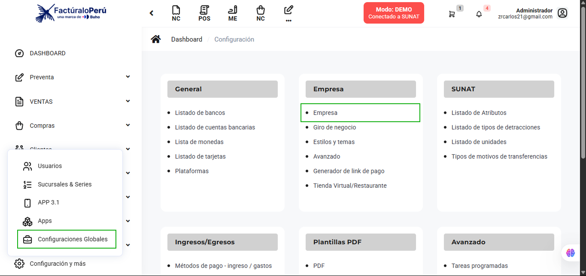
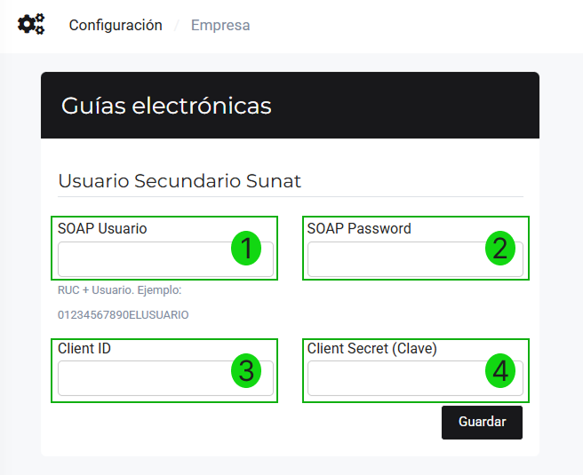
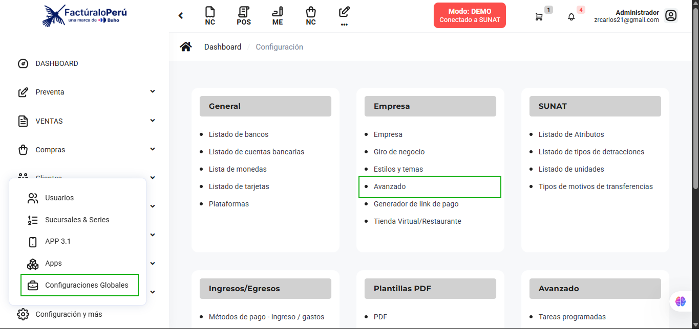
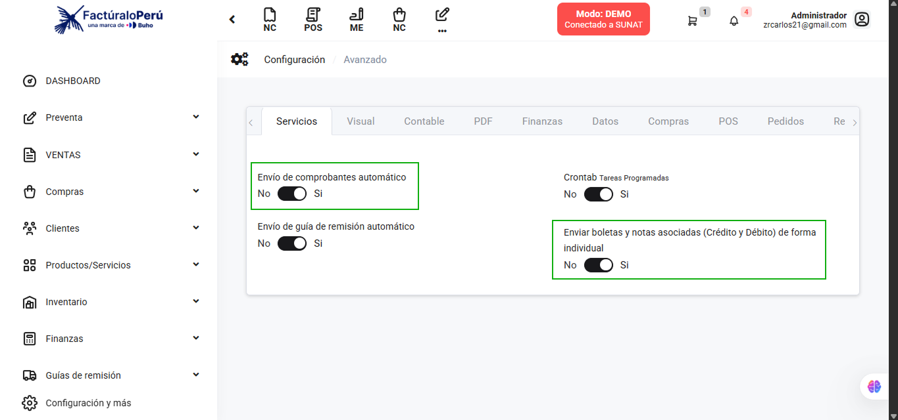

# 📘 Guía de Configuración Esencial - Sistema de Facturación

Bienvenido(a) al sistema de facturación. Esta guía te llevará paso a paso para configurar tu plataforma, conectarte a SUNAT y comenzar a facturar de manera oficial.

## ✅ Paso 1: Conectar tu cuenta con SUNAT (DEMO → PRODUCCIÓN)

**¿Por qué es importante?** El sistema inicia en modo DEMO para pruebas. Para facturar oficialmente, debes cambiar a PRODUCCIÓN.

**Configuración necesaria:**
1. Ve a **Configuraciones Globales** → **Empresa** → **Empresa**

2. En "Entorno de sistema" configura:

   1.- Cambiar SOAP tipo de **Demo a Producción**
   2.- Escoger SOAP envío **SUNAT**
   3.- Agregar **usuario secundario SOL** (RUC + usuario)
   4.- Ingresar **contraseña del usuario secundario**

**⚠️ Importante al crear usuario secundario:**
- NO uses palabras relacionadas con el nombre de tu empresa
- Ejemplo: Si tu empresa es "Constructora Juan", usa "C6NSJU4N" (no "CONSJUAN")
- Usa contraseñas con números, letras y mayúsculas
- Puedes generar contraseñas seguras en: [clavesegura.org](https://www.clavesegura.org/es/)

**Certificado Digital:**

- Sube tu archivo .pfx proporcionado por SUNAT
- SUNAT ofrece 2 certificados digitales gratuitos

## ✅ Paso 2: Configurar el Validador de Documentos

**¿Para qué sirve?** Te permite regularizar el estado de tus comprobantes ante eventualidades con SUNAT.

**Configuración:**
- Agrega los tokens del validador en la sección correspondiente
- Esto te dará respaldo ante problemas de conexión con SUNAT

## ✅ Paso 3: Configuración de Guías Electrónicas

**Si emites guías de remisión:**

- Ve a **Configuración** → **Empresa** → **Empresa**
- Sigue la configuración específica para guías electrónicas
- Esto es necesario para que SUNAT acepte tus guías

## ✅ Paso 4: Activar Envío Automático de Comprobantes

**Configuración recomendada:**

1. Ve a **Configuración** → **Empresa** → **Avanzado**

2. Activa las opciones de envío automático (deben estar en "Sí")

**💡 Consejo:** Si SUNAT presenta problemas de conexión, desactiva temporalmente el envío automático y reenvía manualmente desde "Comprobantes no enviados".

## 📦 Paso 5: Agregar tus Productos/Servicios

**Ve a:** **Productos/Servicios** → **Productos**

**Dos opciones:**
- **Individual:** Crear productos uno por uno
- **Masiva:** Importar múltiples productos con imágenes

**Datos importantes:** Nombre, precio, tipo de IGV, código, stock (si aplica)

:::note
Para más información acerca de la gestión de productos, puede revisar la sección correspondiente del *[manual](https://manual.uio.la/Pro7/productos-servicios)*.
:::

## 👥 Paso 6: Registrar tus Clientes

**Ve a:** **Clientes** → **Clientes**

**Dos opciones:**
- **Individual:** Crear clientes uno por uno
- **Masiva:** Importar múltiples clientes

**Datos importantes:** RUC/DNI, razón social, dirección, correo electrónico

:::note
Para más información acerca de la gestión de clientes, puede revisar la sección correspondiente del *[manual](https://manual.uio.la/Pro7/clientes)*.
:::

## 🏢 Paso 7: Configurar Establecimientos y Series

**¿Cuándo es necesario?** Si tienes más de un local o establecimiento.

**Configuración:**
1. Ve a **Configuraciones y más** → **Sucursales & Series**
2. Agrega las series correspondientes a cada establecimiento

:::note
Para más información acerca de la gestión de establecimientos (sucursales), puede revisar la sección correspondiente del *[manual](https://manual.uio.la/Pro7/usuarios-locales-series)*.
:::

**🔄 Migración desde otro proveedor:**
Si vienes de otro sistema, puedes continuar tu numeración:
1. Ve a **Configuración** → **Numeración de facturación**
2. Selecciona **Nuevo** y configura:
   - Tipo de comprobante
   - Serie
   - Número (correlativo desde donde continuar)

## 🎨 Paso 8: Seleccionar Plantilla PDF

**Personaliza tus comprobantes:**
1. Ve a **Configuración** → **PDF plantillas**
2. Elige la plantilla que mejor se adapte a tu empresa
3. Selecciona el **establecimiento** y **activa la plantilla**

## 💰 Paso 9: Configurar Ingresos de Dinero

**Para registrar el dinero de tus ventas, configura:**

**🏪 Dinero en efectivo (Módulo POS):**
- Ve a **POS** → **Caja chica POS**
- Abre cajas para registrar ventas en efectivo

**🏦 Cuentas bancarias:**
1. Ve a **Configuración** → **Listas de cuentas bancarias**
2. Selecciona **Nuevo** y completa:
   - Banco
   - Descripción
   - Número de cuenta
   - Tipo de moneda
   - CCI (Código de Cuenta Interbancaria)
   - Saldo inicial

---

## 🎉 ¡Listo para Facturar!

Una vez completados estos pasos, tu sistema estará configurado para:
- ✅ Emitir facturas electrónicas válidas
- ✅ Emitir boletas electrónicas
- ✅ Enviar comprobantes automáticamente a SUNAT
- ✅ Generar reportes y controlar tu facturación

**📞 ¿Necesitas ayuda adicional?** Consulta los videos tutoriales específicos mencionados en cada sección o contacta al soporte técnico.