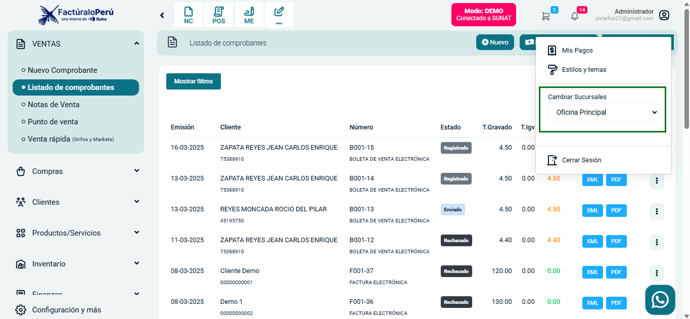

# Cambiar de Sucursal en el Sistema de Facturación

En este artículo te enseñaremos cómo cambiar de sucursal en tu sistema de facturación. Sigue estos pasos para realizarlo:

## Método 1: Desde el Perfil de Administrador

1. Ingresa al sistema con tus credenciales
2. Ubica la sección de administrador en la esquina superior derecha de la pantalla
3. Haz clic en el nombre de usuario o icono de perfil

   

4. En el menú desplegable, selecciona la opción **Cambiar Sucursales**
5. Se abrirá un selector con las sucursales disponibles
6. Selecciona la sucursal deseada desde el menú desplegable
7. Haz clic en la flecha para confirmar el cambio

   

8. El sistema actualizará la información y mostrará los datos correspondientes a la sucursal seleccionada

## Método 2: Desde el Filtro de Datos

También puedes cambiar dashboard para filtrar segun los datos de la sucursal :

1. En la pantalla principal del dashboard, ubica la sección "Filtrar datos históricos"
2. Localiza el campo "Sucursal" 
3. Haz clic en el menú desplegable y selecciona la sucursal deseada
4. El dashboard actualizará automáticamente los datos según la sucursal seleccionada

   

## Consideraciones Importantes

- El cambio de sucursal afecta todos los datos mostrados en el sistema, incluyendo ventas, comprobantes y reportes
- Asegúrate de tener los permisos necesarios para acceder a las diferentes sucursales
- Verifica que estás trabajando en la sucursal correcta antes de emitir comprobantes o realizar operaciones importantes

Para cualquier duda adicional, comunícate con el soporte técnico de FactúraloPeru.