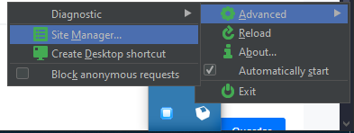
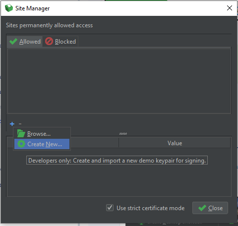
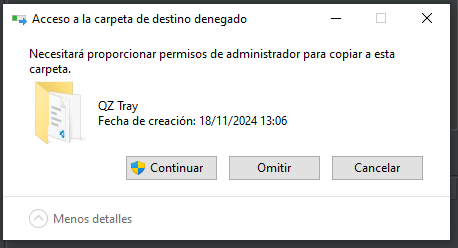
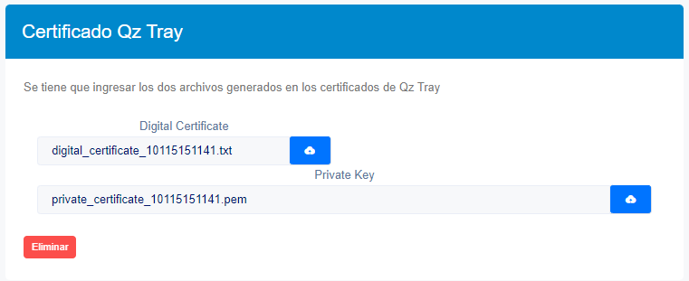

# Configuración de QZ-Tray

## Instalación de QZ-Tray

QZ-Tray es una herramienta esencial que permite la impresión directa desde aplicaciones web hacia impresoras conectadas localmente. Esta funcionalidad elimina la necesidad de cuadros de diálogo y configuraciones adicionales, facilitando la impresión automatizada de tickets, etiquetas y otros documentos.

### Proceso de Instalación

1. Descargue QZ-Tray desde el sitio oficial: [Descargar QZ-Tray](https://qz.io/download/)

:::tip
**Nota**: Durante la instalación, simplemente siga las instrucciones presionando "Siguiente".
:::

## Generación de Certificado

### Paso 1: Acceder a Configuración Avanzada

* Acceda a las configuraciones avanzadas de **QZ-Tray** siguiendo esta ruta:

    **Iconos Ocultos > QZ-Tray > Advanced > Site Manager**

### Paso 2: Generar el Certificado Digital

1. En la ventana de Site Manager, localice y seleccione la opción para generar certificado:

2. El sistema solicitará confirmación para la creación de certificados:
   * Confirme todas las solicitudes de permisos
   * Aparecerá un cuadro de diálogo como el siguiente:

:::tip
**Nota**: Al finalizar el proceso, el sistema abrirá automáticamente la carpeta que contiene los certificados generados.
:::

## Configuración en la Aplicación

### Carga de Certificados

1. Acceda a configuración de empresa, desde **Configuración y más**, **Configuraciones Globales**, seguido **Empresa- Empresa**

2. Localice la opción **Certificado QZ-Tray**

3. Cargue los archivos de certificado generados:
   * Seleccione "Subir" para cada archivo
   * Asigne cada archivo a su campo correspondiente:
     - Digital Certificate
     - Private Key

De esta manera ya tenemos los Certificados en la pagina y podemos imprimir diractamento los documentos.
