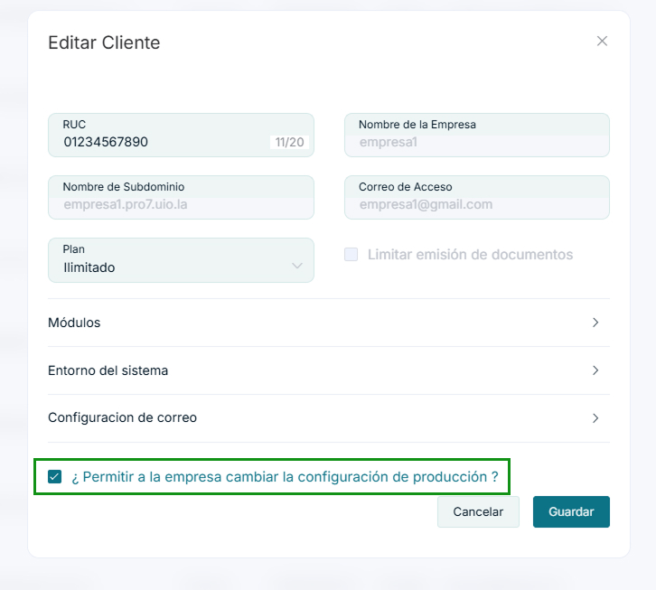

# Problema al Cambiar de Demo a Producción

Si en el módulo de **Configuración y más > Configuraciones globales > Empresa > Empresa** no puede cambiar de modo Demo a Producción, esto puede deberse a que en el panel de administración no se ha configurado la opción que permite a la empresa realizar este cambio.

## Solución al Problema

Para resolver este inconveniente, siga estos pasos:

1. Acceda al **Panel de Administración** con credenciales de administrador.

2. Diríjase a la sección de **Listado de Clientes** luego tendra que desplazarse a la derecha hasta encontrar la opcion **Acciones**, tendra que elejir la opcion **Editar**.

3. Localice y active la casilla denominada **Permitir a la empresa cambiar la configuración a producción**.

4. Guarde los cambios realizados.

5. Solicite al usuario que intente nuevamente cambiar el modo desde Demo a Producción en su panel de empresa.

## Soporte Técnico

Si después de seguir estos pasos continúa experimentando problemas, contacte al soporte técnico proporcionando:

- Nombre de la empresa
- Usuario administrador
- Capturas de pantalla del error
- Detalles de las acciones realizadas

El equipo de soporte podrá ayudarle a resolver el problema específico que está experimentando.
