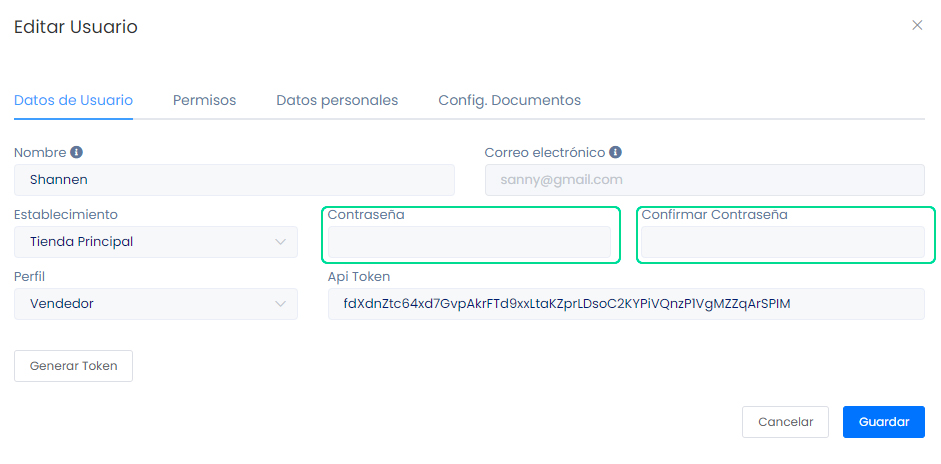

# Cambiar Contraseña del Sistema de Facturación

En este artículo te enseñaremos a cambiar tu contraseña en tu sistema de facturación. Sigue estos pasos para realizarlo:

Ingresa al módulo **Usuarios/Locales & Series** en la subcategoría **Usuarios**, selecciona el botón **Editar** al usuario que desee cambiar la contraseña.

Seguido aparecerá la siguiente ventana:

Ingresa su nueva contraseña y seguido confirme su contraseña, después seleccione el botón **Guardar.** Y ya habrá cambiado la contraseña del usuario.
